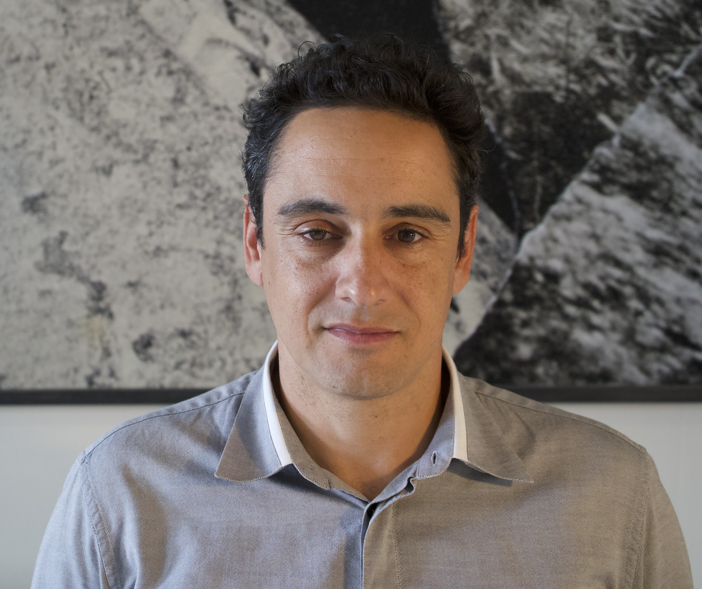
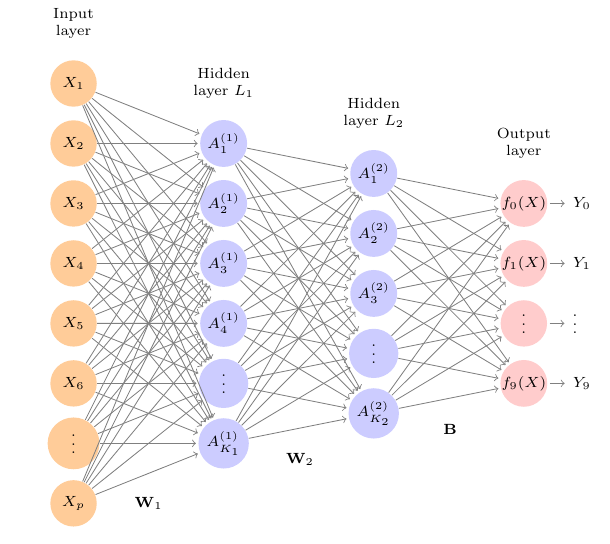
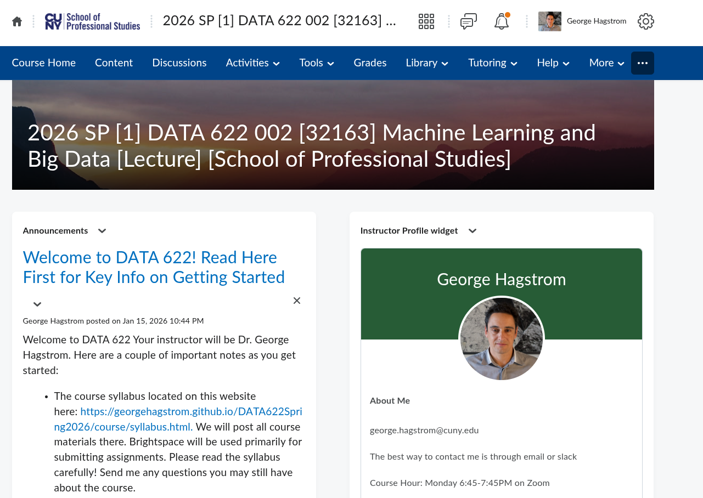
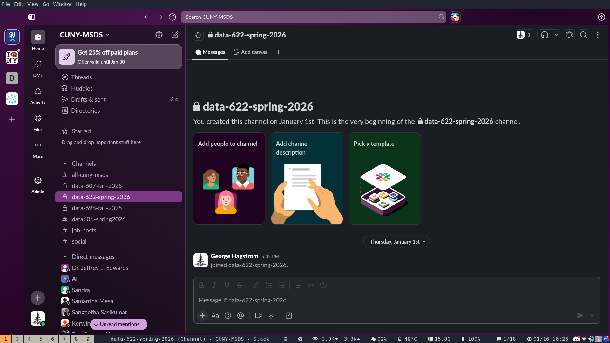
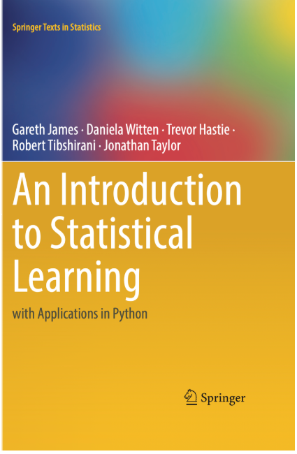
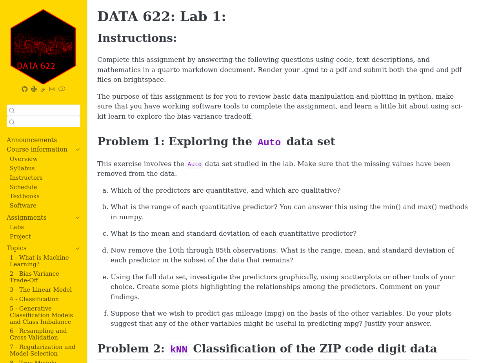

## About Me {.smaller}

:::: {.columns}

::: {.column width="60%"}

- Doctoral Lecturer at CUNY SPS
- [Past research experience](https://scholar.google.com/citations?user=2La77skAAAAJ&hl=en):
  - Plasma physics and Applied Mathematics (NYU)
  - Ecology and Evolutionary Biology (Princeton)
- Research using Bayesian methods and genomic data to improve
global scale ocean and climate models
- Taught math at NYU

:::

::: {.column width="40%"}

:::

::::

## What is Machine Learning?

:::: {.columns}

Machine Learning uses algorithms and data to make predictions
and uncover complex processes

::: {.column width="50%"}

  - Classification, Regression, Causal Inference
  - Theory
  - ML Infrastructure

:::

::: {.column width="50%"}

:::

::::

## Course Website(s)

:::: {.columns}

::: {.column width="50%"}

-  Brightspace to submit homework
- [Course Website](https://georgehagstrom.github.io/DATA622Fall2026/) 

:::

::: {.column width="50%"}

:::

::::

## Course Website and Meetup

:::: {.columns}

::: {.column width="50%"}

-  Brightspace to submit homework
- [Course Website](https://georgehagstrom.github.io/DATA622Fall2026/) 
- Course Meetup: Monday 6:45-7:45PM
- [Zoom Link](
https://us02web.zoom.us/j/6211354884?omn=86938044575)

:::

::: {.column width=50%"}

:::

::::

## Slack Channel

:::: {.columns}
::: {.column width="50%"}
- Program slack workspace for messaging and rapid communications
- [https://cuny-msds.slack.com](https://cuny-msds.slack.com)
- [Invite Link](https://join.slack.com/t/cuny-msds/shared_invite/zt-3ans1b3dz-5HhIols06wNraCMUhZ~jXw)
- I will add you to 622 slack channel

:::

::: {.column width="50%"}

:::

::::

## Textbooks

:::: {.columns}
::: {.column width="50%"}
Two most important textbooks:

1. Introduction to Statistical Learning with Python
  - Available free online [ISLP](https://statlearning.com)

2. DevOps for Data Science
  - Available free online [DevOps](https://do4ds.com/)
:::

::: {.column width="50%"}

:::

::::

## Assignments

:::: {.columns}
::: {.column width="50%"}
- 8 Lab Assignments (65\%)
- Final Project (35\%)
:::

::: {.column width="50%"}

:::
::::

## Looking forward to a great semester!

Thanks for watching

