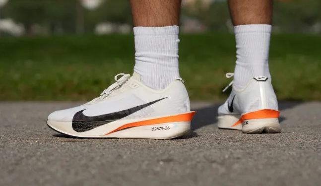
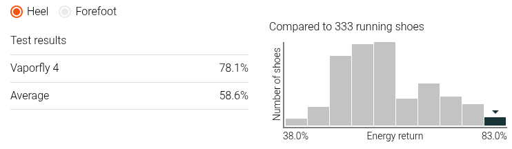
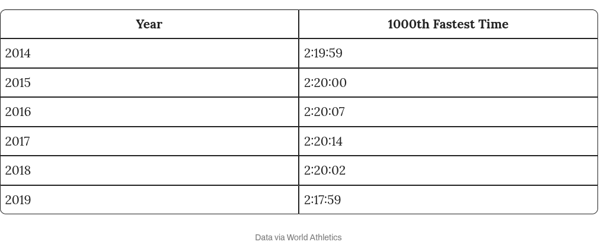
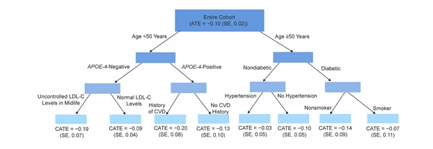

```{python}
import pandas as pd
import numpy as np
import matplotlib.pyplot as plt

from sklearn.ensemble import GradientBoostingRegressor, GradientBoostingClassifier


from econml.dml import CausalForestDML, LinearDML
from sklearn.linear_model import LassoCV
from sklearn.model_selection import cross_val_predict


okabe_ito = {
    "orange":    "#E69F00",
    "sky_blue":  "#56B4E9",
    "green":     "#009E73",
    "yellow":    "#F0E442",
    "blue":      "#0072B2",
    "vermilion": "#D55E00",
    "pink":      "#CC79A7",
    "black":     "#000000",
}

oi_colors = list(okabe_ito.values())

```


## Week Summary

- Lab 6 Available (Due November 8th at midnight)
- MVP Demo This Week
- Reading: ThinkCausal Tutorial


##  Super Shoes

- Recently, Running Shoe Technology Improved




## Example: Super Shoes

- Recently, Running Shoe Technology Improved




## Example: Super Shoes

- Elite Marathon times have fallen




## How much do Super-Shoes Help?

- Optimistic CEO:

"Our super-shoes will save you almost 50 minutes off your marathon time"


```{python}

np.random.seed(111)
n = 5000

vo2 = np.random.lognormal(mean=np.log(48), sigma=0.18, size=n)


age = np.clip(55 - 0.3 * vo2 + np.random.normal(0, 8, n), 18, 70)

vo2_std = (vo2 - vo2.mean()) / vo2.std()


prob_premium = 1 / (1 + np.exp(-(2*(vo2_std - 2))))


premium_shoes = np.random.binomial(1, prob_premium)


exp_time = 120 + 8000 * (1/vo2 - 1/90)

true_shoe_effect = -2.0

noise_sd = 2 + 0.03 * exp_time 


marathon_time = (exp_time
                + true_shoe_effect * premium_shoes
                + np.random.normal(0, 1, n) * noise_sd)

df = pd.DataFrame({
    'race_time': marathon_time,
    'premium_shoes': premium_shoes,
    'age': age,
    'vo2':vo2
})


weekly_miles = np.clip(20 + 10 * vo2_std + np.random.normal(0, 5, n), 5, 80)
income = np.clip(50000 + 15000 * vo2_std + np.random.normal(0, 12000, n), 20000, 200000)
races_per_year = np.clip(3 + 2 * vo2_std + np.random.normal(0, 2, n), 0, 15)

prob_premium = 1 / (1 + np.exp(-(
    -2 + 0.5 * vo2_std + 0.3 * income/50000 + 0.2 * races_per_year
)))

marathon_time = (exp_time
                - 0.1 * weekly_miles
                + true_shoe_effect * premium_shoes
                + np.random.normal(0, 1, n) * noise_sd)


df = pd.DataFrame({
    'time': marathon_time,
    'shoes': premium_shoes,
    'age': age,
    'miles':weekly_miles,
    'races':races_per_year,
    'income':income,
    'vo2':vo2
})


df.groupby('shoes')['time'].mean().rename_axis('Shoe Type').to_frame('Avg Race Time (min)').rename(index={0: 'Standard', 1: 'Premium'})

```

- Why might this be wrong?


## More Realistic Perspective

```{python}
#| output: asis


print(df.head(5).round(1).to_markdown(index=False))

```


## More Realistic Perspective

```{python}
fig, ax = plt.subplots(figsize=(8, 5))

ax.hist(df.loc[df['shoes'] == 0, 'time'],
        bins=30, alpha=0.5, density=True, label='Standard', color=oi_colors[0])
ax.hist(df.loc[df['shoes'] == 1, 'time'],
        bins=30, alpha=0.5, density=True, label='Premium', color=oi_colors[1])

ax.set_xlabel('Marathon Time (min)')
ax.set_ylabel('Density')
ax.set_title('Marathon Time Distribution by Shoe Type')
ax.legend()
plt.show()
```

## How about a Predictive Model?

- Fit an 'xgboost' model to the data
- Calculate _Average Treatment Effect_ or ATE:

$$
\mathrm{ATE} = \sum_{i=1}^n \left(\hat{f}(\mathbf{x}_i,\mathrm{PShoe}=1) - \hat{f}(\mathbf{x}_i,\mathrm{PShoe}=0)\right)
$$

- This is called an _S-Learner_


## Predicted Model Results


```{python}
#| output: asis

X_all = df[['vo2', 'age', 'shoes','miles','income','races']].values
y = df['time'].values

xgb = GradientBoostingRegressor(n_estimators=200, max_depth=4, random_state=42)
xgb.fit(X_all, y)

# Predict for everyone with premium shoes
X_premium = X_all.copy()
X_premium[:, 2] = 1

# Predict for everyone with standard shoes
X_standard = X_all.copy()
X_standard[:, 2] = 0


xgb_shoe_effect = xgb.predict(X_premium) - xgb.predict(X_standard)

naive_diff = (marathon_time[premium_shoes == 1].mean() -
              marathon_time[premium_shoes == 0].mean())


```


```{python}

fig, ax = plt.subplots(figsize=(10, 6))

ax.scatter(df['vo2'][premium_shoes == 0],
           xgb.predict(X_standard)[premium_shoes == 0],
           c=oi_colors[0], alpha=0.4, s=15, label='Standard shoes')
ax.scatter(df['vo2'][premium_shoes == 0],
           xgb.predict(X_premium)[premium_shoes == 0],
           c=oi_colors[1], alpha=0.4, s=15, label='Premium shoes')

# Connect pairs with vertical lines to show the predicted effect
for i in range(0, n, 5):  # every 5th point to avoid clutter
    ax.plot([df['vo2'].iloc[i], df['vo2'].iloc[i]],
            [xgb.predict(X_standard)[i], xgb.predict(X_premium)[i]],
            color='gray', alpha=0.2, linewidth=0.5)

ax.set_xlabel('VO2 Max',fontsize=18)
ax.set_ylabel('Predicted Marathon Time',fontsize=18)
ax.set_title('S-Learner: Predicted Times by Shoe Type',fontsize=24)
ax.legend()
plt.show()


```

## Predicted Model Results

- Here the 'xgboost' method produces a result that is 50\% smaller than true effect

```{python}
#| output: asis

results = pd.DataFrame({
    'Method': ['True Effect', 'Naive Comparison', 'XGBoost S-Learner'],
    'ATE': [true_shoe_effect, naive_diff, xgb_shoe_effect.mean()]
})

print(results.to_markdown(index=False))

```


## _Causal Inference_ Offers a Better Way


```{python}
#| output: asis


Y = df['time'].values
T = df['shoes'].values
X = df[['vo2']].values
W = df[['age','vo2','miles','income','races']].values

est = LinearDML(
model_y=GradientBoostingRegressor(n_estimators=100, max_depth=3, random_state=4),
    model_t=GradientBoostingClassifier(n_estimators=100, max_depth=3, random_state=4),
    discrete_treatment=True,
    random_state=2
)
est.fit(Y, T, X=None, W=W)

ate = est.ate(X=None)
ate_lb, ate_ub = est.ate_interval(X=None, alpha=0.05)

results = pd.DataFrame({
    'Method': ['True Effect', 'Naive Comparison', 'XGBoost S-Learner', 'LinearDML'],
    'ATE (min)': [true_shoe_effect, naive_diff, xgb_shoe_effect.mean(), ate],
    '95% CI Lower': [None, None, None, ate_lb],
    '95% CI Upper': [None, None, None, ate_ub]
})

print(results.to_markdown(index=False))
```


## Potential Outcomes

::: {.incremental}
- Suppose I am running NYC Marathon, and I decide to wear regular shoes
- I complete the marathon in 190 minutes
- _How fast would I have gone if I had used the super shoes?_
:::


## Fundamental Problem of Causal Inference

::: {style="border: 2px solid black; padding: 20px; border-radius: 5px;"}
We will never observe the potential/counterfactual outcomes!
:::

::: {.fragment}
However, that won't stop us from imagining that we have access to it when we are 
developing methods
:::


## Potential Outcomes

- Here, shoe choice is a treatment
- $Y_1$ is outcome if given treatment
- $Y_0$ is outcome if given control


| Runner | $Y_0$ | $Y_1$ | Effect  | 
|--------|:--------------:|:-------------:|:----------------:|
| George  |  190              |               |                  | 
| Juanita |                |       181        |                  | 
| David  |                |        135       |                  | 
| Mary   |   205             |               |                  | 


## Potential Outcomes

- Here, shoe choice is a treatment
- $Y_1$ is outcome if given treatment
- $Y_0$ is outcome if given control


| Runner | $Y_0$ | $Y_1$ | Effect  | 
|--------|:--------------:|:-------------:|:----------------:|
| George  |  190              |    [185]{style="color:#808080"}           |   -5               | 
| Juanita |  [184]{style="color:#808080"}             |       181        |        -3          | 
| David  |    [137]{style="color:#808080"}            |        135       |       -2           | 
| Mary   |   205             |    [199]{style="color:#808080"}         |       -6           | 


## Causal Estimands {.smaller}

- Average Treatment Effect (ATE): 
$$\sum_{i=1}^n \frac{1}{n} \left(Y_{i1} - Y_{i0}\right)$$

| Runner | $Y_0$ | $Y_1$ | Effect  | 
|--------|:--------------:|:-------------:|:----------------:|
| George  |  190              |    [185]{style="color:#808080"}           |   -5               | 
| Juanita |  [184]{style="color:#808080"}           |       181        |        -3          | 
| David  |    [137]{style="color:#808080"}            |        135       |       -2           | 
| Mary   |   205             |    [199]{style="color:#808080"}          |       -6           | 
| __ATE__ |    |       | __-4__ |


## Causal Estimands {.smaller}

- Average Treatment Effect on the Treated (ATT)
$$
\sum_{i\in \mathrm{Treated}} \frac{1}{n_T} \left(Y_{i1} - Y_{i0}\right)
$$

| Runner | $Y_0$ | $Y_1$ | Effect  | 
|--------|:--------------:|:-------------:|:----------------:|
| Juanita |  [184]{style="color:#808080"}              |       181        |        -3          | 
| David  |    [137]{style="color:#808080"}            |        135       |       -2           | 
| __ATT__ |    |     |      __-2.5__ |


## Causal Estimands {.smaller}

- Average Treatment Effect on Controls  (ATC)
$$
\sum_{i\in \mathrm{Treated}} \frac{1}{n_T} \left(Y_{i1} - Y_{i0}\right)
$$

| Runner | $Y_0$ | $Y_1$ | Effect  | 
|--------|:--------------:|:-------------:|:----------------:|
| George  |  190              |    [185]{style="color:#808080"}           |   -5 
| Mary   |   205             |    [199]{style="color:#808080"}           |       -6           | 
| __ATC__ |    |     |      __-5.5__ |


## Treatment effect depends on person? {.smaller}

- _Conditional Average Treatment Effect_ or CATE

$$
\mathrm{CATE}(\mathbf{X}) = E(Y_1 - Y_0 |\mathbf{X}) 
$$


| Runner | Pro? | $Y_0$ | $Y_1$ | Effect  | 
|--------:|:---|:-----------:|:-------------:|:----------------:|
| George | No |  190              |    [185]{style="color:lightgrey"}           |   -5               | 
| Juanita |No |  [184]{style="color:#808080"}             |       181        |        -3          | 
| David |Yes  |    [137]{style="color:#808080"}          |        135       |       -2           | 
| Mary | No  |   205             |    [199]{style="color:lightgrey"}           |       -6           | 
| __CATE__  |  __Yes__  |  __137__   |  __135__   | __-2__ |
| __CATE__  |  __No__      | __193__ |  __188.3__ | __-4.6__ |


## Predictive versus Causal Questions

- Traditional ML estimates:

$$
\hat{f}(\mathbf{X}) = E(Y|\mathbf{X})
$$

- Causal Inference estimates:

$$
\hat{\mathrm{CATE}}(\mathbf{X}) = E(Y_1-Y_0|\mathbf{X})
$$

- In the first case, the data was generated naturally
- In the second, there was an intervention


## Predictive versus Causal Questions

- Use Traditional ML when you are not intervening in the data generating process
  - Fraud Detection
  - Image Recognition
  - Demand Forecasting
  - Will customer default next month
  - Customer Churn


## Predictive versus Causal Questions

- Use Causal Inference when you are intervening
  - Will our drug increase survival?
  - Will demand rise if we offer a sale?
  - If we increase credit limits, will our profits increase?
  - Will this customer churn if I offer a 25\% discount?


## Predictive versus Causal Questions:

- Predictive:
  - What is going to happen next?
  - What class is this observation?
- Causal:
  - What will happen if if I __do__ X


## Beyond Linear Regression

- In Linear Regression part of coursse, we had to _control for confounders_ to make causal conclusions

**Problem 1: Many relationships are nonlinear**

- Solution: Try to __match__ data points with opposite values of treatment
- IE Find a pair of runners with similar age, VO2, training history, but who used different shoes
- Find difference of pairs


## Beyond Linear Regression


**Problem 2: Matching doesn't work with many features**


```{python}

dims = np.arange(1, 51)

n_points = 500

nn_distance = (1 / n_points) ** (1 / dims) 

fig, ax = plt.subplots(figsize=(12, 8))
ax.plot(dims, nn_distance, '-',c=oi_colors[1], linewidth=2,
        label='Avg nearest neighbor distance')
ax.set_xlabel('Number of dimensions',fontsize=18)
ax.set_ylabel('Distance',fontsize=18)
ax.set_title('Curse of Dimensionality',fontsize=24)


ax.legend(fontsize=16)
plt.tight_layout()


```


## Propensity Score

::: {style="border: 2px solid black; padding: 20px; border-radius: 5px;"}
Rubens and Rosenbaum: Instead of matching on exact characteristics, we can match on
_probability of getting the treatment_.
:::

## Propensity Score

- Fit logistic regression to predict probability of having premium shoes
- Stratify by this _propensity_ score
  - Add as covariate, matching, inverse probability weighting, more
- Compute ATE

## Causal Machine Learning

- What if we use ML both to model outcome (running time) and treatment (odds of wearing shoe)?
- Build two models:
  - $f_T(\mathbf{W})$ predicts treatment
  - $f_Y(\mathbf{W})$ predicts outcome
- Treatment effect is relationship between residuals of these two models


## CATE

- Suppose that we want to know how the shoes impact runners of different speed:
$$
\mathrm{CATE}(\mathrm{VO2}) = E(\mathrm{Time}_1 - \mathrm{Time}_0 | \mathrm{VO2})
$$

- Now add another ML model in final stage
- Build three models:
  - $\hat{f}_T(\mathbf{W},\mathbf{X})$ predicts treatment
  - $\hat{f}_Y(\mathbf{W},\mathbf{X})$ predicts outcome
  - $\hat{f}_\tau(\mathbf{X})$ predicts treatment effect 


## Causal Forest

- _Causal Forest_ make splits of final tree to maximize CATE heterogeneity




## Requirements for Causal Inference

1. You have all confounders in your model
  - This requires your domain knowledge
  - No guarantees
  - Model will be silently wrong


## Requirements for Causal Inference

2. Overlap Criterion
  - For each value of confounders, there is non-zero chance of either treatment class
  - Model won't tell about regions where this isn't true

```{python}

propensity = cross_val_predict(
    GradientBoostingClassifier(n_estimators=100, max_depth=3, random_state=4),
    df[['vo2', 'age','income','races','miles']],
    df['shoes'],
    cv=10,
    method='predict_proba'
)[:, 1]


fig, ax = plt.subplots(figsize=(8, 5))
ax.hist(propensity[df['shoes'] == 0], bins=30, alpha=0.5,
        density=True, label='Standard shoes', color=oi_colors[1])
ax.hist(propensity[df['shoes'] == 1], bins=30, alpha=0.5,
        density=True, label='Super shoes', color=oi_colors[2])
ax.set_xlabel('Propensity Score P(Shoes | X)')
ax.set_ylabel('Density')
ax.set_title('Overlap Check: Propensity Score Distribution')
ax.legend()
plt.show()

```

## Impact of Overlap on CATE

```{python}

np.random.seed(111)
n = 50000

vo2 = np.random.lognormal(mean=np.log(55), sigma=0.2, size=n)


age = np.clip(55 - 0.3 * vo2 + np.random.normal(0, 8, n), 18, 70)

vo2_std = (vo2 - vo2.mean()) / vo2.std()


prob_premium = 1 / (2 + np.exp(-(2*(vo2_std - 2))))


premium_shoes = np.random.binomial(1, prob_premium)


exp_time = 120 + 8000 * (1/vo2 - 1/90)

true_shoe_effect = -2.0

noise_sd = 2 + 0.03 * exp_time 


marathon_time = (exp_time
                + true_shoe_effect * premium_shoes * exp_time/(120.0)
                + np.random.normal(0, 1, n) * noise_sd)


df = pd.DataFrame({
    'race_time': marathon_time,
    'premium_shoes': premium_shoes,
    'age': age,
    'vo2':vo2
})


weekly_miles = np.clip(20 + 10 * vo2_std + np.random.normal(0, 5, n), 5, 80)
income = np.clip(50000 + 15000 * vo2_std + np.random.normal(0, 12000, n), 20000, 200000)
races_per_year = np.clip(3 + 2 * vo2_std + np.random.normal(0, 2, n), 0, 15)

prob_premium = 0.5 + 0.0* vo2 #1 / (2 + np.exp(-(
  #  -2 + 0.5 * vo2_std + 2 * income/50000 + 0.2 * races_per_year
#)))


df = pd.DataFrame({
    'time': marathon_time,
    'shoes': premium_shoes,
    'age': age,
    'miles':weekly_miles,
    'races':races_per_year,
    'income':income,
    'vo2':vo2
})

Y = df['time'].values
T = df['shoes'].values
X = df[['vo2']].values
W = df[['age', 'miles', 'races', 'income']].values

est = CausalForestDML(
    model_y=GradientBoostingRegressor(n_estimators=100, max_depth=3, random_state=4),
    model_t=GradientBoostingClassifier(n_estimators=100, max_depth=3, random_state=4),
    n_estimators=500,
    min_samples_leaf=20,
    discrete_treatment=True,
    random_state=98876
)
est.fit(Y, T, X=X, W=W)

vo2_grid = np.linspace(35, df['vo2'].max(), 100).reshape(-1, 1)
cate_pred = est.effect(vo2_grid)
cate_lb, cate_ub = est.effect_interval(vo2_grid, alpha=0.05)

# Calculate the true CATE
exp_time_grid = 120 + 8000 * (1/vo2_grid.ravel() - 1/90)
true_cate_grid = true_shoe_effect * exp_time_grid / 120.0

fig, ax = plt.subplots(figsize=(10, 6))

ax.plot(vo2_grid, true_cate_grid, 'k-', linewidth=2.5, label='True CATE')
ax.plot(vo2_grid, cate_pred, 'b-', linewidth=2, label='Causal Forest CATE')
ax.fill_between(vo2_grid.ravel(), cate_lb, cate_ub,
                alpha=0.2, color='blue', label='95% CI')
ax.axhline(y=0, color='gray', linestyle=':', alpha=0.5)
ax.set_xlabel('VO2',fontsize=16)
ax.set_ylabel('CATE',fontsize=16)
ax.set_title('Effect of Super Shoes on Marathon Time',fontsize=20)
ax.legend(fontsize=14)
plt.show()

```


## Impact of Overlap on CATE

```{python}


vo2_grid = np.linspace(55, df['vo2'].max(), 100).reshape(-1, 1)
cate_pred = est.effect(vo2_grid)
cate_lb, cate_ub = est.effect_interval(vo2_grid, alpha=0.05)


fig, ax = plt.subplots(figsize=(10, 6))

ax.plot(vo2_grid, true_cate_grid, 'k-', linewidth=2.5, label='True CATE')
ax.plot(vo2_grid, cate_pred, 'b-', linewidth=2, label='Causal Forest CATE')
ax.fill_between(vo2_grid.ravel(), cate_lb, cate_ub,
                alpha=0.2, color='blue', label='95% CI')
ax.axhline(y=0, color='gray', linestyle=':', alpha=0.5)
ax.set_xlabel('VO2',fontsize=16)
ax.set_ylabel('CATE',fontsize=16)
ax.set_title('Effect of Super Shoes on Marathon Time',fontsize=20)
ax.legend(fontsize=14)
plt.show()

```


## Requirements for Causal Inference

3. No post-treatment variables
  - If the variable could have been impacted by the treatment, you 
  cannot use it


## Continuous Treatments

- Grams of carbs before race
- Loan Interest or Amount
- Sale Price


## Continuous Treatments

- Disrete treatment defined effect as difference
- For continuous it is the _derivative_

$$
\mathrm{CATE}(t) = \tau(t) = \frac{\partial E(Y(t)|X)}{\partial t}
$$

- Causal Forest estimates slope on each leaf wrt to treatment


## Continuous Overlap

- Regression instead of classification to predict treatment dosage
- Overlap Criterion: $R^2$ of nuisance model for treatment less than say 0.95

