```{python}
import pandas as pd
import numpy as np
import matplotlib.pyplot as plt
import shap
from sklearn.ensemble import RandomForestRegressor
import pickle
from econml.dml import CausalForestDML, LinearDML
from sklearn.linear_model import LassoCV
from sklearn.model_selection import cross_val_predict
from sklearn.metrics import r2_score, mean_squared_error
from sklearn.inspection import PartialDependenceDisplay

okabe_ito = {
    "orange":    "#E69F00",
    "sky_blue":  "#56B4E9",
    "green":     "#009E73",
    "yellow":    "#F0E442",
    "blue":      "#0072B2",
    "vermilion": "#D55E00",
    "pink":      "#CC79A7",
    "black":     "#000000",
}

oi_colors = list(okabe_ito.values())

```


## HW 4 Comments

1. Cross Validation with Linear Models

```{python}
#| echo: true
#| eval: false
#| code-overflow: wrap

# I saw this or something equivalent in most homeworks:

cv = KFold(n_splits=5, 
        shuffle=True, 
        random_state=32131)

ridge_cv = RidgeCV(alphas=alphas, 
                fit_intercept=True, 
                cv=cv,
                scoring="neg_root_mean_squared_error")


```


## HW 4 Comments

1. Cross Validation with Linear Models


```{python}
#| echo: true
#| eval: false
#| code-overflow: wrap

# I saw this or something equivalent in most homeworks:

cv = KFold(n_splits=5, 
        shuffle=True, 
        random_state=32131)

ridge_cv = RidgeCV(alphas=alphas, 
                fit_intercept=True, 
                cv=cv,
                scoring="neg_root_mean_squared_error")


```

- Not wrong, but you can do 'loo-cv' here for free


## HW 4 Comments

1. Cross Validation with Linear Models


```{python}
#| echo: true
#| eval: false
#| code-overflow: wrap

# Best way to do this:

ridge_cv = RidgeCV(alphas=alphas, 
                fit_intercept=True,
                scoring="neg_root_mean_squared_error")


```


## HW 4 Comments

2. Different $\alpha$ for weighted and unweighted regression

```{python}
#| echo: true
#| eval: false

# The best alpha from the unweighted model

best_alpha = ridge_cv.alpha_

ridge_weights = Ridge(alpha=best_alpha,
                fit_intercept=True,
                scoring="neg_root_mean_squared_error"
)

```


## HW 4 Comments

2. Different $\alpha$ for weighted and unweighted regression

```{python}
#| echo: true
#| eval: false

# Instead just do RidgeCV

ridge_weights = RidgeCV(alphas=alphas,
                fit_intercept=True,
                scoring="neg_root_mean_squared_error"
)

```


## HW 4 Comments

3. Interpreting Graphs
  - Bootstrap Uncertainty vs Minutes Played


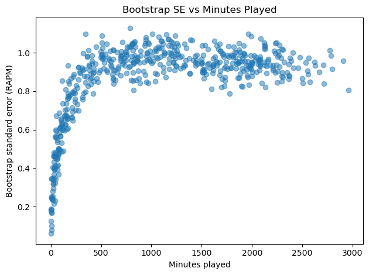


## HW 4

3. Interpreting Graphs
  - Bootstrap Uncertainty vs Minutes Played


Is uncertainty is highest for low minute players?


## Week Summary

- Reading: 
  - [Interpretable Machine Learning 2-4, 17-18](https://christophm.github.io/interpretable-ml-book/interpretability.html)
  - [Fairness and Machine Learning- 1](https://fairmlbook.org/index.html)
- Coding Vignette on Causal ML
- MVP Demos: contact me


## Black Boxes Gone Wrong

1. _Clever Hans:_ Horse that could add

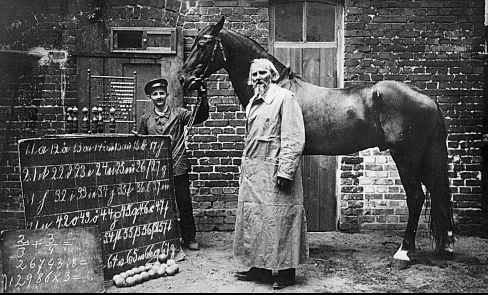{width=50%}


## Black Boxes Gone Wrong

2. Dog vs. Wolf

<div style="display: flex; justify-content: center; gap: 2%; width: 85%; margin: auto;">

{width=400}

{width=400}

</div>

::: {.incremental}

- Image classifier trained on images of dogs and wolves used the presence of snow as primary means of determining class

:::


## Black Boxes Gone Wrong

3. Identifying Whales in Hydrophone Recordings
  - Cornell University held a contest to identify Right Whales
  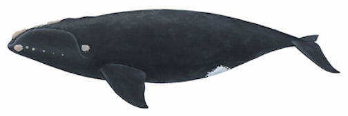


## Black Boxes Gone Wrong

3. Identifying Whales in Hydrophone Recordings
  - Cornell University held a contest to identify Right Whales
  - Winner had astonishingly high accuracy

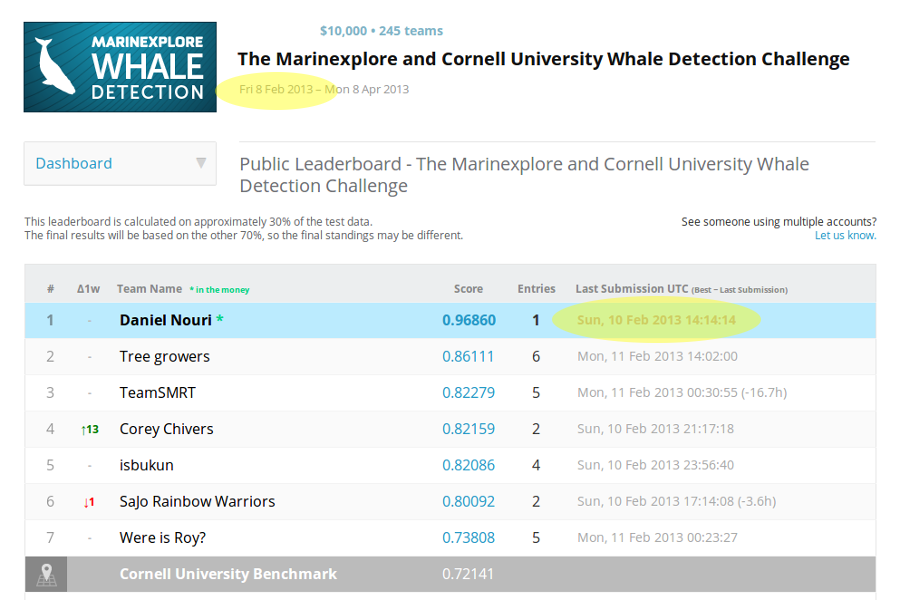{width=60%}


## Black Boxes Gone Wrong

3. Identifying Whales in Hydrophone Recordings
  - Cornell University held a contest to identify Right Whales
  - Winner had astonishingly high accuracy
  - Algorithm worked by taking advantage of recording metadata

## Black Boxes Gone Wrong

3. Identifying Whales in Hydrophone Recordings
  - Recordings without whales always had a length rounded to 10s of _milliseconds_
  - Enough to get AUC of 0.945
  - After removing data leakage, AUC dropped from 0.99+ to 0.59


## When Interpretability?

- Sometimes we do not care about the reason for a prediction:
  - Low Stakes
  - Very highly vetted (OCR, modern image recognition, etc)


## When Interpretability?

- Sometimes the reasons are critical
  - Detecting pedestrians or cyclists in self-driving cars

<div style="display: flex; justify-content: center; gap: 2%; width: 85%; margin: auto;">

{width=400}

{width=400}
</div>


## When Interpretability?

 - Sometimes the reasons are critical 
  - Extending or denying credit or loans
  - Making a decision: Will customer churn because we talked to them too much or too little?
  - High $ value decisions with stakeholders


## What is Interpretability?

- Biran and Cotton 2017:


::: {style="border: 2px solid black; padding: 20px; border-radius: 5px;"}
Interpretability is the degree to which a human can understand the cause of a decision.
:::


## Interpretability Features

- Interpretability is __Contrastive__

- You want to explain a certain prediction or decision was made instead of an
alternative

- How would my odds of approval change if I had less credit card debt?


## Interpretability Features

- Interpretability is __Selective__

- You want to focus on the most important few features, not every single feature


## Interpretability Features

- Interpretability is __Social__

- What counts as a good explanation depends on who you are talking to:
  - Data Scientist Colleague
  - Regulator
  - Non-technical manager
  - Customer


## Interpretability Methods

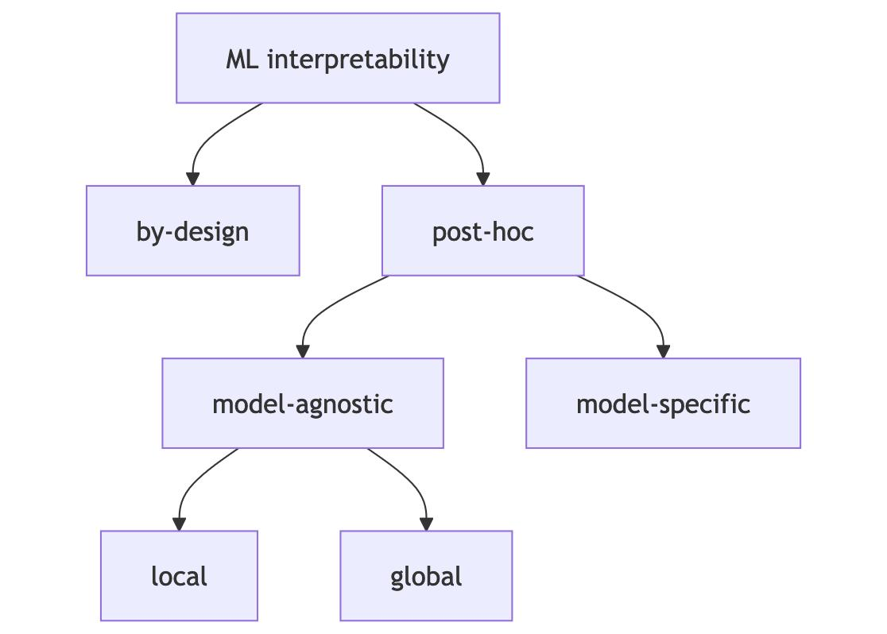


## Interpretability Methods

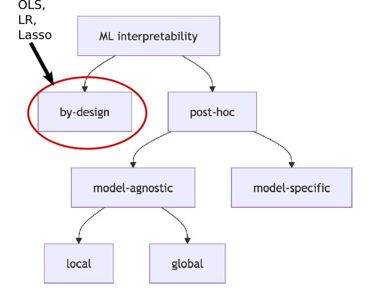


## Interpretability Methods

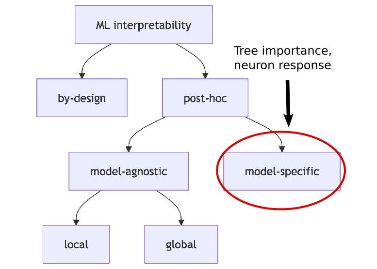


## Interpretability Methods

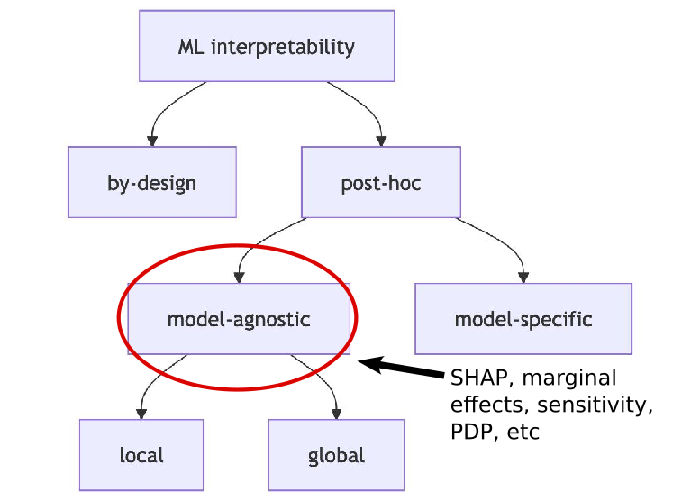


## Post-Hoc Model-Agnostic Ingredients

Everything uses __SIPA__:

1. Sample from the data
2. Intervene on some variables
3. Predict the outcome
4. Aggregate the results


## Bikeshare Example

- Washington DC Hourly Bike Share Data
- Target is 'cnt' variable
- Features are weather, type of day, time of day, etc

```{python}

bike = pd.read_csv('bike.csv')
hour = pd.read_csv('hour.csv')

hour = hour.merge(bike[["dteday", "cnt_2d_bfr","days_since_2011"]], on="dteday", how="left")


hour = hour.dropna(subset=["cnt_2d_bfr"])

hour_reduced = hour.drop(columns=["instant", "dteday","casual","registered"])


hour_reduced.head(5)

```


## Bikeshare Model

- How does our Random Forest Perform?

```{python}

X = hour_reduced.drop(columns=["cnt"])
y = hour_reduced["cnt"]


feature_names = X.columns.tolist()

# We will do a time split

split = int(len(X) * 0.8)
X_train, X_test = X[:split], X[split:]
y_train, y_test = y[:split], y[split:]

rf = RandomForestRegressor(n_estimators=100, max_depth=15, n_jobs=-1, random_state=100000)

rf.fit(X_train, y_train)
y_pred = rf.predict(X_test)

print(f"RMSE: {np.sqrt(mean_squared_error(y_test, y_pred)):.1f}")
print(f"\$R^2\$: {r2_score(y_test, y_pred):.3f}")

```

- Not awful, but this is very lazy

## Bikeshare Model by Hour


- Let's look at the predictive accuracy by hour

```{python}

r2_by_hour = (
    X_test.assign(y_true=y_test.values, y_pred=y_pred)
    .groupby("hr")
    .apply(lambda g: r2_score(g["y_true"], g["y_pred"]))
    )


angles = np.linspace(0, 2 * np.pi, 24, endpoint=False)

fig, ax = plt.subplots(subplot_kw={"projection": "polar"})
ax.vlines(angles, 0, r2_by_hour.values, linewidth=4)
ax.set_xticks(angles)
ax.set_xticklabels(range(24), fontsize=16)
ax.set_theta_offset(np.pi / 2)
ax.set_theta_direction(-1)
ax.set_ylim(0, 1)
ax.tick_params(axis="y", labelsize=16)
ax.set_rlabel_position(360 * 4 / 24)
ax.set_yticks([0.2, 0.4, 0.6,0.8])
ax.set_title("R^2 by hour", y=1.08,fontsize=24);


```


## Bikeshare Model by Hour


- Let's look at the predictive accuracy by hour

```{python}

r2_by_hour = (
    X_test.assign(y_true=y_test.values, y_pred=y_pred)
    .groupby("hr")
    .apply(lambda g: r2_score(g["y_true"], g["y_pred"]))
    )


angles = np.linspace(0, 2 * np.pi, 24, endpoint=False)

fig, ax = plt.subplots(subplot_kw={"projection": "polar"})
ax.vlines(angles, 0, r2_by_hour.values, linewidth=4)
ax.set_xticks(angles)
ax.set_xticklabels(range(24), fontsize=16)
ax.set_theta_offset(np.pi / 2)
ax.set_theta_direction(-1)
ax.set_ylim(0, 1)
ax.tick_params(axis="y", labelsize=16)
ax.set_rlabel_position(360 * 4 / 24)
ax.set_yticks([0.2, 0.4, 0.6,0.8])
ax.set_title("R^2 by hour", y=1.08,fontsize=24);


```

## Tree Importance

```{python}


feature_imp = pd.DataFrame(
    {'importance': rf.feature_importances_},
    index=feature_names
).sort_values(by='importance', ascending=False)

fig, ax = plt.subplots(figsize=(10, 6))
feature_imp.head(15).plot.barh(ax=ax, legend=False, color="#21918C")
ax.invert_yaxis()
ax.set_xlabel("Feature Importance", fontsize=16)
ax.set_title("Bike Share Feature Importances", fontsize=20)
ax.tick_params(axis="both", labelsize=13)
plt.tight_layout()


```

## Flaws of Tree Importance

- Just tells us magnitude
- No direction
- No interactions
- No local dependence


## Local Versus Global

- Local looks at the impact of features at a specific data point.
- Ceteris Parabis plots (or "Slope" or "Marginal Effect"):

```{python}


instance = X_test.iloc[0].copy()


hours = np.arange(24)
preds = []
for h in hours:
    instance["hr"] = h
    preds.append(rf.predict(instance.values.reshape(1, -1))[0])

plt.plot(hours, preds, marker="o", markersize=4)
plt.xlabel("Hour")
plt.ylabel("Predicted bike count")
plt.title(f"Individual Conditional Expectation: workingday={int(instance['workingday'])}, temp={instance['temp']:.2f}");
plt.tight_layout()


```

## Local Versus Global

- Global looks at the impact of the feature averaged over many instances
- Partial Dependence Plot averages all of the Conditional Expectation Curves

```{python}
#| echo: true
#| eval: false

PartialDependenceDisplay.from_estimator(rf, 
  X_test, 
  features=["hr"], 
  grid_resolution=24)


```


## Local Versus Global

- Global looks at the impact of the feature averaged over many instances
- Partial Dependence Plot averages all of the Conditional Expectation Curves

```{python}

with plt.rc_context({"font.size": 18}):
    PartialDependenceDisplay.from_estimator(rf, X_test, features=["hr"], grid_resolution=24)


```


## Local Versus Global

- Global looks at the impact of the feature averaged over many instances
- Partial Dependence Plot averages all of the Conditional Expectation Curves

```{python}

with plt.rc_context({"font.size": 18}):
    pdp_plot = PartialDependenceDisplay.from_estimator(rf, X_test.astype(float), features=["hr"], grid_resolution=24,kind="both", subsample=1000, random_state=1, ice_lines_kw={"alpha": 0.05},pd_line_kw={"linewidth": 3, "color": "red"})


```


## SHAP

- SHAP is a _newish_ tool that is complex but has some very nice additional features:
  - Divides attribution additively between the features for each prediction/decision
  - Can easily make comparisons (Why did you approve person A instead of Person B)
  - Some very good theoretical properties!


## Shapley Values

- The idea of Shapley is based on averaging lots of conditional expectations:
- Target feature is $x_t$
- Conditional features are $\mathbf{x}_c$
- Look at:
$$
E(\hat{f}| x_t, x_c) - E(\hat{f}| x_c)
$$ 
- Suppose we know the features $\mathbf{x}_c$. How much does knowing $x_t$  change the expeced prediction?


## Shapley Values

- The idea of Shapley is based on averaging lots of conditional expectations:
- Target feature is $x_t$
- Conditional features are $\mathbf{x}_c$
- Look at:
$$
\Delta_t(\mathbf{x}_c) = E(\hat{f}| x_t, x_c) - E(\hat{f}| x_c)
$$ 
- Suppose we know the features $\mathbf{x}_c$. How much does knowing $x_t$  change the expected prediction?


## Shapley Values

- To get the Shapley value, we average the $\Delta_t(\mathbf{x}_c)$ over all possible combinations of features $c$:
$$
\phi_t(\mathbf{x}) = \frac{1}{N_c} \sum_{c} \Delta_t(\mathbf{x}_c)
$$
- Combinations of features are called "coalitions"
- For each data point and each feature get a "contribution"

## Shapley Example

- Consider an apartment pricing model
- Variables are: 
    - Apartment size 
    - floor level
    - Can you have a cat as a pet? 
- Predicted sales price

## Shapley Example

- Our data point is 50$m^2$, 1st floor, bans cats, near parks

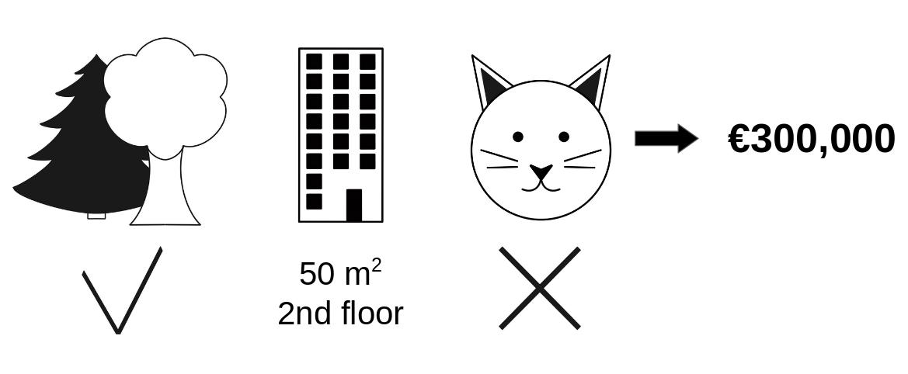


## Shapley Example

- Consider full coalition
- Just look at difference between ban cats and not

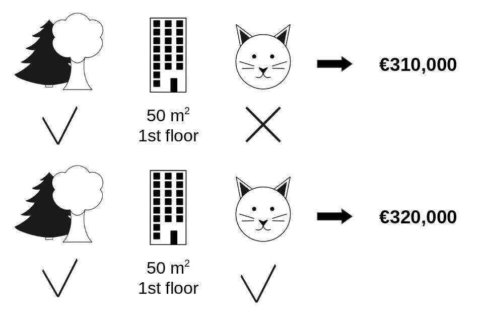


## Shapley Example

- What if cat ban was continuous, like floor area instead?
- Then you average over model predicitions of all floor areas....
  - Technically, you do this by resampling from your training data
  - Same goes for when area is in your coalition

## Shapley Coalitions

- Here are all the coalitions behind a single shapley value

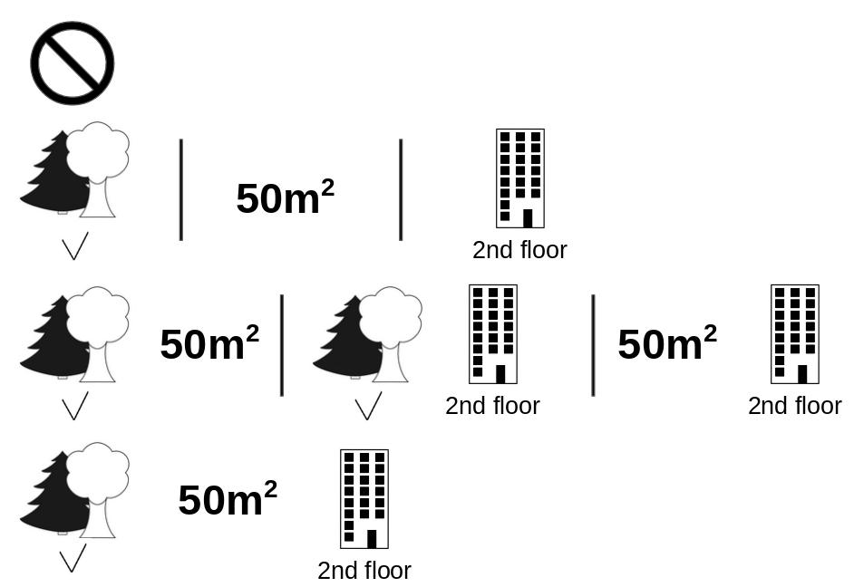


## SHAP

- Overall this is called _Shapley Additive ExPlanations_ or __SHAP__
- Big challenge: Too many possible coalitions
- Need Approximate algorithms:
  - Monte Carlo
  - KernelShap
  - TreeShap
  - Others.....


```{python}

# Commenting the expensive code and loading it 
#explainer = shap.TreeExplainer(rf, X_train)
#shap_values = explainer.shap_values(X_test,check_additivity=False)

#with open("shap_explainer.pkl", "wb") as f:
#    pickle.dump(explainer, f)
#with open("shap_values.pkl", "wb") as f:
#    pickle.dump(shap_values, f)


# So it doesn't take me forever to make these slides

with open("shap_explainer.pkl", "rb") as f:
    explainer = pickle.load(f)
with open("shap_values.pkl", "rb") as f:
    shap_values = pickle.load(f)
```

## SHAP Importance

```{python}
#| echo: true

# Code for a feature importance plot

shap.summary_plot(shap_values, X_test)

```


## SHAP Dependence Plot

```{python}
#| echo: true

# Code for a shap dependence plot

shap.dependence_plot("temp", shap_values, X_test,
    interaction_index=None)


```


## Interactions by default

```{python}
#| echo: true

# Code for a shap dependence plot with interactions picked by size


shap.dependence_plot("temp", shap_values, X_test,
    cmap=plt.cm.twilight_shifted)


```

## SHAP Interactions Plot

```{python}
#| echo: true

# Code for a shap dependence plot with interaction chosen

shap.dependence_plot("hr", shap_values, X_test, 
    interaction_index="workingday")


```


## Shap Waterfall Plot

```{python}
#| echo: true

# The waterfall plot shows how a prediction was made

shap.waterfall_plot(shap.Explanation(
    values=shap_values[0], base_values=explainer.expected_value, 
    data=X_test.iloc[0]
))


```


## Shap Waterfall Plot v2

```{python}
#| echo: true

# 6 hours later waterfall plot

shap.waterfall_plot(shap.Explanation(
    values=shap_values[6], base_values=explainer.expected_value, 
    data=X_test.iloc[6]
))


```


## Shap Plot for the worst prediction

```{python}

errors = np.abs(y_test.values - y_pred)
idx = np.argmax(errors)

print(hour.iloc[X_test.index[idx]]["dteday"])

shap.waterfall_plot(shap.Explanation(
    values=shap_values[idx], base_values=explainer.expected_value, data=X_test.iloc[idx]
))

```


## Thanks!