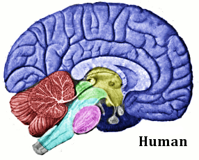
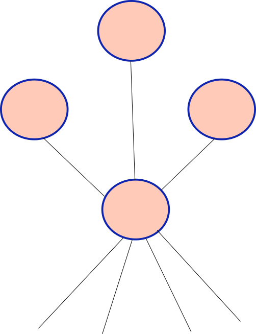
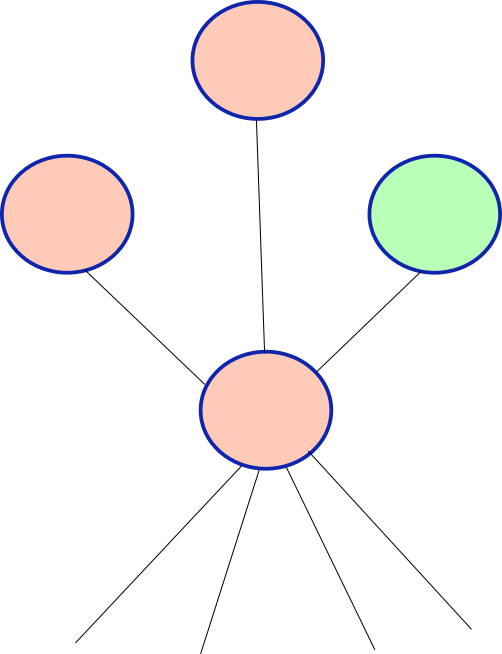
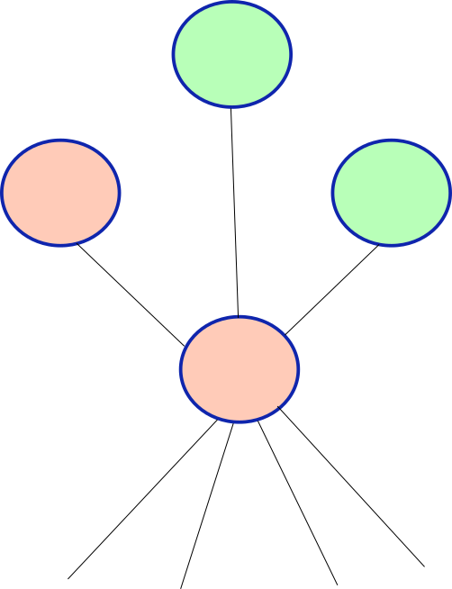
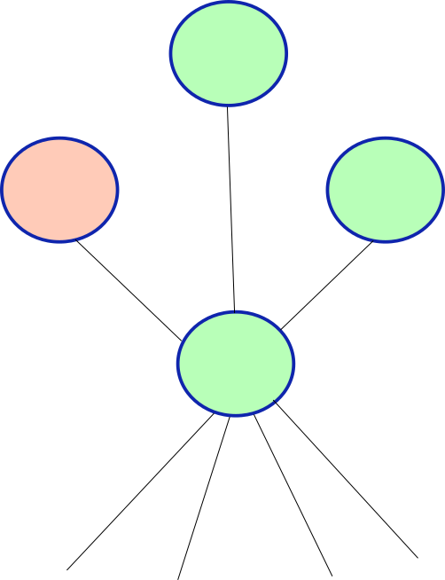
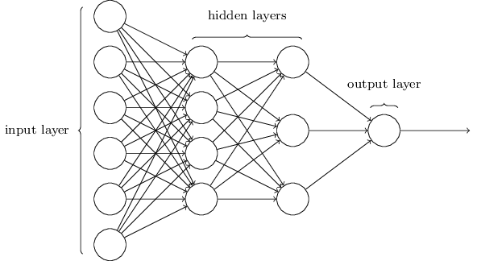
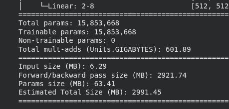
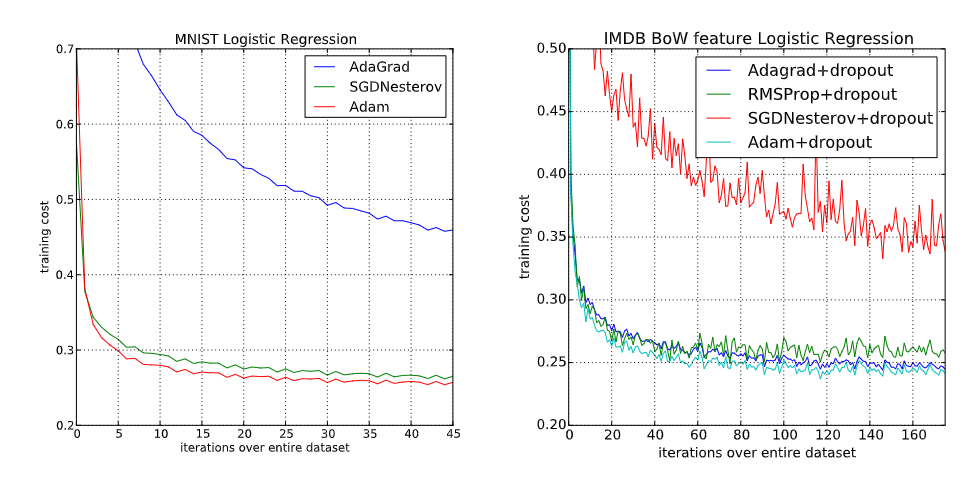

## Week Summary

- Contact me ASAP if you haven't scheduled MVP demo
- Lab 7 due Sunday November 29th
- You will want a Google Colab Pro student account!!!
- Vignette on neural networks in Colab

## Neural Network Gameplan

- Week 12: Basics, pytorch, activation functions, optimization algos
- Week 13: CNNs, RNNs, Deep Learning Considerations, vision applications
- Week 14: Pretrained Networks, Transfer Learning, text applications


## Introduction to Neural Networks

- Invented originally to understand how the brain works

{width=50%}

## Introduction to Neural Networks

- Was found to have an enormous number of applications
  - Classification
  - Pattern Recognition
  - Generative Models


  
  
## Introduction to Neural Networks

- Interesting objects in their own right
  - People study them as they would any other complex systems


## What is a Neuron?

- Neurons send and receive electrical signals


## Connected Neurons

:::: {.columns}


::: {.column width=50%}

- They are connected to other neurons


:::

::: {.column width=50%}
{width=60%}
:::

::::


## Connected Neurons

:::: {.columns}

::: {.column width=50%}


- They are connected to other neurons
- They respond to stimulus from senses and other neurons

:::

::: {.column width=50%}
{width=60%}
:::

::::


## Connected Neurons

:::: {.columns}


::: {.column width=50%}

- They are connected to other neurons
- They respond to stimulus from senses and other neurons


:::

::: {.column width=50%}
{width=60%}
:::

::::


## Connected Neurons

:::: {.columns}


::: {.column width=50%}

- They are connected to other neurons
- They respond to stimulus from senses and other neurons
- Cross a threshold before firing

:::

::: {.column width=50%}
{width=60%}
:::

::::


## Connected Neurons

:::: {.columns}


::: {.column width=50%}

- They are connected to other neurons
- They respond to stimulus from senses and other neurons
- Cross a threshold before firing


:::


::: {.column width=50%}
{width=60%}
:::

::::


## Connected Neurons

:::: {.columns}


::: {.column width=50%}

- They are connected to other neurons
- They respond to stimulus from senses and other neurons
- Cross a threshold before firing
- Neuronal Cascade is part of cognition

:::

::: {.column width=50%}
{width=60%}
:::

::::


## Single Neuron 

- Single Neuron converts several inputs into an output:


## Single Neuron

- Integrates over the input signals using weights:
$$
x_{\mathrm{out}} = \phi\left(\sum_{i=1}^n w_ix_i + c\right)
$$

## Single Neuron

- Integrates over the input signals using weights:
$$
x_{\mathrm{out}} = \phi\left(\sum_{i=1}^n w_ix_i + c\right)
$$

- $\phi$ is called the activation function
- $w_i$ are the weights
- $c$ is the bias

## Activation Functions

- Biology intuition: 
  - $\phi=1$ when integrated inputs positive
  - $\phi=0$ or $\phi=-1$ (doesn't matter) when integrated input negative
- Leads to step/sigmoid functions:

```{python}
import matplotlib.pyplot as plt
import numpy as np
xvec = np.linspace(-10,10,100)
yvec = np.tanh(xvec)

plt.figure(figsize=(6, 3))
plt.plot(xvec, yvec, color='dodgerblue', linewidth=2)
plt.title('Activation Function', fontsize=16)
plt.xlabel('x', fontsize=14)
plt.ylabel('$\phi(x)$', fontsize=14)
plt.grid(True, which='both', linestyle='--', linewidth=0.5, alpha=0.7)
plt.axhline(0, color='gray', linewidth=1)
plt.axvline(0, color='gray', linewidth=1)
plt.legend()
plt.tight_layout()
plt.show()


```

## Activation Functions to Know

- Perceptron
$$
\phi(x) = \cases{1& \text{if} \quad x\geq 0 \\
                0& \text{if} \quad x<0}
$$
```{python}
xvec = np.linspace(-10,10,100)
yvec = np.heaviside(xvec,0)

plt.figure(figsize=(8, 4))
plt.plot(xvec, yvec, color='dodgerblue', linewidth=2)
plt.title('Perceptron', fontsize=16)
plt.xlabel('x', fontsize=14)
plt.ylabel('$\phi(x)$', fontsize=14)
plt.grid(True, which='both', linestyle='--', linewidth=0.5, alpha=0.7)
plt.axhline(0, color='gray', linewidth=1)
plt.axvline(0, color='gray', linewidth=1)
plt.tight_layout()
plt.show()


```


## Activation Functions to Know

- Sigmoid Function

$$
\phi(x) = \frac{1}{1+e^{-x}}
$$

```{python}

xvec = np.linspace(-10,10,100)
yvec = 1.0/(1+np.exp(-xvec))

plt.figure(figsize=(8, 4))
plt.plot(xvec, yvec, color='dodgerblue', linewidth=2)
plt.title('Sigmoid', fontsize=16)
plt.xlabel('x', fontsize=14)
plt.ylabel('$\phi(x)$', fontsize=14)
plt.grid(True, which='both', linestyle='--', linewidth=0.5, alpha=0.7)
plt.axhline(0, color='gray', linewidth=1)
plt.axvline(0, color='gray', linewidth=1)
plt.tight_layout()
plt.show()


```


## Activation Functions to Know

- Hyperbolic Tangent

$$
\phi(x) = \frac{e^x - e^{-x}}{e^x +e^{-x}}
$$


```{python}
xvec = np.linspace(-10,10,100)
yvec = np.tanh(xvec)

plt.figure(figsize=(8, 4))
plt.plot(xvec, yvec, color='dodgerblue', linewidth=2)
plt.title('Hyperbolic Tangent', fontsize=16)
plt.xlabel('x', fontsize=14)
plt.ylabel('$\phi(x)$', fontsize=14)
plt.grid(True, which='both', linestyle='--', linewidth=0.5, alpha=0.7)
plt.axhline(0, color='gray', linewidth=1)
plt.axvline(0, color='gray', linewidth=1)
plt.tight_layout()
plt.show()

```


## Activation Functions to Know

- Rectified Linear Unit (ReLU)

$$
\phi(x) = \cases{0& \text{if} \quad x\geq 0 \\
                x& \text{if} \quad x<0}
$$

```{python}
import pandas as pd
xvec = np.linspace(-10,10,100)
yvec = np.heaviside(xvec,0)*xvec

plt.figure(figsize=(8, 4))
plt.plot(xvec, yvec, color='dodgerblue', linewidth=2)
plt.title('ReLU', fontsize=16)
plt.xlabel('x', fontsize=14)
plt.ylabel('$\phi(x)$', fontsize=14)
plt.grid(True, which='both', linestyle='--', linewidth=0.5, alpha=0.7)
plt.axhline(0, color='gray', linewidth=1)
plt.axvline(0, color='gray', linewidth=1)
plt.tight_layout()
plt.show()


```

## Feedforward Neural Networks

- Input layer, one neuron per input variable
- One neuron per target function
- Neurons organized in layers



## Feedforward Examples

- Image Recognition
  - Input Neurons are pixels
  - Output neurons correspond to each category
  - Inner Layers Represent Features
  - Can use a softmax layer at the end to determine category


## Neural Network Considerations

- Even a small NN can be huge:



- Need lots of data
- Lots of different regularization

## What are NNs used for?

- Anything where the features are abstract
  - Images
  - Audio
  - Text
- Large amounts of data
- Tabular data problems decision trees often just as good but with less trouble


## How would you train one?

- Have set of training data $\mathbf{x}_i$ and target $y_i$
- Have settled on an architecture:
  - $n_i$ neurons in layer $i$
  - $m$ total layers
  - $w_{jk,i}$ is weight of neuron $j$ in layer $i-1$ on neuron $k$ in layer $i$
  - $b_{ki}$ is bias of neuron $k$ in layer $i$
  
## How would you train one?

- Overall neural network generates a function:
$$
y_{\mathrm{pred}} = F(\mathbf{x})
$$
- Evaluate function by stepping through the layers in order
- Can define a loss minimization problem:
$$
\min_{\mathbf{w},\mathbf{b}} \sum_{l=1}^N \Phi(y_l,F(\mathbf{x},\mathbf{w},\mathbf{b}))
$$


## Backpropagation

- In order to optimize, compute the gradient
- Repeated application of the chain rule
- NN packages use the network structure to efficiently compute the gradients
- Referred to as backpropagation
- Related technique of automatic differentiation

## `pytorch`

- Open Source Machine Learning Library from Meta/FB
- PyTorch optimizes usability while maintaining good performance
  - No small task when dealing with GPUs
- PyTorch favors simple over easy
  - A little bit harder at first when working with GPUs
  - But easier to debug when you build complex models
- Python First

## `tensors`

- Primary data object in `pytorch` is called a `tensor`

```{python}
#| echo: true

import torch
import numpy as np

data = [[1, 2],[3, 4]]
x_data = torch.tensor(data)
x_data


```

## `tensors`

- Tensors are like magic numpy arrays
  - They live on a particular device:
```{python}
#| echo: true
print(f"Device tensor is stored on: {x_data.device}")

```

- When programming with GPUs, you must manually control the movement of tensor data across the cluster


## What is a GPU

- Normal computers have several (~20) very powerful cores
  - Each core can do complex operations sequentially
- GPU has huge number (~10,000) of very basic cores
  - Cores can just multiply and add
  - Cores work in parallel
  - Perfect for Neural Networks

## `tensors`

- Tensors are like magic numpy arrays
  - They come with automatic gradient tracking
  - When you perform a computation with a tensor, `pytorch` stores the computational graph
  - `*.backward()` computes gradient

```{python}
#| echo: true

x = torch.ones(5)  # input tensor
y = torch.zeros(3)  # expected output
w = torch.randn(5, 3, requires_grad=True)
b = torch.randn(3, requires_grad=True)
z = torch.matmul(x, w)+b
loss = torch.nn.functional.binary_cross_entropy_with_logits(z, y)

loss.backward()

```

## `tensors`

- `loss.backward()` updated the tensors `w` and `b` to include the
gradient with respect to `loss`
$$
\frac{\partial \mathrm{loss}}{\partial \mathbf{w}},\quad \frac{\partial \mathrm{loss}}{\partial \mathbf{b}},
$$
```{python}
#| echo: true
print(w.grad)
print(b.grad)

```

## Dataloaders

- `pytorch` is written to separate model building/training and dataset management
- `torch.utils.data.Dataset` enables built in datasets
- `torch.utils.data.DataLoader` is for managing and iterating over datasets


## DataLoaders

- This code will download the fashion-mnist dataset and prep it for use:

```{python}
#| echo: true
import torch
from torch.utils.data import Dataset
from torchvision import datasets
from torchvision.transforms import ToTensor
import matplotlib.pyplot as plt


training_data = datasets.FashionMNIST(
    root="data",
    train=True,
    download=True,
    transform=ToTensor()
)

test_data = datasets.FashionMNIST(
    root="data",
    train=False,
    download=True,
    transform=ToTensor()
)

```

## Constructing a Neural Network {.smaller}

- Neural Network architectures are constructed using the nn.Module class

```{python}
#| echo: true

import torch.nn as nn
import torch.nn.functional as F
import torch.optim as optim


# The network class contains the intializer and some methods for our neural network
# You create a network by calling Network([Nodes_Input,Nodes_2,Nodes_3,...,Nodes_Output]) 

class Network(nn.Module):
    def __init__(self, sizes):
        super(Network, self).__init__()
        self.sizes = sizes
        self.num_layers = len(sizes)
        
        self.layers = nn.ModuleList()
        for i in range(self.num_layers - 1):
            layer = nn.Linear(sizes[i], sizes[i+1])
            nn.init.xavier_normal_(layer.weight)   # Good initialization for shallow/sigmoid nets
            #nn.init.kaiming_normal_(layer.weight, mode='fan_out', nonlinearity='relu') initialization for relus
            #nn.init.kaiming_uniform_(layer.weight, mode='fan_out', nonlinearity='relu') initialization for relus and deep nets

            nn.init.zeros_(layer.bias)               # initialize the bias to 0
            self.layers.append(layer)
    
    # Forward is the method that calculates the value of the neural network. Basically we recursively apply the activations in each
    # layer
    
    def forward(self, x):
        for layer in self.layers[:-1]:
            x = nn.sigmoid(layer(x))   # sigmoid layers
            #x = F.relu(layer(x)) # You will try the relu layer in the last problem
        x = self.layers[-1](x) 
        return x

```

## Initializing a Network

- Can call the constructor to make your network:

```{python}
#| echo: true
Network([784,100,10])

```

## Training a network 

- Define Training Function

```{python}
def train(network, train_data, epochs, eta, test_data=None):
 
    optimizer = optim.SGD(network.parameters(),momentum=0.8,nesterov=True, lr=eta,weight_decay=1e-5)
    loss_fn = nn.CrossEntropyLoss()
    
    loss_history = []      
    accuracy_history = []  
    train_accuracy_history = []

    # We are going to loop over the epochs
    for epoch in range(epochs):
        # This puts the network into training mode
        network.train()
        running_loss = 0.0
        batch_count = 0

        # Now we loop through the batches to train
        for data, target in train_data:
            optimizer.zero_grad() # This clears the internally stored gradients
            output = network(data) # evaluate the neural network on the minibatch, we will compare this to the target
            # Here we calculate the loss function and then use backpropagation
            # to calculate the gradient
            loss = loss_fn(output, target) 
            loss.backward()
        
            # Update the weights
            optimizer.step()
            
            running_loss += loss.item()
            batch_count += 1
            
        # Track our metrics
        avg_loss = running_loss / batch_count
        loss_history.append(avg_loss)
        # Compute our training set accuracy
        train_acc = evaluate(network,train_data)
        train_accuracy_history.append(train_acc)
        
        # Compute our test set accuracy
        acc = evaluate(network, test_data)
        accuracy_history.append(acc)
        
        # Update the status of our run at this epoch
        print(f"Epoch {epoch+1}: Avg loss: {avg_loss:.4f} | Test Accuracy: {acc:.4f} | Train Accuracy: {train_acc:.4f} ")
    
    return loss_history, train_accuracy_history, accuracy_history


def evaluate(network, test_data):
    network.eval()
    correct = 0
    total = 0
    # We have the "with torch.no_grad()" line for efficiency purposes
    with torch.no_grad():
        for data, target in test_data:
            output = network(data)
            pred = output.argmax(dim=1, keepdim=True)
            correct += pred.eq(target.view_as(pred)).sum().item()
            total += data.size(0)
    acc = correct / total
    return acc


```

```{python}
#| echo: true
#| eval: false
def train(network, train_data, epochs, eta, test_data=None):
 
    optimizer = optim.SGD(network.parameters(),momentum=0.8,nesterov=True, lr=eta,weight_decay=1e-5)
    loss_fn = nn.CrossEntropyLoss()
    
    loss_history = []      
    accuracy_history = []  
    train_accuracy_history = []

    # We are going to loop over the epochs
    for epoch in range(epochs):
        # This puts the network into training mode
        network.train()
        running_loss = 0.0
        batch_count = 0


```

## Training a Network 

- Loop over batches of training examples

```{python}
#| echo: true
#| eval: false

        # Now we loop through the batches to train
        for data, target in train_data:
            optimizer.zero_grad() # This clears the internally stored gradients
            output = network(data) # evaluate the neural network on the minibatch, we will compare this to the target
            # Here we calculate the loss function and then use backpropagation
            # to calculate the gradient
            loss = loss_fn(output, target) 
            loss.backward()
        
            # Update the weights
            optimizer.step()
            
            running_loss += loss.item()
            batch_count += 1


```


## Loading Data

```{python}
#| echo: true
from torchvision import datasets, transforms
from torch.utils.data import DataLoader

transform = transforms.Compose([transforms.ToTensor(), transforms.Lambda(lambda x: x.view(-1))])


train_dataset = datasets.FashionMNIST('data/', train=True, download=True, transform=transform)
test_dataset = datasets.FashionMNIST('data/', train=False, transform=transform)

img, label = training_data[100]

plt.imshow(img.squeeze(),cmap="gray")

```

## Train

```{python}
#| echo: true
#| eval: false


train_loader = DataLoader(train_dataset, batch_size=10, shuffle=True)
test_loader = DataLoader(test_dataset, batch_size=10, shuffle=False)

# Initialize network
net = Network([784, 30, 10])

# Train
train(net, train_loader, epochs=1, eta=0.01, test_data=test_loader)


```


## Optimization Basics

:::: {.columns}

::: {.column width=35%}
- Simplified loss landscape:
- Imagine more dimensions
:::

::: {.column width=65%}
```{python}

%matplotlib inline

from mpl_toolkits.mplot3d import Axes3D
import matplotlib.pyplot as plt
from matplotlib import cm
from IPython.display import HTML
from matplotlib.colors import LogNorm

import numpy as np

```

```{python}
def himmel(x,y):
    return( (x**2+y-11)**2 + (x+y**2-7)**2)


def grad_himmel(params):
    x = params[0]
    y = params[1]

    grad_x = 4*x*(x**2+y-11) + 2*(x+y**2-7)
    grad_y = 2*(x**2+y-11) + 4*y*(x+y**2-7)
    return([grad_x,grad_y])

```

```{python}


def plot_surface(x, y, z, azim=0, elev=60, dist=30, cmap="magma"):

    fig = plt.figure()
    ax = fig.add_subplot(111, projection='3d')
    plot_args = {'rstride': 1, 'cstride': 1, 'cmap':cmap,
             'linewidth': 20, 'antialiased': True,
             'vmin': 0, 'vmax': 200}
    ax.plot_surface(x, y, z, **plot_args)
    ax.view_init(azim=azim, elev=elev)
    ax.dist=dist
    ax.set_xlim(-5, 5)
    ax.set_ylim(-5, 5)
    ax.set_zlim(0, 200)
    
    plt.xticks([-5, -2, 0, 2, 5], ["-5", "-2", "0", "2", "5"])
    plt.yticks([-5, -2, 0, 2, 5], ["-5", "-2", "0", "2", "5"])
    ax.set_zticks([0, 50, 100, 150,200])
    ax.set_zticklabels(["0", "50", "100", "150","200"])
    
    ax.set_xlabel("x", fontsize=18)
    ax.set_ylabel("y", fontsize=18)
    ax.set_zlabel("z", fontsize=18)
    return fig, ax;


x, y = np.mgrid[-5:5:100j, -5:5:100j]
fig1,ax1=plot_surface(x,y,himmel(x,y))


plt.show()


```
:::

::::


## Gradient Descent


:::: {.columns}

::: {.column width=50%}

```{python}

def contour_himmel():
    x, y = np.meshgrid(np.arange(-5, 5, 0.01), np.arange(-5, 5, 0.01))
    fig, ax = plt.subplots(figsize=(6, 6))
    z=himmel(x,y)
    #cax = ax.contourf(x, y, z, levels=np.logspace(-4, 10, 35), norm=LogNorm(), cmap="magma")
    cax = ax.contourf(x,y,1.0+z,levels = np.logspace(0,2.5,50),norm=LogNorm(),cmap="magma")

    ax.set_xlabel('$x$',fontsize=18)
    ax.set_ylabel('$y$',fontsize=18)
    ax.set_title("Loss Function",fontsize=18)
    ax.set_xlim((-4.5, 4.5))
    ax.set_ylim((-4.5, 4.5))
    
    return fig,ax

fig1,ax1 = contour_himmel()
plt.show()

```

:::

::: {.column width=50%}

- Start at $\mathbf{x}_0$
- Find gradient $\nabla \mathrm{loss}(\mathbf{x})$
- $\mathbf{x}_n = \mathbf{x}_{n-1} - \kappa \nabla\mathrm{loss}(\mathbf{x}_{n-1})$
- $\kappa$ is _learning rate_

:::

::::


## What Learning Rate to Pick?

- High learning rate trains faster
- Too high and don't converge at all
- Limit is set by algorithm and ellipticity of well


## What Learning Rate to Pick?


:::: {.columns}

::: {.column width=50%}

```{python}

def gd(grad, init, n_epochs=1000, eta=10**-4, noise_strength=0):
    #This is a simple optimizer
    params=np.array(init)
    param_traj=np.zeros([n_epochs+1,2])
    param_traj[0,]=init
    v=0;
    for j in range(n_epochs):
        noise=noise_strength*np.random.randn(params.size)
        v=eta*(np.array(grad(params))+noise)
        params=params-v
        param_traj[j+1,]=params
    return param_traj


def overlay_trajectory_contour(ax,trajectory, label,color='k',lw=2):
    xs=trajectory[:,0]
    ys=trajectory[:,1]
    ax.plot(xs,ys, color, label=label,lw=lw)
    return ax;

def quadratic(x,y,a=1,b=10):
    return a*x**2+b*y**2-1

def grad_quadratic(params,a=1,b=10):
    x=params[0]
    y=params[1]
    grad_x= 2*a*x
    grad_y= 2*b*y
    return [grad_x,grad_y]
  
def contour_quadratic():
    x, y = np.meshgrid(np.arange(-4.5, 4.5, 0.2), np.arange(-4.5, 4.5, 0.2))
    fig, ax = plt.subplots(figsize=(6,4))
    z=quadratic(x,y)+1
    cax = ax.contourf(x, y, z, levels=np.logspace(-1, 2.5, 35), norm=LogNorm(), cmap="magma")
    ax.plot(0,0, 'r*', markersize=18)

    ax.set_xlabel('$x$')
    ax.set_ylabel('$y$')

    ax.set_xlim((-4.5, 4.5))
    ax.set_ylim((-4.5, 4.5))
    
    return fig,ax
  

x, y = np.meshgrid(np.arange(-4.5, 4.5, 0.2), np.arange(-4.5, 4.5, 0.2))

fig, ax = contour_quadratic()


#initial point
init1=[-4,4]
kappa = 0.09

gd_1=gd(grad_quadratic,init1, n_epochs=100, eta=kappa)
gd_opt=gd(grad_quadratic,init1, n_epochs=100, eta=0.05)

overlay_trajectory_contour(ax,gd_1,'$\eta=$%s'% kappa,'k', lw=1)

plt.show()


```
:::

::: {.column width=50%}
- Steepness discrepancy limits learning rate
- Most of the step is in wrong direction
:::
::::


## Momentum

- Advanced algos use momentum, gives "memory" of past gradient
- Reduces effect of valley oscillation

```{python}
def gd_with_mom(grad, init, n_epochs=5000, eta=10**-4, beta=0.9,gamma=0.9):
    params=np.array(init) # Start with initial condition
    param_traj=np.zeros([n_epochs+1,2]) # Save the entire trajecotry
    param_traj[0,]=init # Also save the initial condition to the trajectory
    
    v=0 # Starting with 0 momentum
    
    # Epochs is borrowing term from machine learning
    # Here it means timestep
    
    for j in range(n_epochs): 
        v=gamma*v+(np.array(grad(params))) # Compute v
        params=params-eta*v  # Update the location
        param_traj[j+1,]=params # Save the trajectory
    return param_traj


```


:::: {.columns}

::: {.column width=50%}

```{python}

x, y = np.meshgrid(np.arange(-4.5, 4.5, 0.2), np.arange(-4.5, 4.5, 0.2))

fig, ax = contour_quadratic()


#initial point
init1=[-4,4]
kappa =  0.1154431

mom_traj=gd_with_mom(grad_quadratic,init1, n_epochs=100, eta=kappa,gamma=0.26987)
#mom_traj_slow = gd_with_mom(grad_quadratic,init1, n_epochs=100, eta=0.01,gamma=0.9)

overlay_trajectory_contour(ax,mom_traj,'$\eta=$%s'% kappa,'k', lw=1)

plt.show()

```

:::

::: {.column width=50%}

```{python}
fig, ax = plt.subplots(figsize=(6,4))

ax.plot(np.log10(np.linalg.norm(mom_traj,axis=1)),label="MOM")
ax.plot(np.log10(np.linalg.norm(gd_opt,axis=1)),label="GD")
ax.legend()
plt.title("Comparison of GD and GD with momentum ")
plt.ylabel("log10 error")
plt.xlabel("timestep")
plt.show()
```

:::
::::


## Hyperparameter Problems

- We don't know the shape of the loss landscape to pick $\kappa$
- We handle this several ways:
  - Experimentation
  - Heuristics
  - Adaptive Methods


## Stochastic Gradient Descent

- Common for optimization algorithms to "get stuck"

```{python}
import pandas as pd
gd_accuracy = pd.read_csv("gd_no_noise_accuracy.csv")
plt.plot(gd_accuracy)
plt.title("Classification Accuracy on MNIST")
plt.xlabel("Epoch")
plt.ylabel("Classication Accuracy (%)")
plt.ylim(0,100)

```


## Stochastic Gradient Descent

- In low-D local minima are problematic

```{python}

def beales_function(x,y):
    return np.square(1.5-x+x*y)+np.square(2.25-x+x*y*y)+np.square(2.625-x+x*y**3)
    return f

def grad_beales_function(params):
    x=params[0]
    y=params[1]
    grad_x=2*(1.5-x+x*y)*(-1+y)+2*(2.25-x+x*y**2)*(-1+y**2)+2*(2.625-x+x*y**3)*(-1+y**3)
    grad_y=2*(1.5-x+x*y)*x+4*(2.25-x+x*y**2)*x*y+6*(2.625-x+x*y**3)*x*y**2
    return [grad_x,grad_y]


def contour_beales_function():
    #plot beales function
    x, y = np.meshgrid(np.arange(-4.5, 4.5, 0.2), np.arange(-4.5, 4.5, 0.2))
    fig, ax = plt.subplots(figsize=(10, 6))
    z=beales_function(x,y)
    cax = ax.contourf(x, y, 1+z, levels=np.logspace(-.6, 5, 35), norm=LogNorm(), cmap="magma")
    ax.plot(3,0.5, 'r*', markersize=18)

    ax.set_xlabel('$x$')
    ax.set_ylabel('$y$')

    ax.set_xlim((-4.5, 4.5))
    ax.set_ylim((-4.5, 4.5))
    
    return fig,ax

fig, ax = contour_beales_function()
plt.show()

```

## Stochastic Gradient Descent

- Trajectories get Stuck

```{python}

Nsteps=10**5

lr_s=10**-5
noise = 0.0
init1=np.array([4,3])
fig1, ax1=contour_beales_function()

gdm_trajectory1=gd_with_mom(grad_beales_function,init1,Nsteps,eta=lr_s, gamma=0.9)

plt.legend(loc=2)

init2=np.array([1.5,1.5])

gdm_trajectory2=gd_with_mom(grad_beales_function,init2,Nsteps,eta=10**-6, gamma=0.9)

init3=np.array([-1,4])


gdm_trajectory3=gd_with_mom(grad_beales_function,init3,10**5,eta=lr_s, gamma=0.9)

init4=np.array([-4,-1])

gdm_trajectory4=gd_with_mom(grad_beales_function,init4,Nsteps,eta=lr_s, gamma=0.9)


overlay_trajectory_contour(ax1,gdm_trajectory1,label=" ",color='k', lw=2)
overlay_trajectory_contour(ax1,gdm_trajectory2,label=" ",color='m', lw=2)
overlay_trajectory_contour(ax1,gdm_trajectory3,label=" ",color='r', lw=2)
overlay_trajectory_contour(ax1,gdm_trajectory4,label=" ",color='g', lw=2)


plt.show()


```


## Stochastic Gradient Descent 

- The barriers in high dimensions likely more complex
- Stochastic Gradient Descent modifies gradient descent style methods
  - Compute the gradient of loss using only part of the data
  - Called a "mini-batch"
  - Smaller the mini-batch, the more the noise


## Stochastic Gradient Descent

```{python}
import pandas as pd
gd_noise_accuracy = pd.read_csv("gd_noise_accuracy.csv")
plt.plot(gd_accuracy,label="no noise")
plt.plot(gd_noise_accuracy,label="noise")
plt.title("Classification Accuracy on MNIST")
plt.xlabel("Epoch")
plt.ylabel("Classication Accuracy (%)")
plt.ylim(0,100)
plt.legend()

```

## Stochastic Gradient Descent

- In 2D, can just add noise

```{python}

def gd_noise_mom(grad, init, n_epochs=1000, eta=10**-4,gamma=0.9, noise_strength=0):
    #This is a simple optimizer
    params=np.array(init)
    param_traj=np.zeros([n_epochs+1,2])
    param_traj[0,]=init
    v=0;
    for j in range(n_epochs):
        noise=noise_strength*np.random.randn(params.size)
        v=gamma*v+eta*(np.array(grad(params))+noise)
        params=params-v
        param_traj[j+1,]=params
    return param_traj


Nsteps=10**5

lr_s=10**-5
noise = 400.0
init1=np.array([4,3])
fig1, ax1=contour_beales_function()

gdm_trajectory1=gd_noise_mom(grad_beales_function,init1,Nsteps,eta=lr_s, gamma=0.9,noise_strength=noise)

plt.legend(loc=2)

init2=np.array([1.5,1.5])

gdm_trajectory2=gd_noise_mom(grad_beales_function,init2,Nsteps,eta=10**-6, gamma=0.9,noise_strength=noise)

init3=np.array([-1,4])


gdm_trajectory3=gd_noise_mom(grad_beales_function,init3,10**5,eta=lr_s, gamma=0.9,noise_strength=noise)

init4=np.array([-4,-1])

gdm_trajectory4=gd_noise_mom(grad_beales_function,init4,Nsteps,eta=lr_s, gamma=0.9,noise_strength=noise)


overlay_trajectory_contour(ax1,gdm_trajectory1,label=" ",color='k', lw=2)
overlay_trajectory_contour(ax1,gdm_trajectory2,label=" ",color='m', lw=2)
overlay_trajectory_contour(ax1,gdm_trajectory3,label=" ",color='r', lw=2)
overlay_trajectory_contour(ax1,gdm_trajectory4,label=" ",color='g', lw=2)


plt.show()


```

## Annealing

- Noise can deflect you from the minimum when you are close
- Common practice is to start with noise high, reduce it later
  - Simulated annealing (from metallurgy)
- Even more common to start with high learning rate and gradually decrease it
  - Whereas in some ML applications increasing batch-size could cause overfitting


## Adaptive Methods

- We saw that hyper-parameters are hard to pick at outset
- Ideal learning rate depends on condition number and also magnitude of gradients
- Concept: Change Learning Rate as we go
  - Keep memory of gradient in each variable
  - Step in the direction of the average gradient
  - Decrease learning rate if variance is high
  - Increase learning rate if variance is low

## ADAM

- Adaptive Moment Estimation
- Have a local estimate of average gradient $\hat{\mathbf{v}}_i$
- Have a local estimate of squared gradient $\hat{G}_{s,i}$
- Adjusted learning rate based on both:
$$
\mathbf{x}_{i+1} = \mathbf{x}_i -\kappa \frac{\hat{\mathbf{v}}_i}{\sqrt{\hat{G}_{s,i}+\epsilon}}
$$


## When and Why is ADAM good?

- ADAM is much more robust to learning rate choices
- ADAM is excellent when the gradient is sparse
- ADAM is often the best in initial training stages

  


## When is ADAM bad?

- ADAM is perhaps the most widely used optimizer, the default for deep learning
- However, it is not even guaranteed to converge on easy problems
- Can generalize worse (need more regularization)
- Less memory efficient
- It is very heuristic in nature, can be improved


## Thanks