```{python}
import numpy as np
import matplotlib.pyplot as plt
from torchvision import datasets
from scipy.signal import correlate2d


%matplotlib inline

from mpl_toolkits.mplot3d import Axes3D
from matplotlib import cm
from IPython.display import HTML
from matplotlib.colors import LogNorm


```

## Week Summary

- Focus this week is convolutionary neural networks (CNNs)
- Secondary focus:
  - Heuristics for training Neural Networks
  - Deep Neural Network Issues
- Lab 7 Due this week


## Optimization Basics

:::: {.columns}

::: {.column width=35%}
- Simplified loss landscape:
- Imagine more dimensions
:::

::: {.column width=65%}
```{python}


```

```{python}
def himmel(x,y):
    return( (x**2+y-11)**2 + (x+y**2-7)**2)


def grad_himmel(params):
    x = params[0]
    y = params[1]

    grad_x = 4*x*(x**2+y-11) + 2*(x+y**2-7)
    grad_y = 2*(x**2+y-11) + 4*y*(x+y**2-7)
    return([grad_x,grad_y])

```

```{python}


def plot_surface(x, y, z, azim=0, elev=60, dist=30, cmap="magma"):

    fig = plt.figure()
    ax = fig.add_subplot(111, projection='3d')
    plot_args = {'rstride': 1, 'cstride': 1, 'cmap':cmap,
             'linewidth': 20, 'antialiased': True,
             'vmin': 0, 'vmax': 200}
    ax.plot_surface(x, y, z, **plot_args)
    ax.view_init(azim=azim, elev=elev)
    ax.dist=dist
    ax.set_xlim(-5, 5)
    ax.set_ylim(-5, 5)
    ax.set_zlim(0, 200)
    
    plt.xticks([-5, -2, 0, 2, 5], ["-5", "-2", "0", "2", "5"])
    plt.yticks([-5, -2, 0, 2, 5], ["-5", "-2", "0", "2", "5"])
    ax.set_zticks([0, 50, 100, 150,200])
    ax.set_zticklabels(["0", "50", "100", "150","200"])
    
    ax.set_xlabel("x", fontsize=18)
    ax.set_ylabel("y", fontsize=18)
    ax.set_zlabel("z", fontsize=18)
    return fig, ax;


x, y = np.mgrid[-5:5:100j, -5:5:100j]
fig1,ax1=plot_surface(x,y,himmel(x,y))


plt.show()


```
:::

::::


## Gradient Descent


:::: {.columns}

::: {.column width=50%}

```{python}

def contour_himmel():
    x, y = np.meshgrid(np.arange(-5, 5, 0.01), np.arange(-5, 5, 0.01))
    fig, ax = plt.subplots(figsize=(6, 6))
    z=himmel(x,y)
    #cax = ax.contourf(x, y, z, levels=np.logspace(-4, 10, 35), norm=LogNorm(), cmap="magma")
    cax = ax.contourf(x,y,1.0+z,levels = np.logspace(0,2.5,50),norm=LogNorm(),cmap="magma")

    ax.set_xlabel('$x$',fontsize=18)
    ax.set_ylabel('$y$',fontsize=18)
    ax.set_title("Loss Function",fontsize=18)
    ax.set_xlim((-4.5, 4.5))
    ax.set_ylim((-4.5, 4.5))
    
    return fig,ax

fig1,ax1 = contour_himmel()
plt.show()

```

:::

::: {.column width=50%}

- Start at $\mathbf{x}_0$
- Find gradient $\nabla \mathrm{loss}(\mathbf{x})$
- $\mathbf{x}_n = \mathbf{x}_{n-1} - \kappa \nabla\mathrm{loss}(\mathbf{x}_{n-1})$
- $\kappa$ is _learning rate_

:::

::::


## What Learning Rate to Pick?

- High learning rate trains faster
- Too high and don't converge at all
- Limit is set by algorithm and ellipticity of well


## What Learning Rate to Pick?


:::: {.columns}

::: {.column width=50%}

```{python}

def gd(grad, init, n_epochs=1000, eta=10**-4, noise_strength=0):
    #This is a simple optimizer
    params=np.array(init)
    param_traj=np.zeros([n_epochs+1,2])
    param_traj[0,]=init
    v=0;
    for j in range(n_epochs):
        noise=noise_strength*np.random.randn(params.size)
        v=eta*(np.array(grad(params))+noise)
        params=params-v
        param_traj[j+1,]=params
    return param_traj


def overlay_trajectory_contour(ax,trajectory, label,color='k',lw=2):
    xs=trajectory[:,0]
    ys=trajectory[:,1]
    ax.plot(xs,ys, color, label=label,lw=lw)
    return ax;

def quadratic(x,y,a=1,b=10):
    return a*x**2+b*y**2-1

def grad_quadratic(params,a=1,b=10):
    x=params[0]
    y=params[1]
    grad_x= 2*a*x
    grad_y= 2*b*y
    return [grad_x,grad_y]
  
def contour_quadratic():
    x, y = np.meshgrid(np.arange(-4.5, 4.5, 0.2), np.arange(-4.5, 4.5, 0.2))
    fig, ax = plt.subplots(figsize=(6,4))
    z=quadratic(x,y)+1
    cax = ax.contourf(x, y, z, levels=np.logspace(-1, 2.5, 35), norm=LogNorm(), cmap="magma")
    ax.plot(0,0, 'r*', markersize=18)

    ax.set_xlabel('$x$')
    ax.set_ylabel('$y$')

    ax.set_xlim((-4.5, 4.5))
    ax.set_ylim((-4.5, 4.5))
    
    return fig,ax
  

x, y = np.meshgrid(np.arange(-4.5, 4.5, 0.2), np.arange(-4.5, 4.5, 0.2))

fig, ax = contour_quadratic()


#initial point
init1=[-4,4]
kappa = 0.09

gd_1=gd(grad_quadratic,init1, n_epochs=100, eta=kappa)
gd_opt=gd(grad_quadratic,init1, n_epochs=100, eta=0.05)

overlay_trajectory_contour(ax,gd_1,'$\eta=$%s'% kappa,'k', lw=1)

plt.show()


```
:::

::: {.column width=50%}
- Steepness discrepancy limits learning rate
- Most of the step is in wrong direction
:::
::::


## Momentum

- Advanced algos use momentum, gives "memory" of past gradient
- Reduces effect of valley oscillation

```{python}
def gd_with_mom(grad, init, n_epochs=5000, eta=10**-4, beta=0.9,gamma=0.9):
    params=np.array(init) # Start with initial condition
    param_traj=np.zeros([n_epochs+1,2]) # Save the entire trajecotry
    param_traj[0,]=init # Also save the initial condition to the trajectory
    
    v=0 # Starting with 0 momentum
    
    # Epochs is borrowing term from machine learning
    # Here it means timestep
    
    for j in range(n_epochs): 
        v=gamma*v+(np.array(grad(params))) # Compute v
        params=params-eta*v  # Update the location
        param_traj[j+1,]=params # Save the trajectory
    return param_traj


```


:::: {.columns}

::: {.column width=50%}

```{python}

x, y = np.meshgrid(np.arange(-4.5, 4.5, 0.2), np.arange(-4.5, 4.5, 0.2))

fig, ax = contour_quadratic()


#initial point
init1=[-4,4]
kappa =  0.1154431

mom_traj=gd_with_mom(grad_quadratic,init1, n_epochs=100, eta=kappa,gamma=0.26987)
#mom_traj_slow = gd_with_mom(grad_quadratic,init1, n_epochs=100, eta=0.01,gamma=0.9)

overlay_trajectory_contour(ax,mom_traj,'$\eta=$%s'% kappa,'k', lw=1)

plt.show()

```

:::

::: {.column width=50%}

```{python}
fig, ax = plt.subplots(figsize=(6,4))

ax.plot(np.log10(np.linalg.norm(mom_traj,axis=1)),label="MOM")
ax.plot(np.log10(np.linalg.norm(gd_opt,axis=1)),label="GD")
ax.legend()
plt.title("Comparison of GD and GD with momentum ")
plt.ylabel("log10 error")
plt.xlabel("timestep")
plt.show()
```

:::
::::


## Hyperparameter Problems

- We don't know the shape of the loss landscape to pick $\kappa$
- We handle this several ways:
  - Experimentation
  - Heuristics
  - Adaptive Methods


## Stochastic Gradient Descent

- Common for optimization algorithms to "get stuck"

```{python}
import pandas as pd
gd_accuracy = pd.read_csv("gd_no_noise_accuracy.csv")
plt.plot(gd_accuracy)
plt.title("Classification Accuracy on MNIST")
plt.xlabel("Epoch")
plt.ylabel("Classication Accuracy (%)")
plt.ylim(0,100)

```


## Stochastic Gradient Descent

- In low-D local minima are problematic

```{python}

def beales_function(x,y):
    return np.square(1.5-x+x*y)+np.square(2.25-x+x*y*y)+np.square(2.625-x+x*y**3)
    return f

def grad_beales_function(params):
    x=params[0]
    y=params[1]
    grad_x=2*(1.5-x+x*y)*(-1+y)+2*(2.25-x+x*y**2)*(-1+y**2)+2*(2.625-x+x*y**3)*(-1+y**3)
    grad_y=2*(1.5-x+x*y)*x+4*(2.25-x+x*y**2)*x*y+6*(2.625-x+x*y**3)*x*y**2
    return [grad_x,grad_y]


def contour_beales_function():
    #plot beales function
    x, y = np.meshgrid(np.arange(-4.5, 4.5, 0.2), np.arange(-4.5, 4.5, 0.2))
    fig, ax = plt.subplots(figsize=(10, 6))
    z=beales_function(x,y)
    cax = ax.contourf(x, y, 1+z, levels=np.logspace(-.6, 5, 35), norm=LogNorm(), cmap="magma")
    ax.plot(3,0.5, 'r*', markersize=18)

    ax.set_xlabel('$x$')
    ax.set_ylabel('$y$')

    ax.set_xlim((-4.5, 4.5))
    ax.set_ylim((-4.5, 4.5))
    
    return fig,ax

fig, ax = contour_beales_function()
plt.show()

```

## Stochastic Gradient Descent

- Trajectories get Stuck

```{python}

Nsteps=10**5

lr_s=10**-5
noise = 0.0
init1=np.array([4,3])
fig1, ax1=contour_beales_function()

gdm_trajectory1=gd_with_mom(grad_beales_function,init1,Nsteps,eta=lr_s, gamma=0.9)

plt.legend(loc=2)

init2=np.array([1.5,1.5])

gdm_trajectory2=gd_with_mom(grad_beales_function,init2,Nsteps,eta=10**-6, gamma=0.9)

init3=np.array([-1,4])


gdm_trajectory3=gd_with_mom(grad_beales_function,init3,10**5,eta=lr_s, gamma=0.9)

init4=np.array([-4,-1])

gdm_trajectory4=gd_with_mom(grad_beales_function,init4,Nsteps,eta=lr_s, gamma=0.9)


overlay_trajectory_contour(ax1,gdm_trajectory1,label=" ",color='k', lw=2)
overlay_trajectory_contour(ax1,gdm_trajectory2,label=" ",color='m', lw=2)
overlay_trajectory_contour(ax1,gdm_trajectory3,label=" ",color='r', lw=2)
overlay_trajectory_contour(ax1,gdm_trajectory4,label=" ",color='g', lw=2)


plt.show()


```


## Stochastic Gradient Descent 

- The barriers in high dimensions likely more complex
- Stochastic Gradient Descent modifies gradient descent style methods
  - Compute the gradient of loss using only part of the data
  - Called a "mini-batch"
  - Smaller the mini-batch, the more the noise


## Stochastic Gradient Descent

```{python}
import pandas as pd
gd_noise_accuracy = pd.read_csv("gd_noise_accuracy.csv")
plt.plot(gd_accuracy,label="no noise")
plt.plot(gd_noise_accuracy,label="noise")
plt.title("Classification Accuracy on MNIST")
plt.xlabel("Epoch")
plt.ylabel("Classication Accuracy (%)")
plt.ylim(0,100)
plt.legend()

```

## Stochastic Gradient Descent

- In 2D, can just add noise

```{python}

def gd_noise_mom(grad, init, n_epochs=1000, eta=10**-4,gamma=0.9, noise_strength=0):
    #This is a simple optimizer
    params=np.array(init)
    param_traj=np.zeros([n_epochs+1,2])
    param_traj[0,]=init
    v=0;
    for j in range(n_epochs):
        noise=noise_strength*np.random.randn(params.size)
        v=gamma*v+eta*(np.array(grad(params))+noise)
        params=params-v
        param_traj[j+1,]=params
    return param_traj


Nsteps=10**5

lr_s=10**-5
noise = 400.0
init1=np.array([4,3])
fig1, ax1=contour_beales_function()

gdm_trajectory1=gd_noise_mom(grad_beales_function,init1,Nsteps,eta=lr_s, gamma=0.9,noise_strength=noise)

plt.legend(loc=2)

init2=np.array([1.5,1.5])

gdm_trajectory2=gd_noise_mom(grad_beales_function,init2,Nsteps,eta=10**-6, gamma=0.9,noise_strength=noise)

init3=np.array([-1,4])


gdm_trajectory3=gd_noise_mom(grad_beales_function,init3,10**5,eta=lr_s, gamma=0.9,noise_strength=noise)

init4=np.array([-4,-1])

gdm_trajectory4=gd_noise_mom(grad_beales_function,init4,Nsteps,eta=lr_s, gamma=0.9,noise_strength=noise)


overlay_trajectory_contour(ax1,gdm_trajectory1,label=" ",color='k', lw=2)
overlay_trajectory_contour(ax1,gdm_trajectory2,label=" ",color='m', lw=2)
overlay_trajectory_contour(ax1,gdm_trajectory3,label=" ",color='r', lw=2)
overlay_trajectory_contour(ax1,gdm_trajectory4,label=" ",color='g', lw=2)


plt.show()


```

## Annealing

- Noise can deflect you from the minimum when you are close
- Common practice is to start with noise high, reduce it later
  - Simulated annealing (from metallurgy)
- Even more common to start with high learning rate and gradually decrease it
  - Whereas in some ML applications increasing batch-size could cause overfitting


## Adaptive Methods

- We saw that hyper-parameters are hard to pick at outset
- Ideal learning rate depends on condition number and also magnitude of gradients
- Concept: Change Learning Rate as we go
  - Keep memory of gradient in each variable
  - Step in the direction of the average gradient
  - Decrease learning rate if variance is high
  - Increase learning rate if variance is low

## ADAM

- Adaptive Moment Estimation
- Have a local estimate of average gradient $\hat{\mathbf{v}}_i$
- Have a local estimate of squared gradient $\hat{G}_{s,i}$
- Adjusted learning rate based on both:
$$
\mathbf{x}_{i+1} = \mathbf{x}_i -\kappa \frac{\hat{\mathbf{v}}_i}{\sqrt{\hat{G}_{s,i}+\epsilon}}
$$


## When and Why is ADAM good?

- ADAM is much more robust to learning rate choices
- ADAM is excellent when the gradient is sparse
- ADAM is often the best in initial training stages

  


## When is ADAM bad?

- ADAM is perhaps the most widely used optimizer, the default for deep learning
- However, it is not even guaranteed to converge on easy problems
- Can generalize worse (need more regularization)
- Less memory efficient
- It is very heuristic in nature, can be improved


## Inductive Bias

- Machine Learning works best when structure of hypothesis set matches structure of target function:
    - Linear regression and linear relationships
    - Naive Bayes and feature independence
    - Decisions Trees bias towards specific features
    - Nearest Neighbors: Features contribute equally


## Network Architecture and Inductive Bias

- Fully Connected Networks don't have much inductive bias

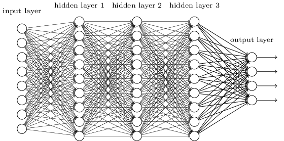


## Image Recognition Bias and Symmetry

- Neural Network for image recognition
- This is a bicycle

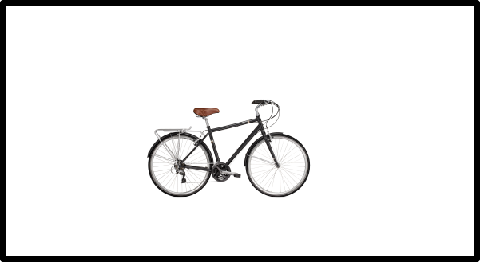


## Image Recognition Bias and Symmetry

- Neural Network for image recognition
- If we shift it it is still a bicycle

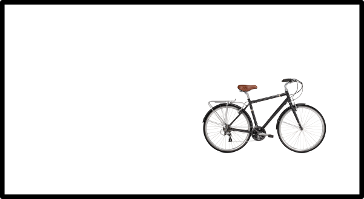


## Image Recognition Bias and Symmetry

- Neural Network for image recognition
- If we shift it it is still a bicycle

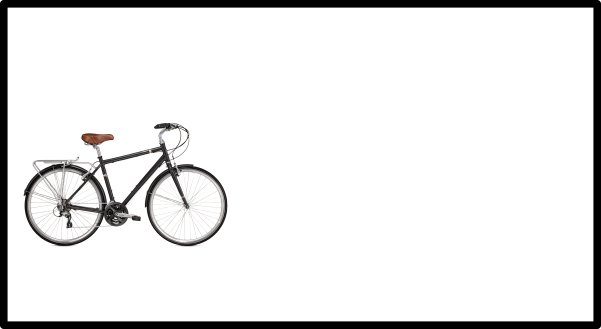


## Image Recognition Bias and Symmetry

- Neural Network for image recognition
- If we shift it it is still a bicycle

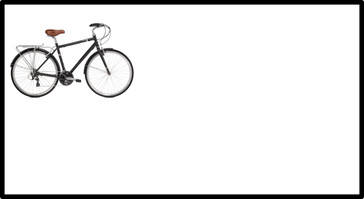


## Image Recognition Bias and Symmetry

- Neural Network for image recognition
- If we shift it it is still a bicycle

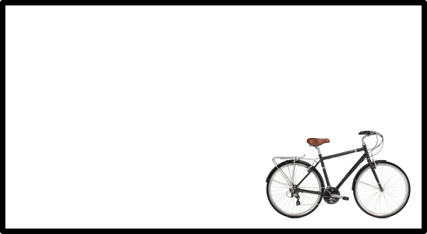


## Image Recognition Bias and Symmetry

- Neural Network for image recognition
- If we shift it it is still a bicycle

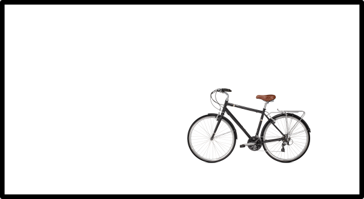


## Image Recognition Bias and Symmetry

- Neural Network for image recognition
- We can even rotate it

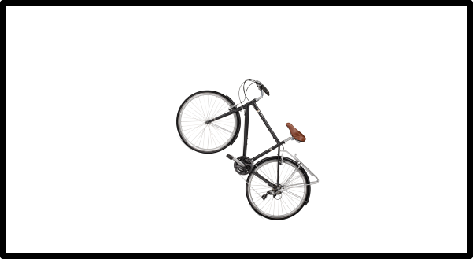


## Accuracy of Fully Connected Networks

- Fully Connected Networks are not suited to image recognition

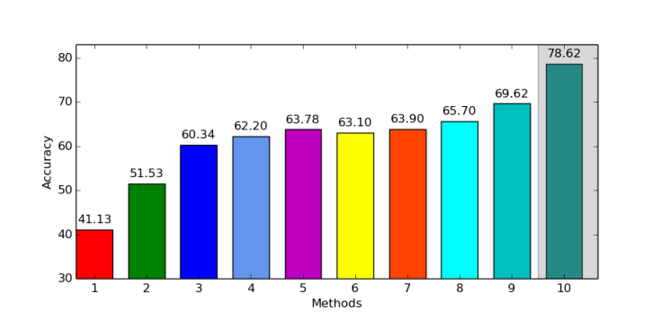

- Small well designed neural networks exceed 90\% on CIFAR10
- Best networks exceed 99\%


## Convolution

- 1960s Q: How do we detect edges in images?
- 1960s A: Create an "archetype" image of an edge, and calculate the correlation of it with each part of the original image

```{python}


Gx = np.array([[-1, 0, 1],
               [-2, 0, 2],
               [-1, 0, 1]], dtype=np.float32)

Gy = np.array([[-1, -2, -1],
               [ 0,  0,  0],
               [ 1,  2,  1]], dtype=np.float32)


fig, axes = plt.subplots(1, 2, figsize=(8, 4))

axes[0].imshow(Gx, cmap='grey', vmin=-2, vmax=2)
axes[0].set_title('Vertical Edge Detector')
for i in range(3):
    for j in range(3):
        axes[0].text(j, i, f'{int(Gx[i,j])}', ha='center', va='center', fontsize=24, fontweight='bold')

axes[1].imshow(Gy, cmap='grey', vmin=-2, vmax=2)
axes[1].set_title('Horizontal Edge Detector')
for i in range(3):
    for j in range(3):
        axes[1].text(j, i, f'{int(Gy[i,j])}', ha='center', va='center', fontsize=24, fontweight='bold')

for ax in axes:
    ax.set_xticks([])
    ax.set_yticks([])

plt.tight_layout()
plt.show()


```


## Applying the Convolution

- The convolution 'kernel' is like a pattern that is applied all over the target image

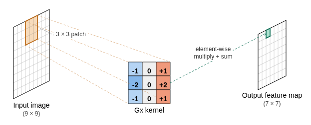


## Convolution in Practice


```{python}


# Load FashionMNIST
data = datasets.FashionMNIST(root='./data', train=True, download=True)
classes = data.classes


def apply_sobel(image):
    gx = correlate2d(image, Gx, mode='valid')
    gy = correlate2d(image, Gy, mode='valid')
    return gx, gy

# Pick a few different items to show variety
indices = [0, 1, 2, 3, 5, 7]

fig, axes = plt.subplots(3,len(indices),  figsize=(18, 12))
axes[0, 0].set_title('Original',fontsize=16)
axes[1, 0].set_title('Vertical Edges',fontsize=16)
axes[2, 0].set_title('Horizontal Edges',fontsize=16)


for col, idx in enumerate(indices):
    img = np.array(data[idx][0], dtype=np.float32)
    label = classes[data[idx][1]]

    gx, gy = apply_sobel(img)

    axes[0,col].imshow(img, cmap='gray')
    axes[0,col].set_xlabel(label, fontsize=16)
    axes[1,col].imshow(gx, cmap='gray')
    axes[2,col].imshow(gy, cmap='gray')


    for row in range(3):
        axes[row, col].set_xticks([])
        axes[row, col].set_yticks([])

plt.tight_layout()
plt.show()


```


## Convolutional Neural Networks

:::: {.columns}

::: {.column width=50%}
- CNN Architecture:
  - Layers are small, learned filters
  - Feature map per layer
:::

::: {.column width=50%}
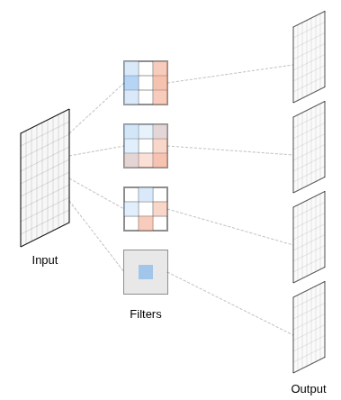
:::

::::


## Convolutional Neural Networks

:::: {.columns}

::: {.column width=50%}
- CNN Architecture:
  - Layers are small, learned filters
  - Feature map per layer
  - Apply ReLU to feature maps
:::

::: {.column width=50%}
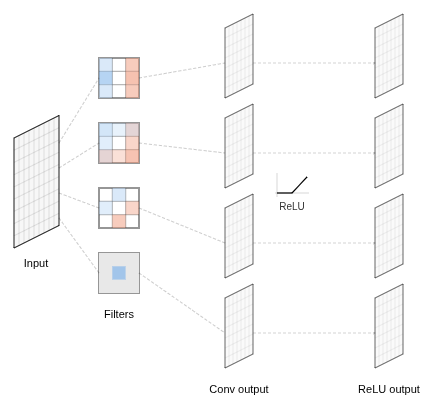
:::

::::


## Convolutional Neural Networks

:::: {.columns}

::: {.column width=50%}
- CNN Architecture:
  - Layers are small, learned filters
  - Feature map per layer
  - Apply ReLU to feature maps
  - Stack Conv layers
:::

::: {.column width=50%}
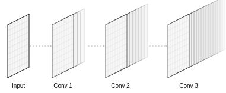
:::

::::


## Pooling

- Convolutional layers dramatically increase the size of outputs
- Max pooling layers reduce the spatial size
- Look at 2x2 or 3x3 grid and pick maximum value

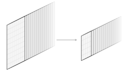


## Full Architecture

- CNNs mix 1-3 Conv layers between max pooling layers
- Have some fully connected layers at the end for classification

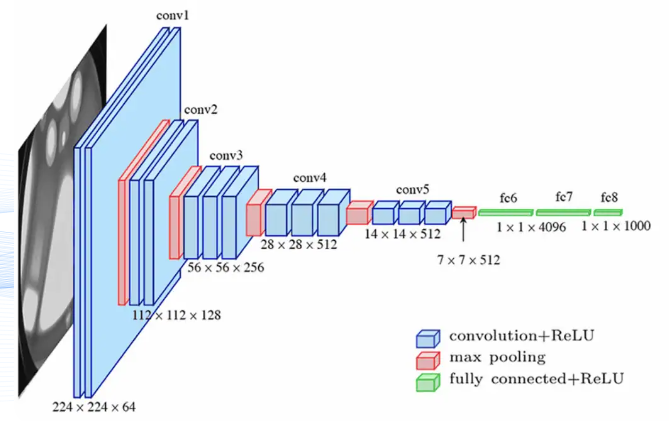


## CNNs Outperform Fully Connected for Images

:::: {.columns}


::: {.column width=50%}
Fully Connected:

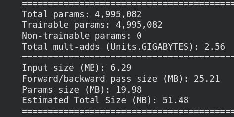
:::


::: {.column width=50%}
Fully Connected:

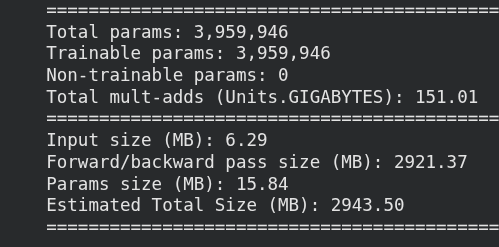
:::


::::


## CNNs Outperform Fully Connected for Images

:::: {.columns}


::: {.column width=50%}
Fully Connected:

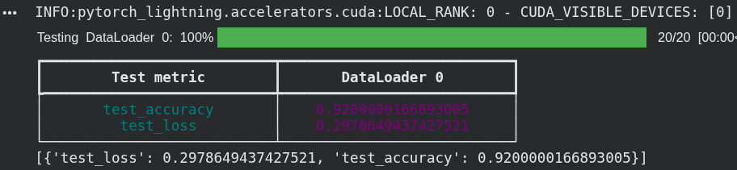
:::


::: {.column width=50%}
Fully Connected:

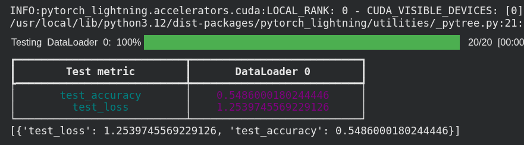
:::

::::

## More Inductive Biases

- Translation and Rotation
  - Convolution effectively reuses weights to handle translations
- Slight change in colors, lightness/darkness
- Image being partially obscured

## Data Augmentation

- Instead of modifying models, we modify training set with transformations!

```{python}
#| echo: True
#| eval: False

transform_train = transforms.Compose([
    transforms.RandomHorizontalFlip(),
    transforms.RandomCrop(32, padding=4),
    transforms.ColorJitter(brightness=0.2, contrast=0.2, saturation=0.2),
    transforms.RandomRotation(5),
    transforms.ToTensor(),
    transforms.Normalize((0.4914, 0.4822, 0.4465),
                         (0.2470, 0.2435, 0.2616)),
    transforms.RandomErasing(p=0.5, scale=(0.02, 0.2))
])


```


## Data Augmentation

- Instead of modifying models, we modify training set with transformations!
- Data augmentation is one of the most powerful "tricks" out there


## Regularization: Dropout

- To prevent memorization, randomly zero out a fraction of neuron weights during training:

```{python}
#| echo: True
#| eval: False

    self.output = nn.Sequential(
        nn.Dropout(0.5),
        nn.Linear(2*2*512, 512),
        nn.ReLU(),
        nn.Linear(512, 100)
    )


```


## Regularization: Early Stopping

- Overfitting: Training loss decreases, validation loss is constant
- Solution: Stop training if validation loss has stopped improving

```{python}
#| echo: True
#| eval: False

early_stopper = EarlyStopping(
    monitor='valid_loss',
    patience=20,
    mode='min'
)

cifar_trainer = Trainer(
    max_epochs=300,
    callbacks=[early_stopper, ...]
)


```


## Deep Learning

- Over time, networks have become deeper
- Empirically, they lead to higher accuracy


## Deep Learning

- Over time, networks have become deeper
- Empirically, they lead to higher accuracy

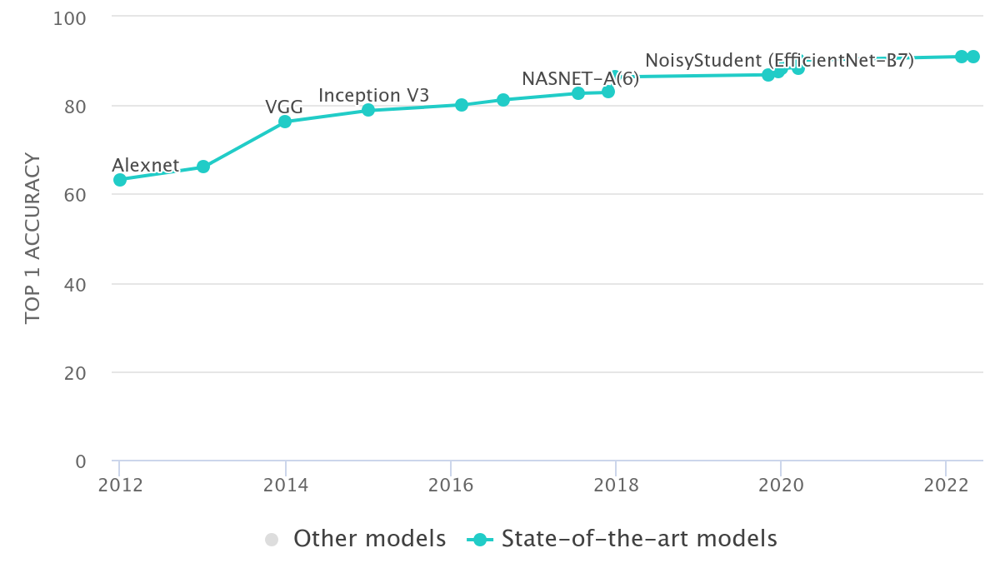


## Different than more neurons

- Scaling up neurons often doesn't help in shallow nets


## Vashing Gradients

- Landscape of deep network varies by layer:

{width=50%}

## Why Vanishing Gradients?

- Consider a deep network with one neuron per layer:

- If activation function is $\phi$ can write it as:
$$
f(x_1) = \phi \circ (w_n x + b_n) \circ \phi \circ (w_{n-1}x + b_{n-1}) \circ \\
\phi\circ \cdots\circ \phi \circ(w_1 x +b_1) (x_1)
$$

## Taking Derivatives

:::: {.columns}

::: {.column width=50%}
- The close to the output, the fewer "terms" in the derivative:
:::

::: {.column width=50%}
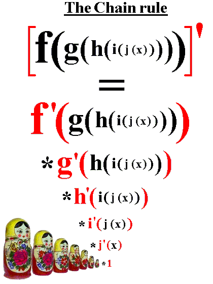
:::
::::


## Solution: Activations

- Rectified Linear Unit (ReLU)

$$
\phi(x) = \cases{0& \text{if} \quad x\leq 0 \\
                x& \text{if} \quad x>0}
$$

```{python}
import numpy as np
import matplotlib.pyplot as plt
xvec = np.linspace(-10,10,100)
yvec = np.heaviside(xvec,0)*xvec

plt.figure(figsize=(8, 4))
plt.plot(xvec, yvec, color='dodgerblue', linewidth=2)
plt.title('ReLU', fontsize=16)
plt.xlabel('x', fontsize=14)
plt.ylabel('$\phi(x)$', fontsize=14)
plt.grid(True, which='both', linestyle='--', linewidth=0.5, alpha=0.7)
plt.axhline(0, color='gray', linewidth=1)
plt.axvline(0, color='gray', linewidth=1)
plt.tight_layout()
plt.show()


```


## Spiky Loss Landscape

- Ideally, as you move in the direction of the gradient the loss smoothly decreases

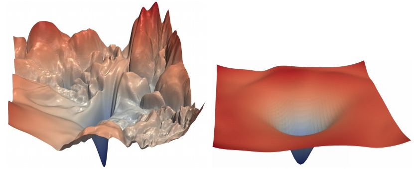


## Batch Norm

- Idea: Rescale the outputs of previous layer so that roughly 50\% of neurons are active in subsequent layer
- At each batch, and each forward step, rescale data so that mean = 0 and variance is 1
- Learn an additional scaling parameter per layer
- For evaluation, using running tally of activations at each layer for normalization


## Batch Norm is a Type of Layer

```{python}
#| echo: True
#| eval: False


    self.conv1 = nn.Conv2d(in_channels, out_channels, kernel_size=3, padding='same')
    self.bn1 = nn.BatchNorm2d(out_channels)
    self.conv2 = nn.Conv2d(out_channels, out_channels, kernel_size=3, padding='same')
    self.bn2 = nn.BatchNorm2d(out_channels)
    self.conv3 = nn.Conv2d(out_channels, out_channels, kernel_size=3, padding='same')
    self.bn3 = nn.BatchNorm2d(out_channels)


```


## Batch Norm Enables Training Deep Networks

- Batch Norm makes the loss landscape much smoother

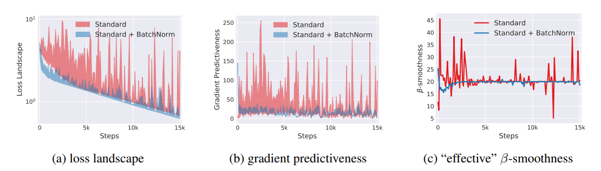


## Thanks