## Week Summary

<!-- TODO: in Spring this deck said Lab 7 was due 5/10, two weeks later than the
     published schedule. The Fall schedule puts Lab 7 at the Nov 30 meetup
     (due Sun 11/29). Pick whichever you actually want and delete this note. -->
- CIFAR100 problem: Lab 7 Due 11/29
    - Lab 8 shortened, available soon
- Schedule Final Presentations Next Week
- RNNs and Text this week
- Pretrained Models next week


## End of Semester Gathering?

- Post in the Slack if you are interested!


## Sequential Data

- Data has a one-dimensional order:

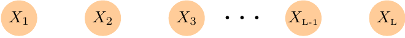


## Sequential Data

- Data has a one-dimensional order:
    - Sound/Music
    - Text
    - DNA/Proteins/RNA
    - Position of a moving object
    - User Behavior


## Recurrent Neural Networks

- Take advantage of the _inductive bias_:
  - What comes next depends on what came before

::: {.r-stack style="height: 2em; justify-content: flex-start; width: 100%;"}
[Apply the network to the data sequentially]{.fragment .fade-in-then-out fragment-index=0 style="position: absolute; left: 5; text-align: left; width: 100%;"}

[Apply it to the old activations and next state]{.fragment .fade-in-then-out fragment-index=1 style="position: absolute; left: 5; text-align: left; width: 100%;"}

[Repeat]{.fragment .fade-in-then-out fragment-index=2 style="position: absolute; left: 5; text-align: left; width: 100%;"}

[Use the final output for your prediction]{.fragment fragment-index=3 style="position: absolute; left: 5; text-align: left; width: 100%;"}
:::

::: {.r-stack}
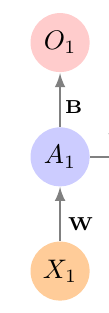{.fragment .fade-in-then-out fragment-index=0}

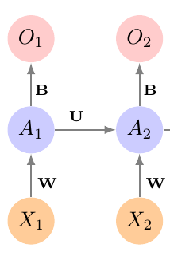{.fragment .fade-in-then-out fragment-index=1}

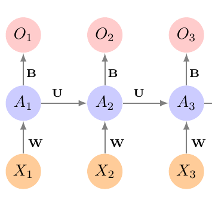{.fragment fragment-index=2}

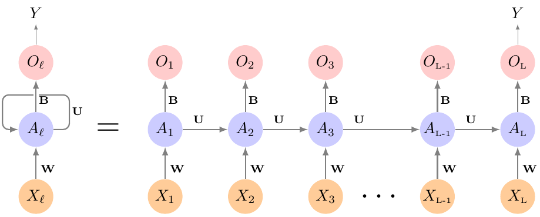{.fragment fragment-index=3}


:::


## RNN Architecture

- Network has $K$ internal layers
- Activations $A_{lk}$ at sequence point $l$
- Need weights for the inputs $X_{il}$:

$$
A_{lk} = g\left(\sum_{j=1}^p w_{jk} X_{lj} + \cdots \right)
$$


## RNN Architecture

- Network has $K$ internal layers
- Activations $A_{lk}$ at sequence point $l$
- Need weights for the old activations $A_{(l-1),s}$:

$$
A_{lk} = g\left(\sum_{j=1}^p w_{jk} X_{lj} + \sum_{s=1}^K u_{sk} A_{(l-1),s} + \cdots \right)
$$

## RNN Architecture

- Network has $K$ internal layers
- Activations $A_{lk}$ at sequence point $l$
- Need a bias:

$$
A_{lk} = g\left(w_{0k} +\sum_{j=1}^p w_{jk} X_{lj} + \sum_{s=1}^K u_{sk} A_{(l-1),s} \right)
$$


## RNN Architecture

- Need to Calculate Output $O_l$:
- Regression:

$$
O_l = \beta_0 + \sum_k=1^K \beta_k A_{lk}
$$

## RNN Architecture

- Need to Calculate Output $O_l$:
- Classification:

$$
O_l = g(\beta_0 + \sum_k=1^K \beta_k A_{lk})
$$

## RNN Architecture

- Need to Calculate Output $O_l$:
- Can also calculate $O_l$ using some additional layers


## RNN Use Cases

- Time Series (624.....)
  - But check out _Reservoir Computing_
- All sorts of device use cases
- Audio processing
- NLP (But have been superseeded recently)


## RNN Example: IMDB Sentiment

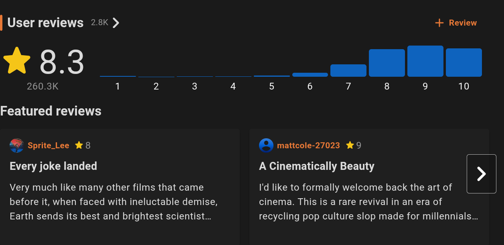

- IMDB contains millions of movie reviews
- Can we predict sentiment from text?


## How Can a Neural Network Read?

- NLP always involves feature engineering:
  - Tokenize into words or n-grams
  - Use Sentiment Lexicon
  - One-Hot Encode and use ML?


## One-Hot and Meaning?

- Consider words "angry" and "mad"
  - Almost the same word
  - Training treats them as independent
- Word meaning is a type of "inductive bias" that we want


## Solution: Low Dimensional Embedding

- Goal: Find mapping from 10,000 dimensional word space to lower dimensional "meaning" space
- Consider Word "King" in One-Hot
$$
\mathrm{King}_{OH} = (0\, 0\, \cdots\, 0\, 1\, 0\, \cdots\, 0)
$$
- In Embedded Representation:
$$
\mathrm{King}_{e} = (-1.1\, 0.3\, \cdots\, 2.2)
$$


## Similar Words Cluster Together

- Queen and Princess are near

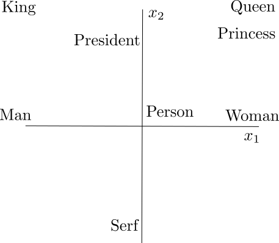


## Features May Be Interpretable

- One axis is Gender, other is Status

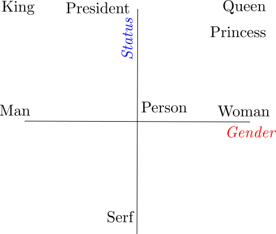


## Dimension Reduction

- Each word is now a vector in $m$-dimensional space

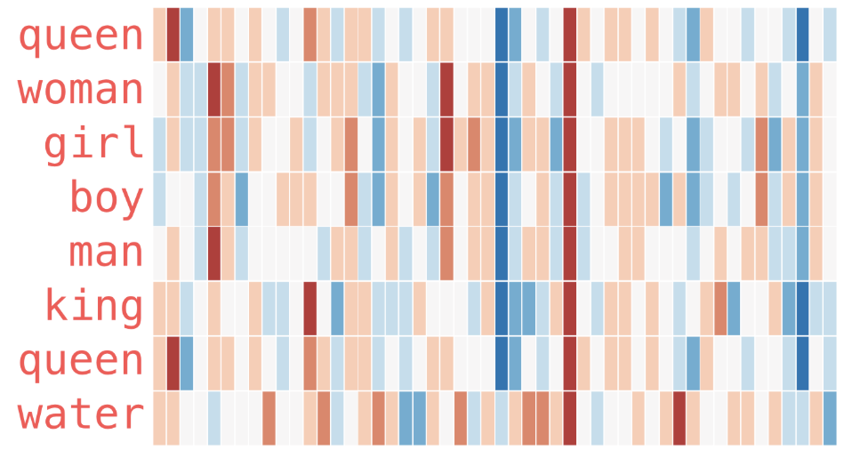


## How to Embed?

- DIY Option:
  - Pick a dimension $m$
  - Learn $10000 \times m$ weights

```{python}
#| echo: true
#| eval: false

class LSTMModel(nn.Module):
    def __init__(self, input_size):
        super(LSTMModel, self).__init__()
        self.embedding = nn.Embedding(input_size, 64)

```


## How to Embed?

- DIY Option:
  - Pick a dimension $m$
  - Learn $10000 \times m$ weights
  - Weights are trained from scratch each time
  - Embedding is unsophisticated, but optimized to your problem


## How to Embed?

- Pretrained Options
  - Global Vectors for word representation (GloVe)
  - Trained on wikipedia text, up to 300 dimensions:

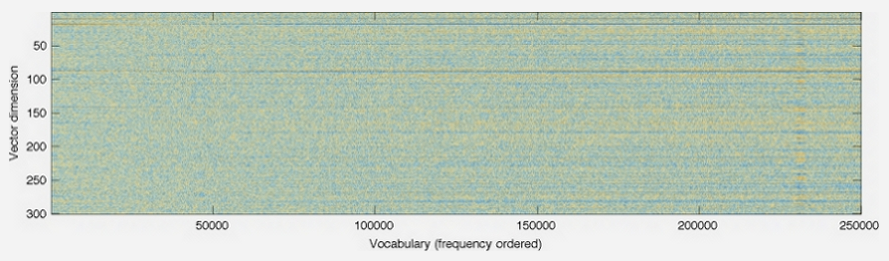


## How to Embed?

- Pretrained Options
  - Global Vectors for word representation (GloVe)
  - Trained on wikipedia text, up to 300 dimensions:

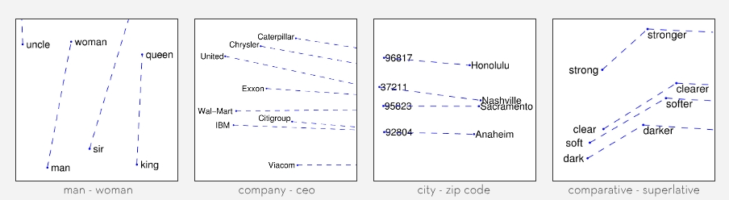

## How to Embed?

- Pretrained Options
  - GloVe
  - Word2Vec
  - BERT (though it is more complicated)

```{python}
#| echo: true
#| eval: false

class LSTMModel(nn.Module):
    def __init__(self, input_size):
        super(LSTMModel, self).__init__()
        self.embedding = nn.Embedding.from_pretrained(
            glove_embeddings,
            freeze=True
            )
```


## Fine Tuning

- Pre-trained embeddings have been trained on huge corpuses of data
- Similar networks exist in other domains, `ResNet` for images
- `freeze=False` fine-tunes those weights
- Fine-tuning allows you to adapt part or the whole of a sophisticated model to your
particular task


## Vanishing Gradients in RNNs

:::: {.columns}

::: {.column width=50%}

- RNNs cause vanishing gradients
- ReLU can't be used!
- Sequence length compounds it
- RNNs lose key information
:::

::: {.column width=50%}


:::
::::


## Long Short Term Memory

- LSTM was invented to handle this
- RNN just has activations $A$
  - Renamed $h$ for LSTM
- LSTM has a "memory" called $C$ (Cell State) 

## Cell State Updates

- Each new token, update $C_l$
- Forget part of $C_{l-1}$
- Add new info from $X_{l}$ and $h_{l-1}$

$$
C_l = f_l C_{l-1} + i_l \tilde{C}_l
$$


## Forgetting

- Forgetting is number between 0 and 1
- Depends on $h_{l-1}$ and $X_l$

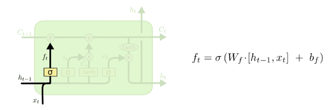


## Input

- Input is number between 0 and 1
- Candidate state is new info to add

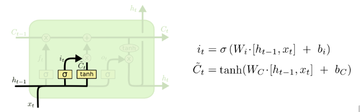


## Cell State Update Diagram

- Ready for the update


## Update Hidden State

- The hidden state is calculated from the cell state

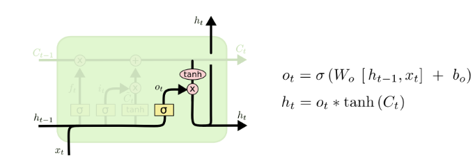


## PyTorch Implementation

```{python}
#| echo: true
#| eval: false

class LSTMModel(nn.Module):
    def __init__(self, input_size):
        super(LSTMModel, self).__init__()
        self.embedding = nn.Embedding(input_size, 64)
        self.lstm = nn.LSTM(input_size=64,
                            hidden_size=64,
                            batch_first=True)
        self.dense = nn.Linear(64, 1)
    def forward(self, x):
        val, (h_n, c_n) = self.lstm(self.embedding(x))
        return torch.flatten(self.dense(val[:,-1]))

```


## LSTM Architecture Tips

- Hidden Layers Become Harmful Fast
  - LSTM doesn't totally eliminate vanishing gradients
- Width depends on your training data
- Dropout, weight decay, layer norm, early stopping, data augmentation
   - Weight Freezing for Embedding


## Optuna

::: {.incremental}
- How do we systematically search to find the best hyperparameters when there are many?
- Grid Search is ineffcient when there are many parameters
- Better: Sample parameters randomly, bias to where you have been getting better results
:::


## Optuna Code

- Choose your hyperparameters and their ranges:

```{python}
#| echo: true
#| eval: false
def lstm_objective(trial):
    # Hyperparameters to optimize over
    embedding_dim = trial.suggest_categorical("embedding_dim", [16, 32, 64, 128])
    hidden_size = trial.suggest_categorical("hidden_size", [32, 64, 128])
    num_layers = trial.suggest_int("num_layers", 1, 3)
    dropout = trial.suggest_float("dropout", 0.0, 0.5)
    learning_rate = trial.suggest_float("learning_rate", 1e-4, 1e-2, log=True)
    weight_decay = trial.suggest_float("weight_decay", 1e-6, 1e-2, log=True)
    batch_size = trial.suggest_categorical("batch_size", [128, 256, 512])


```


## Optuna Code

- Make you NN class depend on the values

```{python}
#| echo: true
#| eval: false
class TrialLSTMModel(nn.Module):
        def __init__(self, input_size):
            super(TrialLSTMModel, self).__init__()
            self.embedding = nn.Embedding(input_size, embedding_dim)
            self.drop1 = nn.Dropout(dropout)
            self.lstm = nn.LSTM(input_size=embedding_dim,
                                hidden_size=hidden_size,
                                num_layers=num_layers,
                                dropout=dropout if num_layers > 1 else 0,
                                batch_first=True)
            self.drop2 = nn.Dropout(dropout)
            self.dense = nn.Linear(hidden_size, 1)


```


## Optuna Code

- Run the trial!

```{python}
#| echo: true
#| eval: false
study = optuna.create_study(direction="maximize")
study.optimize(lstm_objective, n_trials=20)
```

- You will need a bit more boilerplate but its not bad
- There are a lot of sophisticated features


## Get a small boost

- Before tuning 86\%
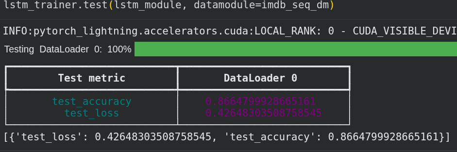

- After tuning 88\%
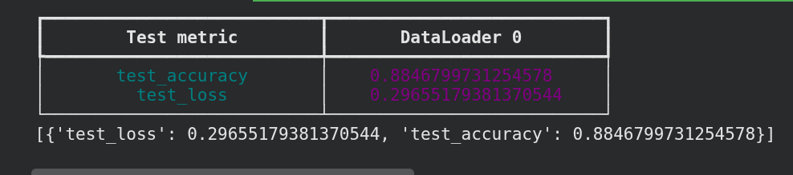


## Thanks
