## Week Summary

- Optional Lab 8
- Presentations!
- Pretrained Models: Different Reading
- Coding Vignette Posted (without video)


## Lab Comments

1. No ridge regression without using the standard scaler!!!
2. Pick CausalML Hyperparameters to Make things Smooth

```{python}
#| echo: true
#| eval: false
est = CausalForestDML(
    model_y=LassoCV(cv=3),
    model_t=LogisticRegressionCV(cv=3),
    n_estimators=8000,
    min_samples_leaf=50,
    #max_depth=5,
    max_samples=0.02,
    discrete_treatment=True,
    random_state=123
)


```


## Lab Comments

1. No ridge regression without using the standard scaler!!!
2. Pick CausalML Hyperparameters to Make things Smooth


## Lab Comments


1. No ridge regression without using the standard scaler!!!
2. Aggressive Choices Lead to Aggressive Fits

```{python}
#| echo: true
#| eval: false

est = CausalForestDML(
    model_y=LassoCV(cv=3),
    model_t=LogisticRegressionCV(cv=3),
    n_estimators=8000,
    min_samples_leaf=10,
    max_depth=40,
    max_samples=0.45,
    discrete_treatment=True,
    random_state=123
)

```


## Lab Comments


1. No ridge regression without using the standard scaler!!!
2. Aggressive Choices Lead to Aggressive Fits


## Contextual Meaning

- Consider an LSTM Processing this Text

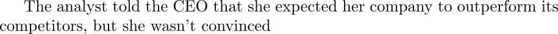{fig-align="center"}


## Contextual Meaning

- Pronouns embedded as vectors, but mean specific things

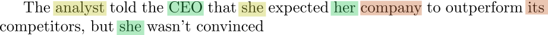{fig-align="center"}


## Contextual Meaning

- LSTM incorporates their meaning via long-range states


{fig-align="center"}


## Contextual Meaning

- Later, same pronouns may occur


{fig-align="center"}


## Contextual Meaning

- LSTM's understanding too compressed to remember previous context


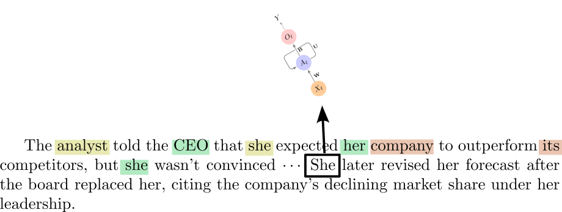{fig-align="center"}


## Context

- Distant words hold key context


{fig-align="center"}


## Attention

- Attention is a mechanism to "update" the meaning of a word based on the surrounding context


## Attention

- Consider simple sentence


{fig-align="center"}


## Attention

- Each token has an embedding


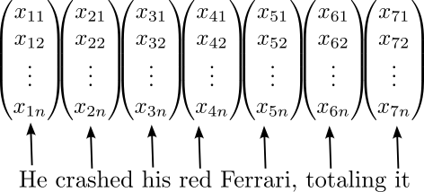{fig-align="center"}


## Attention

- Nearby tokens give context, change embedding in next layer


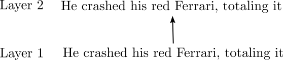{fig-align="center"}


## Attention

- Accumulate changes to embedding in next layer


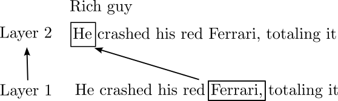{fig-align="center"}


## Attention

- Accumulate changes to embedding in next layer


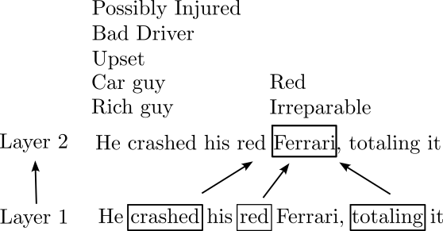{fig-align="center"}


## Attention

- Accumulate changes to embedding in next layer


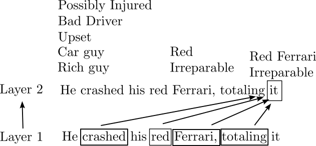{fig-align="center"}


## Transformer Achitecture

- A transformer is an architecture containing layers of
transformer blocks.

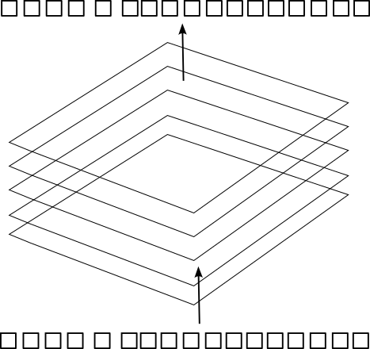{width="80%" fig-align="center"}


## Transformer Layer

- Transformer Layer has two parts:
  - Attention Mechanism
  - MLP layer betweem


## Allocating Attention

- Each attention head within a layer has several projections:
    - 'q_proj' and 'k_proj' determine which other tokens are relevant
    - 'v_proj' determines what information gets added if relevant
    - 'o_proj' combines the added info for each token


## Encoder Models: BERT

- 22 Transformer Layers
- 150M paramters
- Head is trained to predict _masked_ words

{fig-align="center"}


## Encoder Models: BERT

- 22 Transformer Layers
- 150M paramters
- Head is trained to predict _masked_ words

{fig-align="center"}


## Encoder Models

- Excel at all non-generative tasks
  - Classification
  - Named Entity Recognition
  - Similarity
- Fast
- Cannot Generate Text
- Less Efficient Training

## Decoder Models

- ChatGPT, Claude, Gemini, Qwen, etc
- Head is configured to predict next token probability


## Decoder Models

- Can sort of do anything
- Easier to train
  - Can get bigger
  - People think they show more 'emergence'


## Fine Tuning Large Models

- LLMs start life as "Base Models"
- They just produce text:

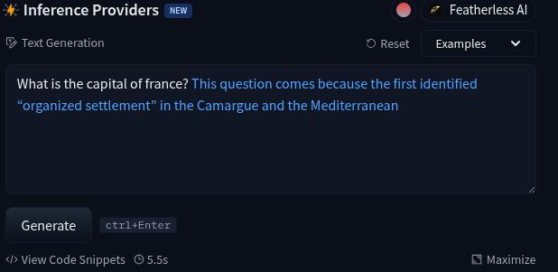


## Fine Tuning Large Models

- To make LLMs useful, they must be specified to a task
- Train them on examples of what you are looking for!

```{python}
#| echo: true
#| eval: false

{"messages": [
  {"role": "user", "content": "What are the main risks of investing in bonds?"},
  {"role": "assistant", "content": "The main risks include interest rate risk, credit risk, and inflation risk..."},
  {"role": "user", "content": "Can you explain interest rate risk more?"},
  {"role": "assistant", "content": "When interest rates rise, existing bond prices fall because..."},
  {"role": "user", "content": "So should I avoid bonds when rates are rising?"},
  {"role": "assistant", "content": "Not necessarily. Short-duration bonds are less affected..."}
]}

```


## Fine Tuning

- Fine tuning works like regular training but:
  - Smaller Dataset
  - Fewer epochs
  - Sometimes only modify part of the network


## Fine Tuning BERT

- The entire thing:

```{python}
#| echo: true
#| eval: false

# Extarct the BERT model
bert_model = AutoModelForSequenceClassification.from_pretrained(
    "answerdotai/ModernBERT-base", num_labels=3)

# Setup the training, this is the analog of the pytorch lightning trainer

bert_trainer = HFTrainer(
    model=bert_model,
    args=bert_training_args,
    train_dataset=hf_train_tok,
    eval_dataset=hf_val_tok,
    data_collator=DataCollatorWithPadding(bert_tokenizer), # Trick to save computation time
    compute_metrics=compute_metrics,
)

# Perform training
bert_trainer.train()

```


## Fine Tuning BERT

- Loop through and freeze/unfreeze!

```{python}
#| echo: true
#| eval: false
    # Freeze lhe first N transformer layers via a loop
    
    for layer in bert_model.model.layers[:-N]:
        for param in layer.parameters():
            param.requires_grad = False


```

## Fine Tuning BERT

- Loop through and freeze/unfreeze!
- Typical to fine-tune layers near the top


## Fine Tune Big Models?

- BERT has 150M parameters
- Qwen 0.5B
- Others have much more, some approach 1T parameters
- Will NOT fit in your GPU RAM

## LoRA

- LoRA stands for Low Rank Adaptation
- For the Linear Algebra Knowers:

$$
L = M_1 \times M_2^t
$$

- $M_1$ and $M_2$ are $N\times r$ matrices
- Way of generating full size matrix with small number of parameters to learn

## LoRA

- LoRA stands for Low Rank Adaptation
- For the Linear Algebra Knowers:

$$
Q_{FT} = Q + \alpha L
$$


## LoRA

- LoRA is standard technique to fine-tune large transformers
- Key hyperparameters:
  - Rank $r$: Higher $r$ is more complex and costlier
  - Higher $\alpha$: $\alpha$ is "size" of perturbation
  - Components: 'q_proj' and 'v_proj', 'MLP' layer
- Apply LoRA to every layer

## LoRA Implementation

- Hugging Faces has great tools for this

```{python}
#| echo: true
#| eval: false

#Get model
qwen_model = AutoModelForCausalLM.from_pretrained(
    qwen_model_id,
    quantization_config=bnb_config,
    torch_dtype=torch.float16,  # force all non-quantized weights to float16
    device_map="auto"
)

# Setup LoRA
lora_config = LoraConfig(
    r=16, lora_alpha=32, lora_dropout=0.05,
    target_modules=["q_proj", "v_proj"],
    task_type="CAUSAL_LM", # Let it know that this model produces text recursively
)


```


## LoRA Implementation

- Hugging Faces has great tools for this

```{python}
#| echo: true
#| eval: false

# Train/Fine Tune!!!
qwen_trainer = SFTTrainer(
    model=qwen_model,
    args=qwen_training_args,
    train_dataset=hf_train_fmt,
    eval_dataset=hf_val_fmt,
    peft_config=lora_config,
)

qwen_trainer.train()

```

## LoRA Impact

- Fine-Tuning leads to stunning performance improvements with relatively little effort

- Original Model:

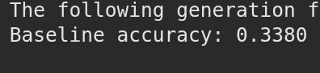 

- Fine Tuned Model:

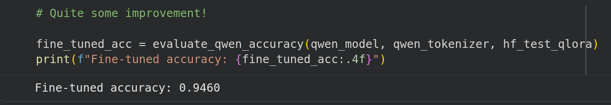


## Thanks!


