```{python}
import ISLP as islp
import numpy as np
from IPython.core.pylabtools import figsize
import pandas as pd
import sklearn as sklearn
from matplotlib.pyplot import subplots

np.random.seed(434901)

```

## Recap: The Learning Problem


{width=50%}


## Goals


1. Model Fit versus Generalization
2. Bias-Variance Tradeoff

## Weekly Tasks

- Lab 1 due Sunday at midnight
- Reading: ISLP 2.2-2.4
- Coding Vignette: Chapter 2 of HOML in `sklearn`
- Keep posting ideas and finding team-mates in Slack


## Assessing Model Accuracy

- In regression, measures like mean square error:
$$
\mathrm{MSE} = \frac{1}{n}\sum_{i=1}^n (y_i - g(\mathbf{x}_i)^2)
$$
- or $R^2:$
$$
R^2 = 1 - \frac{\mathrm{MSE}}{\mathrm{var(y)}}
$$
Are used to assess model accuracy


## Question:

Suppose we have trained a model which has high accuracy on the training data. Are we done?


::: {.fragment style="border: 2px solid black; padding: 20px; border-radius: 5px;"}
[But what we really care about is whether we can extrapolate assessed accuracy to unseen examples]{.incremental}
:::

## Generalization

**Generalization** is defined as the ability of a model to maintain its accuracy on observations outside of its training 

::: {.fragment}
- When a model has high in-sample accuracy, it is not guaranteed that it performs well out of sample
:::

## Overfitting

- Overfitting is a phenomenon that causes bad generalization
- Consider the following dataset:
```{python}
#| fig-width: 12
#| fig-height: 8

pi = np.pi
num_points = 50
xvec = np.random.uniform(-1,1,num_points)

def IFunc(x):
    return x*np.sin(6*x)-np.log(1.01+x) 

noise = 0.2

yvec = IFunc(xvec) + noise*np.random.normal(size=num_points)

full_xvec = np.linspace(-1,1,1000)
full_yvec = IFunc(full_xvec) 

fig, ax = subplots(figsize = (12,8))
ax.scatter(xvec,yvec)
ax.plot(full_xvec,full_yvec)
ax.set_title("Unusual Function Plus Noise", fontsize=36)
ax.set_xlabel("$x$", fontsize=32)
ax.set_ylabel("$y$", fontsize=32)
ax.tick_params(axis='x', labelsize=24)
ax.tick_params(axis='y', labelsize=24)
```


## Models of Increasing Complexity

- Linear Model: $g(x) = g_0 + g_1 x$


```{python}


from sklearn.preprocessing import PolynomialFeatures
from sklearn.linear_model import LinearRegression
from numpy.polynomial.chebyshev import chebvander

def plot_chebyshev_fit(xvec, yvec, full_xvec, full_yvec, degree,linewidth=1):


    X_cheb = chebvander(xvec, deg=degree)
    model = LinearRegression()
    model.fit(X_cheb, yvec)
    

    X_new_cheb = chebvander(full_xvec, deg=degree)
    y_full_pred = model.predict(X_new_cheb)
    


    fig, ax = subplots(figsize=(12, 8))
    
    ax.scatter(xvec, yvec, label='Training data')
    ax.plot(full_xvec, full_yvec, label='True function',linewidth=linewidth)
    ax.plot(full_xvec, y_full_pred, label=f'Degree {degree} fit',linewidth=linewidth)
    ax.set_ylim(-3, 5)
    ax.set_title(f"Degree {degree} Model",fontsize=36)
    ax.text(0.05, 0.95, f'R² = {model.score(X_cheb, yvec):.4f}', 
            transform=ax.transAxes, verticalalignment='top',fontsize=32)
    ax.legend()
    ax.set_xlabel("$x$", fontsize=32)
    ax.set_ylabel("$y$", fontsize=32)
    ax.tick_params(axis='x', labelsize=24)
    ax.tick_params(axis='y', labelsize=24)
    
    return ax

```

::: {style="width: 50%; margin: auto;"}
```{python}
#| fig-width: 12
#| fig-height: 8
plot_chebyshev_fit(xvec, yvec, full_xvec, full_yvec, degree=1)


```
:::

## Models of Increasing Complexity

2. Quadratic Model: $g(x) = g_0 + g_1 x + g_2 x^2$

::: {style="width: 50%; margin: auto;"}
```{python}
#| fig-width: 12
#| fig-height: 8
plot_chebyshev_fit(xvec, yvec, full_xvec, full_yvec, degree=2)


```
:::


## Models of Increasing Complexity

- 5th Degree fit: $g(x) = \sum_{i=0}^5 g_i x^i$

::: {style="width: 50%; margin: auto;"}
```{python}
#| fig-width: 12
#| fig-height: 8
plot_chebyshev_fit(xvec, yvec, full_xvec, full_yvec, degree=5)


```
:::


## Models of Increasing Complexity

- 10th Degree fit: $g(x) = \sum_{i=0}^{10} g_i x^i$

::: {style="width: 50%; margin: auto;"}
```{python}
#| fig-width: 12
#| fig-height: 8
plot_chebyshev_fit(xvec, yvec, full_xvec, full_yvec, degree=10)


```
:::

## Models of Increasing Complexity

- 25th Degree fit: $g(x) = \sum_{i=0}^{25} g_i x^i$

::: {style="width: 50%; margin: auto;"}
```{python}
#| fig-width: 12
#| fig-height: 8
plot_chebyshev_fit(xvec, yvec, full_xvec, full_yvec, degree=25)


```
:::


## Models of Increasing Complexity

- 50th Degree fit: $g(x) = \sum_{i=0}^{50} g_i x^i$

::: {style="width: 50%; margin: auto;"}
```{python}
#| fig-width: 12
#| fig-height: 8
plot_chebyshev_fit(xvec, yvec, full_xvec, full_yvec, degree=50)


```
:::


## Overfitting

- At low flexibility, in sample error was high
- At mid flexibility, in sample error dropped, pattern approximated
- At high flexibility, in sample error was zero


## Training versus Testing Error

- Generalization Gap at high complexity

::: {style="width: 60%; margin: auto;"}
```{python}
#| fig-width: 12
#| fig-height: 9
xtest = np.random.uniform(-1,1,num_points)
xtest.sort()
ytest = IFunc(xtest) + noise*np.random.normal(size=num_points)

num_order = 15

rmse_test_vec = np.zeros(num_order)
rmse_train_vec = np.zeros(num_order)


for deg in range(1,num_order+1):
    x_cheb = chebvander(xvec, deg=deg)
    model = LinearRegression()
    model.fit(x_cheb, yvec)
    y_pred = model.predict(x_cheb)
    rmse_train = np.sqrt(np.mean((yvec - y_pred)**2))
    xtest_cheb = chebvander(xtest, deg=deg)
    y_pred_test = model.predict(xtest_cheb)
    rmse_test = np.sqrt(np.mean((ytest-y_pred_test)**2))
    rmse_train_vec[deg-1] = rmse_train
    rmse_test_vec[deg-1] = rmse_test


fig, ax = subplots(figsize = (8,6))

ax.plot(range(1,num_order+1),np.log(1+rmse_train_vec),label="train error")
ax.plot(range(1,num_order+1),np.log(1+rmse_test_vec),label= "test_error")

ax.legend(fontsize=24)
ax.set_xlabel("Model Complexity", fontsize=36)
ax.set_ylabel("Error", fontsize=32)
ax.tick_params(axis='x', labelsize=24)
ax.tick_params(axis='y', labelsize=24)
ax.set_title("Overfitting at High Complexity",fontsize=36);
```

:::


## Irreducible Error

- Target function $f(\mathbf{x})$ encodes all the information about $y$ contained in the variables $\mathbf{x}$


$$
y = f(\mathbf{x}) + \epsilon
$$

- $\epsilon$ is called the *irreducible error*
- It accounts for other variables that are not measured and randomness
- We have $E(\epsilon) = 0$

## Reducible Error

- When fitting a model $g$ to the data, there are two sources of error:
$$
E((g-y)^2) = E((g-f)^2) - \mathrm{var}(\epsilon)
$$
- The $E((g-f)^2)$ term is the _reducible_ error
- Total error is a sum of _reducible_ and _irreducible_ errors


## Why do complex models overfit?

- Hypothetical scenario: study the performance of a model on a repeated learning task 

::: {style="text-align: left;"}
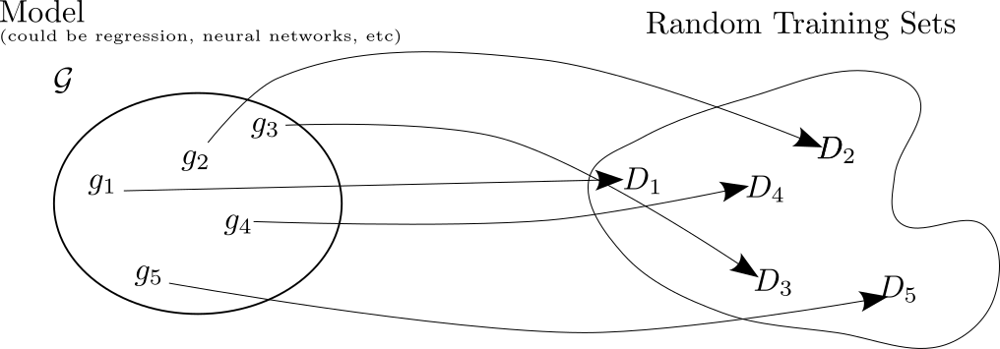{width="80%"}
:::


## Why do complex models overfit?

-  Each fit will be compared to the target function $f$

::: {style="text-align: left;"}
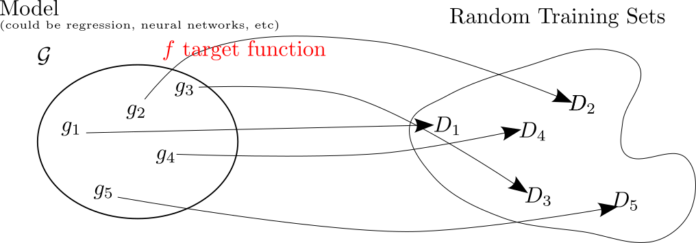{width=80%}
:::

## Bias Variance Tradeoff

- Can look at the "average" fit model

::: {style="text-align: left;"}
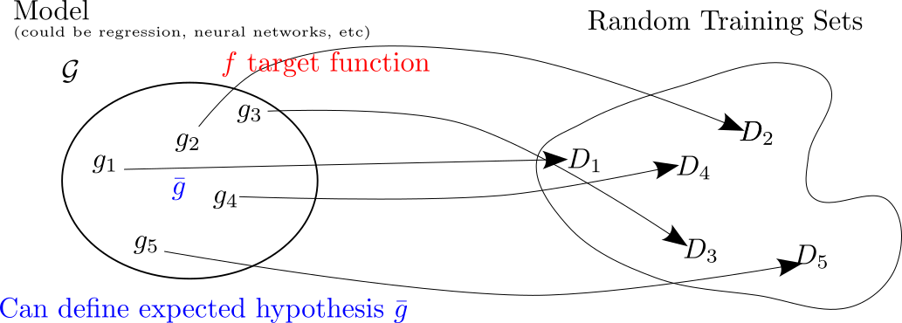{width="80%"}
:::

## Why do complex models overfit?

- Bias is the distance from average fit to target

::: {style="text-align: left;"}
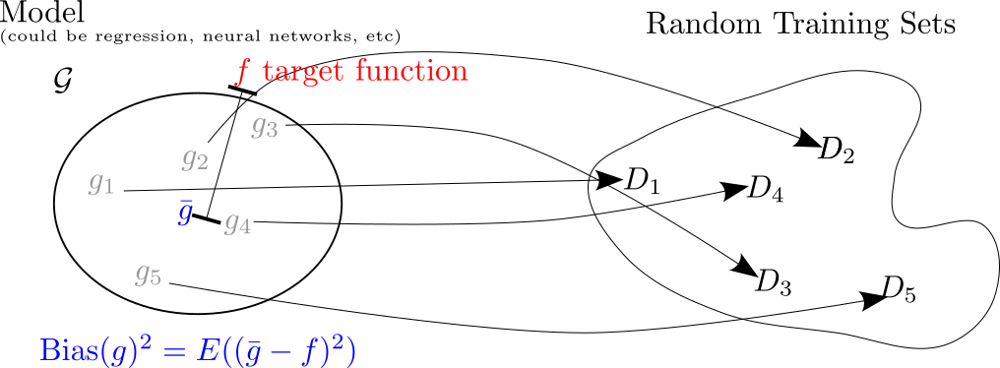{width="80%"}
:::

## Why do complex models overfit?

- Variance is how much individual fits vary from average 

::: {style="text-align: left;"}
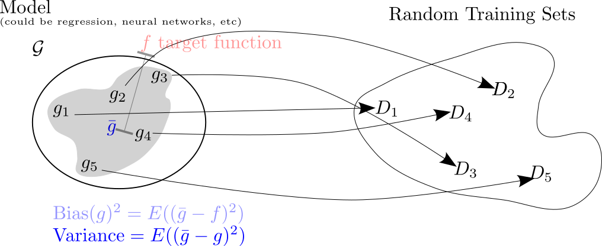{width="80%"}
:::


## Bias-Variance Tradeoff

- Expected out of sample error is sum of squared bias, variance, and irreducible error 

::: {style="text-align: left;"}
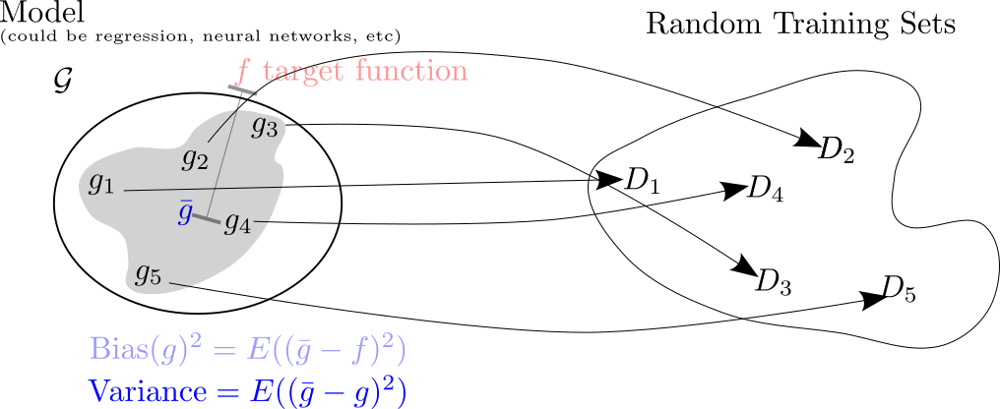{width="80%"}
:::


## Bias-Variance Tradeoff

- Bias and variance trade-off 

::: {style="text-align: left;"}
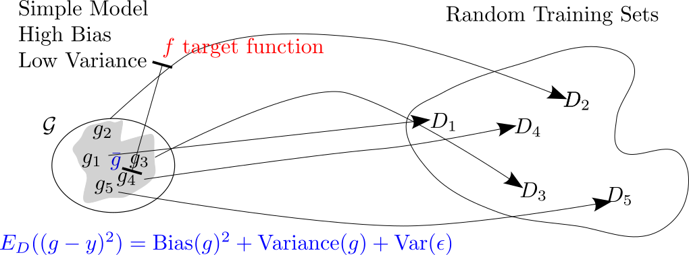{width="80%"}
:::


## Bias-Variance Tradeoff

- Bias and Variance Tradeoff 

::: {style="text-align: left;"}
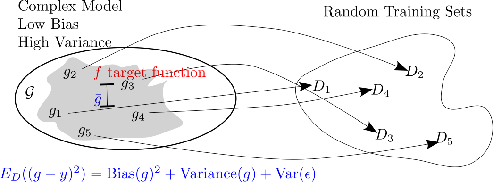{width="80%"}
:::

## Learning Curves

- Simple versus complex models as amount of data increases

```{python}

def target_function(x):
    return(IFunc(x) + noise*np.random.normal())


def mean_error(num_points,degree):
    
    num_trials = 1000
    E_train_vec = np.zeros(num_trials)
    E_test_vec = np.zeros(num_trials)

    for i in range(num_trials):
    
        xtrain = np.random.uniform(-1,1,num_points)
        xtest = np.linspace(start=-1,stop=1,num = 10000)
        ytrain = target_function(xtrain)
        ytest = target_function(xtest)

        x_cheb = chebvander(xtrain, deg=degree)
        model = LinearRegression()
        model.fit(x_cheb, ytrain)
        y_pred = model.predict(x_cheb)
        rmse_train = np.sqrt(np.mean((ytrain - y_pred)**2))
        E_train_vec[i] = rmse_train
        xtest_cheb = chebvander(xtest, deg=degree)
        y_pred_test = model.predict(xtest_cheb)
        rmse_test = np.sqrt(np.mean((ytest-y_pred_test)**2))
        E_test_vec[i] =rmse_test
    
    return([np.mean(E_train_vec),np.mean(E_test_vec)])

```


```{python}
#| eval: false

# If you are following along I pickled this because it made it slow to render

deg_low = 4
deg_high = 15

low_point_range = range(4,300)
high_point_range = range(15,300)

E_train_low = np.zeros(len(low_point_range))
E_test_low = np.zeros(len(low_point_range))

E_train_high = np.zeros(len(high_point_range))
E_test_high = np.zeros(len(high_point_range))


for i, num_points, in enumerate(low_point_range):
    [E_train,E_test] = mean_error(num_points,deg_low)
    E_train_low[i] = E_train
    E_test_low[i] = E_test


for i, num_points in enumerate(high_point_range):
    [E_train,E_test] = mean_error(num_points,deg_high)
    E_train_high[i] = E_train
    E_test_high[i] = E_test


# Here is the pickling code:

data = {
    'E_train_low': E_train_low,
    'E_test_low': E_test_low,
    'E_train_high': E_train_high,
    'E_test_high': E_test_high,
    'low_point_range': low_point_range,
    'high_point_range': high_point_range,
    'deg_low': deg_low,
    'deg_high': deg_high
}

with open('learning_curve.pkl', 'wb') as f:
    pickle.dump(data, f)

```

```{python}

import pickle

with open('../meetup-1/learning_curve.pkl', 'rb') as f:
    data = pickle.load(f)

E_train_low = data['E_train_low']
E_test_low = data['E_test_low']
E_train_high = data['E_train_high']
E_test_high = data['E_test_high']
low_point_range = data['low_point_range']
high_point_range = data['high_point_range']
deg_low = data['deg_low']
deg_high = data['deg_high']


```


```{python}
#| fig-width: 8
#| fig-height: 6
fig, ax = subplots(figsize = (8,6))

ax.plot(low_point_range,E_train_low,label="Train Error")
ax.plot(low_point_range,E_test_low,label="Test Error")
ax.set_ylim(ymin=0,ymax=1)

ax.set_xlabel("Number of Data Points", fontsize=32)
ax.set_ylabel("Mean Error", fontsize=32)
ax.tick_params(axis='x', labelsize=24)
ax.tick_params(axis='y', labelsize=24)
ax.legend(fontsize=24)
ax.set_title("Learning Curve",fontsize=32);


```


## Learning Curves

- Simple versus complex models as amount of data increases


```{python}

fig, ax = subplots(figsize = (8,6))

ax.plot(high_point_range,E_train_high,label="High Train",color="blue")
ax.plot(high_point_range,E_test_high,label="High Test",color="blue")

ax.plot(low_point_range,E_train_low,label="Low Train",color="orange")
ax.plot(low_point_range,E_test_low,label="Low Test",color="orange")

ax.set_ylim(ymin=0,ymax=1)

ax.set_xlabel("Number of Data Points", fontsize=32)
ax.set_ylabel("Mean Error", fontsize=32)
ax.tick_params(axis='x', labelsize=24)
ax.tick_params(axis='y', labelsize=24)
ax.set_title("Learning Curve",fontsize=32)
ax.legend(fontsize=24);

```


## What Complexity to Pick?


::: {.fragment style="border: 2px solid black; padding: 20px; border-radius: 5px;"}
Model complexity dictated by your data more so than the complexity of the phenomenon!
:::


## What Complexity to Pick?


::: {style="border: 2px solid black; padding: 20px; border-radius: 5px;"}
Model complexity dictated by your data more so than the complexity of the phenomenon!
:::

```{python}

num_points = 1000
xvec = np.random.uniform(-1,1,num_points)


yvec = IFunc(xvec) + noise*np.random.normal(size=num_points)

full_xvec = np.linspace(-1,1,1000)
full_yvec = IFunc(full_xvec) 

pcheb = plot_chebyshev_fit(xvec, yvec, full_xvec, full_yvec, degree=50,linewidth=6)


```

## Classification Accuracy

- Switch gears to classification
- Now $y$ is a class label
- predictors $\mathbf{x}$ can still be continuous or discrete


## Classification Accuracy


$$
\mathrm{Error} = \frac{1}{n}\sum_{i=1}^n I(g(\mathbf{x}_i)\neq y_i)
$$

- Here $I=1$ if $g(\mathbf{x_i}\neq y_i)$ and $I=0$ if $g(\mathbf{x}_i=y_i)$
- This counts the number of times the prediction is the wrong class

## Bayes Classifier

- Conditional probability of $y$ given $\mathbf{x}$:
$$
P(y|\mathbf{x})
$$

::: {.fragment .incremental}
- This is probability of class given characteristics
  - Probability of default given balance, income
  - Probability of hall of fame career given college stats
  - Probability of disease given medical tests
:::


## Bayes Classifier


- Best prediction is to pick class with highest chance:
$$
y_{\mathrm{Bayes}}(\mathbf{x}) = \mathrm{argmax}_{y} P(y|\mathbf{x}) 
$$
- Called _Bayes Classifier_ or _Bayes Decision Rule_


## Applying Bayes Decision Rule

- We don't generally know the probabilities
- Classification models often approximate them
- Often the decision rule is basically an extension of Bayes Decision assuming good probabilities


## kNN Model

- Very simple _non-parametric_ classification model is called _k-nearest-neighbors_
$$
g(\mathbf{x})_{kNN} = \mathrm{argmax}_{y}\sum_{\mathbf{x}_i \in N_k(\mathbf{x})} I(y\neq y_i)
$$
- Look at the $k$ nearest points to $\mathbf{x}$
- Pick the $y$ occuring most often 


## kNN Model

- Here is an example for $k=3$. 

::: {style="text-align: center;"}
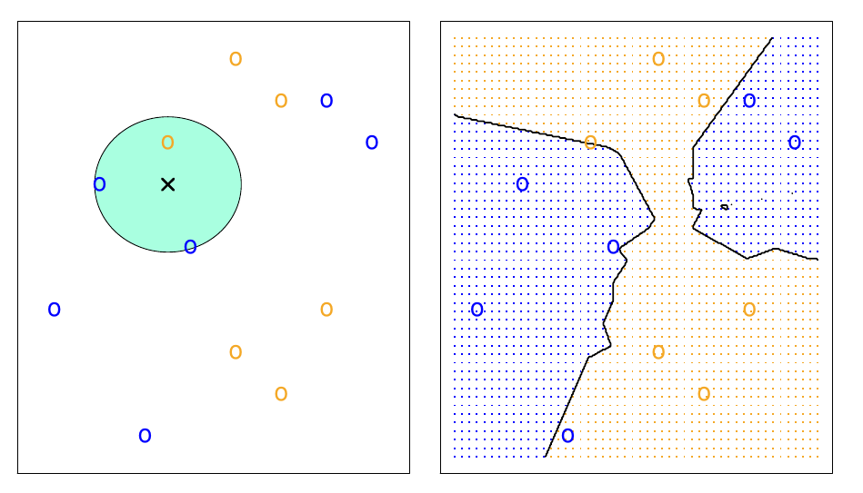{width="60%"}
:::

## kNN Question

- What do you think happens when $k$ is very small?
- What about when $k$ is very big?

## kNN Model

- Classification problem with two classes
- Boundary is the border between 50\% probability of blue 

::: {style="text-align: center;"}
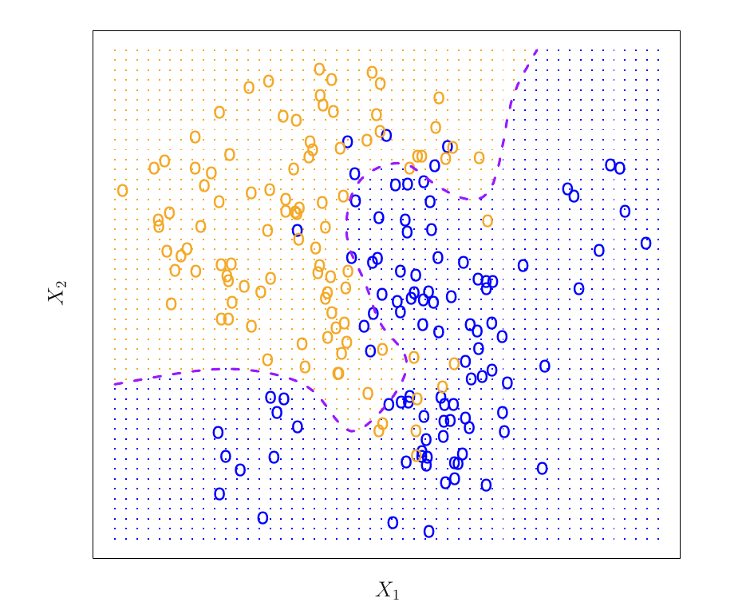{width="40%"}
:::

## kNN Model

- Decision boundary for $k=10$ 

::: {style="text-align: center;"}
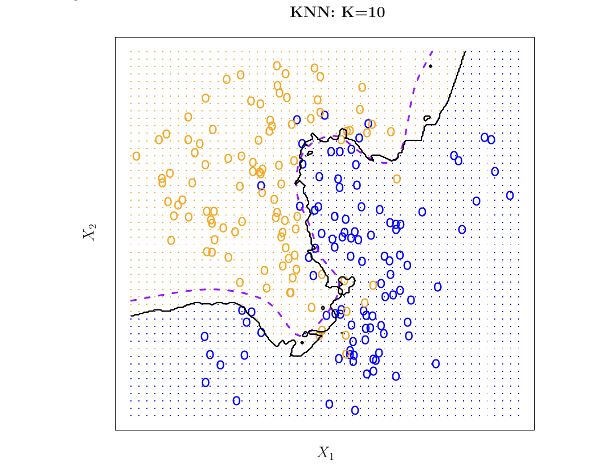{width="50%"}
:::


## kNN Model Over and Under fitting

- $k=1$ corresponds to overfitting 
- $k=100$ corresponds to underfitting

::: {style="text-align: left;"}
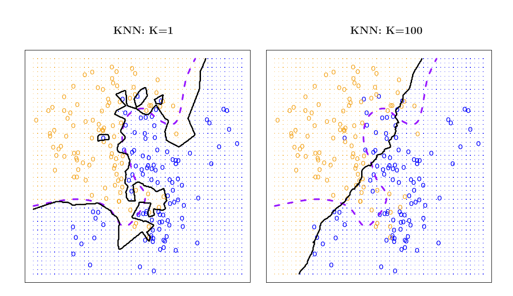{width="60%"}
:::

## kNN Model Generalization Error

- $1/k$ corresponds to model complexity
- Optimal out of sample accuracy at intermediate $k$

::: {style="text-align: left;"}
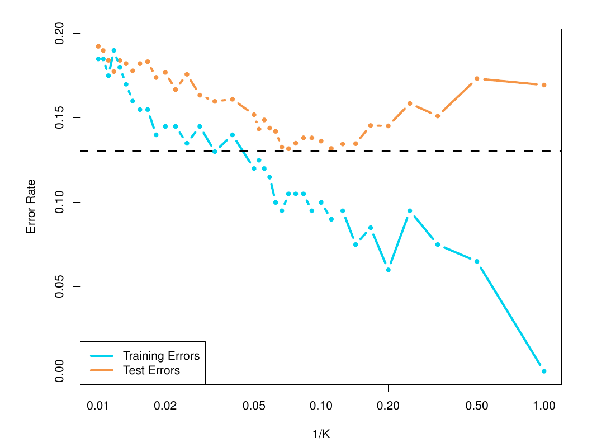{width="60%"}
:::


## Thanks!