```{python}
import ISLP as islp
import numpy as np
from IPython.core.pylabtools import figsize
import pandas as pd
import sklearn as sklearn
from matplotlib.pyplot import subplots
import seaborn as sns
import geopandas as gpd
import matplotlib.pyplot as plt

```

## Week Summary

- HW 2 on Linear Regression is due Next Sunday at midnight
- Post/Contact others about project
- Reading: Chapter 3 of ISLP
- One coding vignette on `statsmodels`


## Linear Regression Revisited

- Prediction is a linear function of the features:

$$
g(\mathbf{x}) = w_1 x_1 + w_2x_2 + \cdots w_nx_n = \sum_{i=1}^n w_ix_i = \mathbf{w}^T\mathbf{x} + c
$$

- Most basic and fundamental regression model

## Why Cover this Again?

- Probably most common production ML model

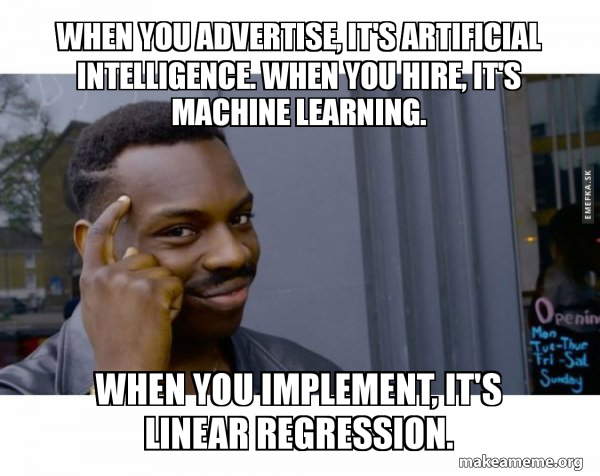{width="80%"}


## Question

- What do you think are the advantages of linear regression?

{width="80%"}

## Linear Regression Advantages

1. Easier to train
2. Easier to understand
3. Easier to fix


## Training is fast and exact

$$
\mathbf{a} = \left(\mathbf{X}^T\mathbf{X}\right)^{-1}\mathbf{X}^T \mathbf{y}
$$

- Much cheaper than a neural network to run
- Can constantly update huge models on the fly on tiny hardware

## Math Aside

- Here $\mathbf{X}$ is the _design matrix_
    $$
    \mathbf{X} = \begin{pmatrix} x_{11} & \cdots & x_{1n} & 1 \\
                      \vdots & \cdots & \vdots & 1 \\
                      x_{m1} & \cdots & x_{mn} & 1
                      \end{pmatrix}
    $$ 

- It is a math object with all the observations stacked in the rows
- Linear algebra is math worth learning

## Linear Models are Interpretable


- Coefficients _may_ tell you causal effects
- Perfect for building intuition during EDA

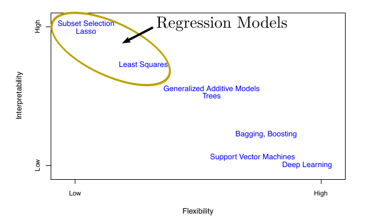


## Start with regression

::: {style="border: 2px solid black; padding: 20px; border-radius: 5px;"}
It's rarely a mistake to start with linear regression, even if you end up just using it as a benchmark to compare to.
:::


## Linear Regression Basics

:::: {.columns}

::: {.column width=50%}
- Features $\mathbf{x} \in \mathcal{X}$:
  - Combination of real numbers and categorical variables
:::

::: {.column width=50%}

:::

::::


## Linear Regression Basics

:::: {.columns}

::: {.column width=50%}
- Input space $y \in \mathcal{Y}$ is just real numbers
:::

::: {.column width=50%}


:::

::::


## Linear Regression Basics

:::: {.columns}

::: {.column width=50%}

- Hypotheses/Models $g\in\mathcal{G}$ are linear functions
$$
g(\mathbf{x}) = w_1x_1+\cdots w_nx_n \\
 = \mathbf{w}^T\mathbf{x}
$$

:::

::: {.column width=50%}


:::

::::


## Linear Regression Basics

:::: {.columns}

::: {.column width=50%}

- Simplest Learning Algorithm: Minimize Loss Function
$$
\mathrm{min}_{\mathbf{w}} \sum_{i=1}^n (\mathbf{w}^T\mathbf{x_i}-y_i)^2
$$

:::

::: {.column width=50%}


:::

::::


## Linear Regression Basics

:::: {.columns}

::: {.column width=50%}


- Maximum likelihood with Gaussian errors:
$$
L(\mathbf{w}) = \prod_{i=1}^n \exp^{-\frac{(\mathbf{w}^T\mathbf{x}_i - y_i)^2}{2\sigma^2}}
$$

:::

::: {.column width=50%}


:::

::::


## Linear Regression Basics

:::: {.columns}

::: {.column width=50%}


- Maximum Likelihood with Gaussian
$$
L(\mathbf{w}) = \prod_{i=1}^n \exp^{-\frac{(\mathbf{w}^T\mathbf{x}_i - y_i)^2}{2\sigma^2}}
$$
- Question: Do you know why?


:::

::: {.column width=50%}


:::

::::


## Linear Regression Basics

:::: {.columns}
::: {.column width=50%}
- Exact Formula:

$$
\mathbf{w} = (X^TX)^{-1}X^T\mathbf{y}
$$

- $X$ is called the _design matrix_
- Contains the data

:::

::: {.column width=50%}


:::
::::


## Linear Regression Basics:

- Learning algorithm works if number of data points $n$ is greater than number of features $p$
- If more features than data points, problem is `ill-posed` but we will show some tricks in a few weeks


## Prediction versus Inference 

- Linear regression coefficients give easy interpretation:
  - $w_i$ is increase in $y$ for a 1 unit increase in $x_i$
  - But this only refers to _predictions_, not to _interventions_
- Whether we care about inference or prediction will change what variables we
will include


## Can Waffle Houses Predict Divorce Rate?


## Waffle Map


## Divorce Rate Map

```{python}

waffles_url = 'https://raw.githubusercontent.com/rmcelreath/rethinking/master/data/WaffleDivorce.csv'
waffles_df = pd.read_csv(waffles_url, sep=';')

us_states = gpd.read_file('https://www2.census.gov/geo/tiger/GENZ2018/shp/cb_2018_us_state_20m.zip')
us_states = us_states[~us_states['STUSPS'].isin(['AK', 'HI', 'PR'])]  

waffle_states = us_states.merge(waffles_df, left_on='NAME', right_on='Location', how='left')


fig, ax = subplots(figsize=(15, 10))
waffle_plot = waffle_states.plot(column='Divorce', cmap='viridis', legend=True, ax=ax,
             legend_kwds={
                        'shrink': 0.5,
                        'aspect': 10,
                        'pad': 0.05})

cbar = waffle_plot.get_figure().axes[-1] 
cbar.tick_params(labelsize=32)  
cbar.set_ylabel('Divorce Rate/100k', fontsize=32) 


ax.axis('off')
ax.set_title('Divorce Rate/100k', fontsize=48)
plt.tight_layout()
plt.show()


```


## Waffle House Example


```{python}
waffles_small = waffles_df[["Location","Loc","Population","Marriage","Divorce","WaffleHouses","South"]].copy()

waffles_small.head()


```

## Confounding

```{python}
import statsmodels.api as sm
import statsmodels.formula.api as smf


fig, ax = subplots(figsize=(8,6))

waffles_df["Waffles_M"] = waffles_df["WaffleHouses"]/waffles_df["Population"]


waffle_reg = smf.ols('Divorce ~ Waffles_M',data = waffles_df).fit()

ax = sns.scatterplot(data = waffles_df,x="Waffles_M",y="Divorce")


x_grid = np.linspace(0,40,10)


pred_df = pd.DataFrame({
  "Waffles_M": x_grid,
  })

pred = waffle_reg.get_prediction(pred_df)
mean = pred.predicted_mean
ci = pred.conf_int()

ax.plot(
  x_grid,
  mean,
  linewidth=1.5
)

ax.fill_between(
  x_grid,
  ci[:, 0],
  ci[:, 1],
  alpha=0.15,
  color = sns.color_palette()[0]
)

ax.set_xlabel("Waffle Houses per Million", fontsize=32)
ax.set_ylabel("Divorce Rate", fontsize=32)
ax.tick_params(labelsize=24)
ax.legend(fontsize=24)
plt.show()


ax.set_xlabel("Wafflehouses per Million",fontsize=24)
ax.set_ylabel("Divorce Rate per 100k",fontsize=24)
ax.set_title("Waffle Houses are Correlated with Divorce Rate",fontsize=24);


```


## Confounding

- Does anyone here believe that building waffle houses will increase the divorce rate?
- Or demolishing them will decrease it?

## Confounding

- We all know Correlation does not equal Causation
- Important for linear (and other) model interpretation

## Confounding

::: {style="border: 2px solid black; padding: 20px; border-radius: 5px;"}
__Confounding__ describes a situation where the predictions of a model differ from the result of experimentally manipulating the 
variables of that model.
::: 

::: {.incremental}
- In the waffle house case, the fact that building waffle houses won't change the divorce rate is an example of confounding.
:::

## Types of Confounds: Fork

- Omitted variable impacts both dependent and
independent variable. 

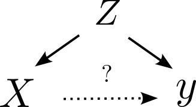

::: {.fragment}
Can you tell me an example of this?
:::


## Types of Confounds: Fork

- Omitted variable impacts both dependent and
independent variable. 

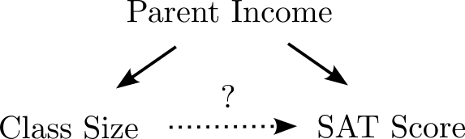


## Types of Confounds: Fork

- Omitted variable impacts both dependent and
independent variable. 

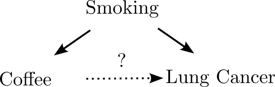


## Types of Confounds: Fork

- Omitted variable impacts both dependent and
independent variable. 

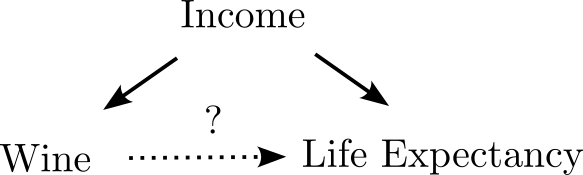


## Types of Confounds: Fork

- Omitted variable impacts both dependent and
independent variable. 

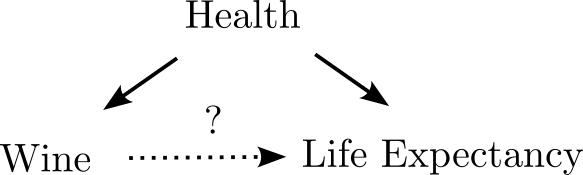


## Control for Confounds

::: {style="border: 2px solid black; padding: 20px; border-radius: 5px;"}
If there is a variable you suspect is a common cause for your dependent and independent variables, you _must_ include it 
in your regression for interpretability
:::

- _controlling_ for the confounder
- _stratifying_ by the confounder

## Waffle Fork

- South causes waffle house and divorce rates


## Waffle Fork

- Mediated by earlier marriage age

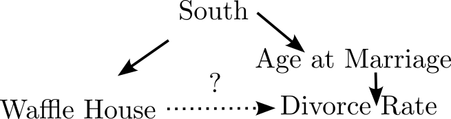


## Controlling for South

- Regression coefficient drops


```{python}

fig, ax = subplots(figsize=(12,8))

waffles_df["Waffles_M"] = waffles_df["WaffleHouses"]/waffles_df["Population"]

mean_simp = mean


waffle_reg = smf.ols('Divorce ~ Waffles_M + South', data=waffles_df).fit()

waffles_df["south_label"] = waffles_df["South"].map({
    0: "Not South",
    1: "South"
})

ax = sns.scatterplot(data = waffles_df,x="Waffles_M",y="Divorce",hue="south_label")

color_dict= dict(zip(
    [1,0],
    sns.color_palette()
))

x_grid = np.linspace(0,40,10)


for ind in ([1, 0]):
    pred_df = pd.DataFrame({
        "Waffles_M": x_grid,
        "South": ind
    })

    pred = waffle_reg.get_prediction(pred_df)
    mean = pred.predicted_mean
    ci = pred.conf_int()

    ax.plot(
        x_grid,
        mean,
        color=color_dict[ind],
        linewidth=1.5,
    )

    ax.fill_between(
        x_grid,
        ci[:, 0],
        ci[:, 1],
        color=color_dict[ind],
        alpha=0.15,
    )


ax.plot(
  x_grid,
  mean_simp,
  color='k',
  linewidth=1.5
)


ax.set_xlabel("Waffle Houses per Million", fontsize=32)
ax.set_ylabel("Divorce Rate", fontsize=32)
ax.tick_params(labelsize=24)
ax.legend(fontsize=24)
plt.show()


```


## Collider Bias

::: {style="border: 2px solid black; padding: 20px; border-radius: 5px;"}
__Collider Bias__ describes a situation when the independent and dependent variable both influence a third variable which 
you have used in your analysis
:::

::: {.fragment}
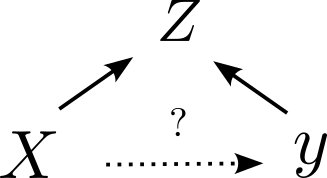
:::


## Low Birthweight paradox


- Mortality rate for low birthweight babies 25x normal weight babies


## Low Birthweight Paradox

::: {.callout}

2. The neonatal mortality rates for single live births of “low birth weight” were substantially and significantly lower for infants of smoking than of nonsmoking mothers.

:::

- Paradoxical Finding:
  - Mortality rate for low birthweight babies with smoking mothers was 50% lower!
  - Makes it seem like smoking is protective against infant mortality


## Should expectant mothers smoke?

::: {.fragment style="border: 2px solid black; padding: 20px; border-radius: 5px;"}
__Hint:__ Smokers were about twice as likely to have babies lighter than 2500 grams, which is considered “low birthweight”.
:::

::: {.fragment}
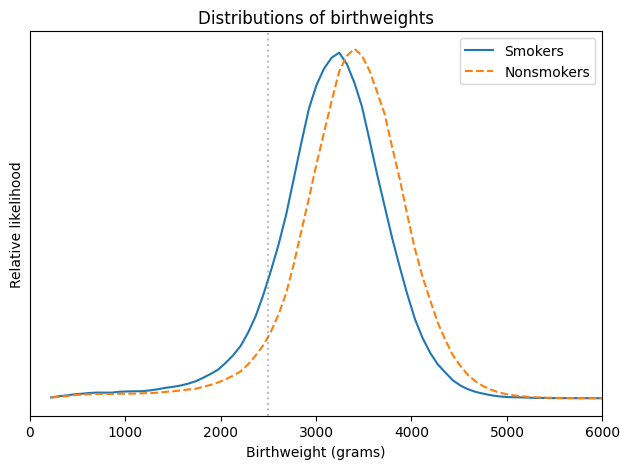{width="50%"}
:::

## Birthweight is a Collider

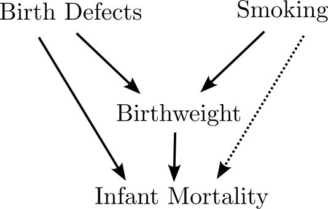


## Birthweight is a collider

- Both smoking and birth defects cause low birthweight
- lbw infants from mothers who smoke have fewer birth defects
- Selecting on low birthweight induces a negative correlation between smoking and infant mortality

## Collider Bias

::: {.fragment style="border: 2px solid black; padding: 20px; border-radius: 5px;"}
- Unlike other confounders, you must not include colliders in your regression if you care about inference!
:::


## Simpson's/Berkson's Paradox


- This appears all over the place:
  - For students already accepted to college, SAT scores don't predict success
 
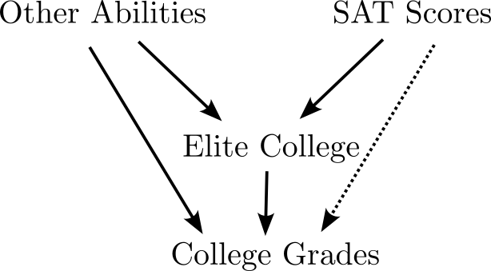
 
 
## Simpson's/Berkson's Paradox


- This appears all over the place:
  - Shorter NBA players are better at shooting than taller ones
 
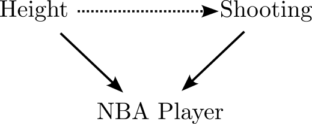


## Simpson's/Berkson's Paradox


- This appears all over the place:
  - BMI is associated with survival for heart disease patients
 
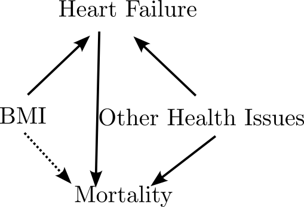


  
## Collinearity for Inference

- Common advice to exclude collinear predictors
- For inference, confounding is _much_ more important and should be your primary concern
- Inference is only as good as your assumptions


## Linear Models for Prediction

- Confounding concerns go out the window when your goal is accurate predictions
- Out of sample accuracy, rather than inference/interpretability
- How?


## Comparing Models

- Hold Out/Cross Validation
  - Save some testing data, use it to test the model


## Comparing Models

- Information Criteria
  - Train with all the data, use statistical theory and likelihood to estimate out of sample accuracy


## Akaike Information Criterion

- AIC for statistical model is:
$$
AIC = n - \log(\hat{L})
$$

- $\hat{L}$ is the likelihood of the model
- $n$ is the number of parameters
- This balances model complexity ($n$) with in-sample accuracy

## Akaike Information Criterion

- There are a wide variety of other information criteria (BIC, WAIC, etc)
- They are used for comparing models
- For linear models, `AIC` approximates the loss of _information_ caused by using the model out of sample
$$
KL(p,q) = \int_{X}dx p(x)(\log(p(x))-\log(q(x)))
$$
- __Only used for model comparison__


## AIC Intuition

- Training sample has some noise
- Additional parameters help to reduce error, but partially fit noise
- For linear models, you can estimate the "cost" of this fit with respect to the KL divergence


## Example: Hitters Data {.scrollable}

- Dataset that contains information on baseball players in 1987

```{python}
import ISLP
Hitters = ISLP.load_data('Hitters')
Hitters = Hitters.dropna()
Hitters.info()
```


## Predicting Salary

- We have a large number of variables to choose from
- What should we put in a predictive model to prevent overfitting?

```{python}
Hitters.corr(numeric_only=True)['Salary'].drop('Salary').abs().sort_values(ascending=False)


```


## Collinear Predictors

```{python}

corr = Hitters.corr(numeric_only=True)
plt.figure(figsize=(12, 10))
sns.heatmap(corr, annot=True, fmt='.2f', cmap='viridis', center=0)
plt.tight_layout()
plt.show()


```


## Lowest AIC

- Model of intermediate complexity is best

```{python}


model_basic = smf.ols('Salary ~ CRBI + CWalks + CRuns',data=Hitters).fit()
model_intelligent = smf.ols('Salary ~ CRBI + CWalks+ CRuns  + Walks  +  Division + AtBat +  CAtBat + PutOuts + Hits + CHits ',data=Hitters).fit()
model_the_works = smf.ols('Salary ~ CRBI + CWalks + CRuns + RBI + Walks + Runs + CHmRun + Years + Errors + Assists + League + Division + AtBat + CAtBat + PutOuts + Hits + CHits + HmRun',data=Hitters).fit()

models = ["basic","intelligent","everything"]
aics = [model_basic.aic,model_intelligent.aic,model_the_works.aic]
aic_df = pd.DataFrame({'models':models,'aic':aics})

aic_df.sort_values('aic')

```

- `intelligent` ignored dropped several features that were irrelevant or redundant
- Doesn't have `HmRun`, `RBI`, `CHmRun`


## Thanks!


