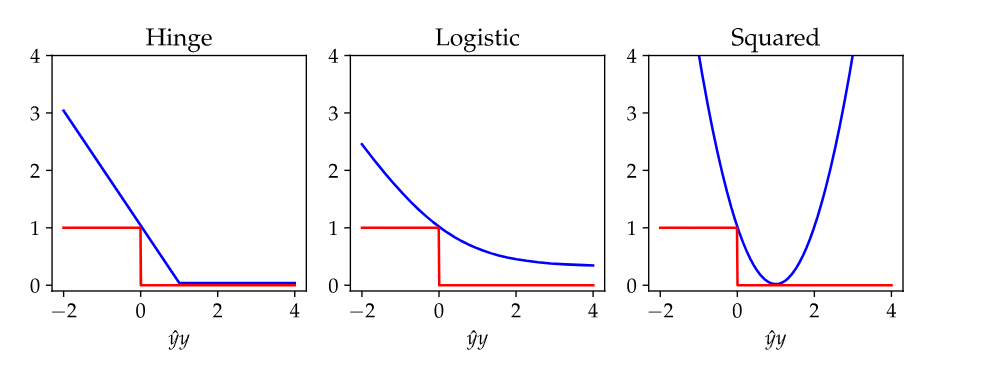

```{python}
import ISLP as islp
import numpy as np
from IPython.core.pylabtools import figsize
import pandas as pd
import sklearn as sklearn
from matplotlib.pyplot import subplots
import seaborn as sns
import matplotlib.pyplot as plt

sklearn.set_config(transform_output="pandas")
from sklearn.model_selection import train_test_split

from sklearn.linear_model import LogisticRegression

from sklearn.compose import ColumnTransformer, make_column_selector

from sklearn.preprocessing import OneHotEncoder, OrdinalEncoder, StandardScaler, LabelEncoder
from sklearn.calibration import calibration_curve
from sklearn.metrics import confusion_matrix, classification_report, accuracy_score, roc_auc_score, roc_curve, RocCurveDisplay, ConfusionMatrixDisplay
from sklearn.pipeline import Pipeline

from marginaleffects import avg_slopes, slopes, plot_predictions, fit_sklearn, avg_comparisons, predictions, datagrid


```


## Week Summary

- Essential to contact others about projects this week
  - Proposal Due in 2 Weeks.
  - Each team reach out to schedule 5-10 minute meeting during October 5 week
- HW 3 on Classification due in 2 weeks
- Coding vignette on classification/LR


## HW 3 Summary:

- Always look at your figures very carefully. 
- Misconception: Noise in data does not help regularize
  - Later we will learn that noise in the algorithm can
- Python arrays indexed starting from 0


## Weather Example

- Meteorologist forecasts the weather


## Weather Example

- Here is an example of a potential forecast:

::: {style="width: 80%; text-align: left;"}
| Day        | 1 | 2 | 3 | 4   | 5   | 6   | 7   | 8   | 9   | 10  |
|------------|---|---|---|-----|-----|-----|-----|-----|-----|-----|
| Prediction | 🌧️ | 🌧️ | 🌧️ | 🌧️ | 🌧️ | 🌧️ | 🌧️ | 🌧️ | 🌧️ | 🌧️ |
| Observed   | 🌧️ | 🌧️ | 🌧️ | ☀️  | ☀️  | ☀️  | ☀️  | ☀️  | ☀️  | ☀️  |
:::

- How would you evaluate this?


## Weather Example

- Which of these two forecasts do you think is better:

::: {style="width: 80%; text-align: left;"}
| Day        | 1 | 2 | 3 | 4   | 5   | 6   | 7   | 8   | 9   | 10  |
|------------|---|---|---|-----|-----|-----|-----|-----|-----|-----|
| Prediction | 🌧️ | 🌧️ | 🌧️ | 🌧️ | 🌧️ | 🌧️ | 🌧️ | 🌧️ | 🌧️ | 🌧️ |
| Observed   | 🌧️ | 🌧️ | 🌧️ | ☀️  | ☀️  | ☀️  | ☀️  | ☀️  | ☀️  | ☀️  |


| Day        | 1 | 2 | 3 | 4   | 5   | 6   | 7   | 8   | 9   | 10  |
|------------|---|---|---|-----|-----|-----|-----|-----|-----|-----|
| Prediction | ☀️ | ☀️ | ☀️ | ☀️ | ☀️ | ☀️ | ☀️ | ☀️ | ☀️ | ☀️ |
| Observed   | 🌧️ | 🌧️ | 🌧️ | ☀️  | ☀️  | ☀️  | ☀️  | ☀️  | ☀️  | ☀️  |
:::

## Which forecast is better?


::: {style="border: 2px solid black; padding: 20px; border-radius: 5px;"}
It depends on the consequences of your decisions!
:::

::: {.incremental}
- Rain: Take the subway, bring umbrella
- Sun: Bike to work, no umbrella
- Cost of getting soaked on rainy day is probably higher than 
inconvenience of not biking or carrying an umbrella
:::

## Probability as Nuance

- What if the forecasts were like this instead:

::: {style="width: 80%; text-align: left;"}
| Day        | 1 | 2 | 3 | 4   | 5   | 6   | 7   | 8   | 9   | 10  |
|------------|---|---|---|-----|-----|-----|-----|-----|-----|-----|
| Prediction | 0.8 | 0.8 | 0.8 | 0.6 | 0.6 | 0.6 | 0.6 | 0.6 | 0.6 | 0.6 |
| Observed   | 🌧️ | 🌧️ | 🌧️ | ☀️  | ☀️  | ☀️  | ☀️  | ☀️  | ☀️  | ☀️  |


| Day        | 1 | 2 | 3 | 4   | 5   | 6   | 7   | 8   | 9   | 10  |
|------------|---|---|---|-----|-----|-----|-----|-----|-----|-----|
| Prediction | 0 | 0 | 0 | 0 | 0 | 0 | 0 | 0 | 0 | 0 |
| Observed   | 🌧️ | 🌧️ | 🌧️ | ☀️  | ☀️  | ☀️  | ☀️  | ☀️  | ☀️  | ☀️  |
:::

## Probability adds Nuance

- Consider a disease classification model
- Patient 1: $P(\mathrm{disease}|\mathrm{labs}) = 0.001$
- Patient 2: $P(\mathrm{disease}|\mathrm{labs}) = 0.15$

::: {style="border: 2px solid black; padding: 20px; border-radius: 5px;"}
Both classify to "no disease", but in patient 2 you might recommend further testing or monitoring
:::


## Calibration versus Relative Ranking

- A model with accurate probabilities is called __well calibrated__
- Sometimes you just need relative rankings
- Which potential customers to call?
- Which drug candidates to test?
- Where to drill test wells?


## Probability Prediction Versus Classification

- Computer Science focuses on error:

$$
\frac{1}{n}\sum_{i=1}^n I(y_i \neq g(\mathbf{x}_i))
$$

- Statistics focuses on probabilities:

$$
p(y|\mathbf{x})
$$


## Loss Functions for Classification

- Classification often works with a threshold function:
$$
g(\mathbf{x}) = 1\quad\quad \mathrm{if}\quad\quad \eta(\mathbf{x}) > 0 \\
g(\mathbf{x}) = 0\quad\quad \mathrm{if}\quad\quad \eta(\mathbf{x}) < 0 
$$

- Minimizing standard error function is computationally intractable!


## Classification Error

- Consider this set of points:

::: {style="width: 60%; text-align: left;"}

:::

## Classification Error

- Linear classifier, error is 2

::: {style="width: 60%; text-align: left;"}

:::

## Classification Error

- As we move line, error does not change

::: {style="width: 60%; text-align: left;"}

:::

## Classification Error

- Except for Sudden Jumps

::: {style="width: 60%; text-align: left;"}

:::

## Surrogate Loss

- Learning algorithms cannot use this discontinuous rule! 
- Instead use _surrogate_ functions which mimic the loss rule
- Based on threshold function




## Logistic loss

- logistic function $\sigma$:
$$
\sigma(\eta(\mathbf{x})) = \frac{1}{1+e^{-\eta(\mathbf{x})}}
$$
- Here is $\eta$ is a score that could range from $-\infty$ to $\infty$
- $\sigma$ is between 0 and 1, can interpret as a probability


## Logistic Regression

- $\eta$ is linear function of predictors:
$$
\eta(\mathbf{x}) = \sum_j w_jx_j 
$$
- Probability that $y=1$ is $\sigma(\eta(\mathbf{x}))$:
$$
p(y=1|\mathbf{x}) = \frac{1}{1+\exp(-\mathbf{w}\cdot\mathbf{x})}
$$


## Maximum Likelihood for LR

- Minimizing logistic loss is equivalent to finding maximum likelihood
- 'log' likelihood formula:
$$
L(\mathbf{w}) = \sum_{y_i = 1} \log(p(1|\mathbf{x}_i)) + \sum_{y_i=0}\log(p(0|\mathbf{x}_i))
$$

## Multinomial Logistic Regression

- What happens if there are more than one class?
- Get weight vector $w_k$ for each predictor (except last one)

$$
p(y=k|\mathbf{x}) = \frac{\exp{\mathbf{w}_k\cdot\mathbf{x}}}{1 + \sum_{j=1}^{K-1} \exp{\mathbf{w}_j\cdot\mathbf{x}}}
$$


## Understanding 'log' loss

-  Consider weather examples again, interpreted as probabilities:

::: {style="width: 80%; text-align: left;"}

| Day        | 1 | 2 | 3 | 4   | 5   | 6   | 7   | 8   | 9   | 10  |
|------------|---|---|---|-----|-----|-----|-----|-----|-----|-----|
| Prediction | 0.8 | 0.8 | 0.8 | 0.6 | 0.6 | 0.6 | 0.6 | 0.6 | 0.6 | 0.6 |
| Observed   | 🌧️ | 🌧️ | 🌧️ | ☀️  | ☀️  | ☀️  | ☀️  | ☀️  | ☀️  | ☀️  |


| Day        | 1 | 2 | 3 | 4   | 5   | 6   | 7   | 8   | 9   | 10  |
|------------|---|---|---|-----|-----|-----|-----|-----|-----|-----|
| Prediction | 0 | 0 | 0 | 0 | 0 | 0 | 0 | 0 | 0 | 0 |
| Observed   | 🌧️ | 🌧️ | 🌧️ | ☀️  | ☀️  | ☀️  | ☀️  | ☀️  | ☀️  | ☀️  |
:::

## Understanding 'log' loss

- Misclassification Error:
    - First forecast made 7 wrong predictions
    - Second forecast made 3 wrong predictions


## Understanding 'log' loss

- 'log' loss
  - First forecast: $3\log(0.8) + 7\log(0.4) = -7$
  - Second forecast $3\log(0) + 7\log(1) = -\infty$


::: {.fragment style="border: 2px solid red; padding: 20px; border-radius: 5px;"}
'log' loss massively penalizes overconfident wrong predictions! 
:::

::: {.fragment style="border: 2px solid blue; padding: 20px; border-radius: 5px;"}
If this is a problem, consider using Brier score or some other loss function
:::


## Example: Credit Data

```{python}
default = islp.load_data('Default')

default.head()


```


## Example: Credit Data

```{python}

fig, ax = subplots(figsize=(8,6))

sns.scatterplot(data=default, x='balance', y='income', 
                hue='default', style='default', 
                markers=['+', 'x'],
                s=50, alpha=0.7, ax=ax)

ax.set_xlabel("Credit Balance (USD)",fontsize=20)
ax.set_ylabel("Income (USD)",fontsize=20)
fig.suptitle("Default Status Versus Income and Balance",x=0.125,ha='left',fontsize=24,fontweight='bold')
ax.set_title("Credit card defaults seem to be driven\n much more strongly by balance than income",fontsize=20)
plt.tight_layout()
plt.show()
                


```


## Example: Credit Data

```{python}

fig, ax = subplots(figsize=(8,6))

sns.scatterplot(data=default, x='balance', y='income', 
                hue='student', style='student', 
                markers=['o', 's'],
                s=50, alpha=0.7, ax=ax)

ax.set_xlabel("Credit Balance (USD)",fontsize=20)
ax.set_ylabel("Income (USD)",fontsize=20)
fig.suptitle("Student Status",x=0.125,ha='left',fontsize=24,fontweight='bold')
ax.set_title("Students have lower income",fontsize=20)
plt.tight_layout()
plt.show()
```


## Model Coefficients

```{python}
train_set, test_set = train_test_split(default, test_size=0.2, random_state=123155,stratify=default["default"])


train_set_target = train_set["default"].copy()
test_set_target = test_set["default"].copy()

le = LabelEncoder()
y_train = le.fit_transform(train_set_target)
y_test = le.transform(test_set_target)

train_set_drop = train_set.copy().drop(["default"],axis=1)
test_set_drop = test_set.copy().drop(["default"],axis=1)

numerical_features = ["balance","income"]

categorical_features = ["student"]

preprocessor = ColumnTransformer([
    ('num', StandardScaler(), numerical_features),
    ('cat', OneHotEncoder(drop='first', handle_unknown='ignore', sparse_output=False), categorical_features)
])  

pipe_lr = Pipeline([
    ('prep', preprocessor),
    ('model', LogisticRegression(max_iter=1000))
])

pipe_lr.fit(train_set_drop,y_train)

model_lr_f = pipe_lr.named_steps['model']

def logistic_features(pipe):
    
    model = pipe.named_steps['model']
    preprocessor = pipe.named_steps['prep']
    
    feature_names = preprocessor.get_feature_names_out()

    coef_df = pd.DataFrame({
        'feature': list(feature_names),
        'coefficient': list(model.coef_[0])
    })

    coef_df['odds_ratio'] = np.exp(coef_df['coefficient'])
    coef_df['abs_coefficient'] = coef_df['coefficient'].abs()
    coef_df = coef_df.sort_values('abs_coefficient', ascending=False)
    return coef_df

coef_df = logistic_features(pipe_lr)

coef_df[["feature","coefficient"]]
```

- What do these coefficients actually mean?


## logit transformation to Odds Ratios

- logistic regression predicts log-odds ratios of outcomes:
$$
\log(\frac{p_{\mathrm{default}}}{1-p_{\mathrm{default}}}) = w_0 + w_1 x_1 + \cdots w_n x_n
$$
- Coefficient relates feature to odds ratio


::: {style="border: 2px solid black; padding: 20px; border-radius: 5px;"}
Most people do not intuitively understand log-odds ratios, nor should they be expected to be
:::

## logit transformation to Odds Ratios

- exponentiate coefficients to recover odds ratios

```{python}

coef_df[["feature","coefficient","odds_ratio"]]
```

- A 1 unit change in variable leads to a change in odds equal to the 'odds_ratio'


## Marginal Effects

- Odds ratios are good, but probabilities are even more intuitive
- Doubling the odds ratio:
 - 1% to 2%
 - 25% to 40%
 - 50% to 67%
 - 90% to 95%


## Marginal Effects

- To see how factors impact proability, decide where you want to make predictions

```{python}

# Very annoying I had to do things this way in case you are looking
# at my code

train_set_drop["student"] = train_set_drop["student"].astype("category")

train_set_drop["balance"] = train_set_drop["balance"] / 1000
train_set_drop["income"] = train_set_drop["income"] / 1000

mod = fit_sklearn(
    "default ~ balance + income + student",
    data=pd.concat([train_set_drop, train_set_target.rename("default")], axis=1),
    engine=LogisticRegression(max_iter=1000),
)


average_slopes = avg_slopes(mod, 
    variables=["balance", "income", "student"])


average_comparisons = avg_comparisons(mod, 
    variables={"balance": "sd", "income": "sd", "student": "reference"})

print(average_slopes)
print(average_comparisons);

```

## Plot the Probability Predictions

```{python}

pred_df = predictions(mod, 
    newdata=datagrid(model=mod, balance=np.linspace(0, 3, 200), student=["Yes", "No"]))

fig, ax = subplots(figsize=(8, 6))
sns.lineplot(data=pred_df.to_pandas(), x="balance", y="estimate", hue="student",linewidth=2.5, ax=ax)
ax.set_xlabel("Balance (1000 USD)", fontsize=16)
ax.set_ylabel("P(Default)", fontsize=16)
ax.set_title("Predicted Default Probability", fontsize=20)
ax.legend(title="Student", fontsize=14, title_fontsize=14)
plt.tight_layout()
plt.show()


```


## Probability Calibration

```{python}
y_prob = pipe_lr.predict_proba(test_set_drop)[:, 1]
prob_true, prob_pred = calibration_curve(y_test, y_prob, n_bins=10, strategy="quantile")

max_val = 0.25

fig, ax = subplots(figsize=(8, 6))
ax.plot(prob_pred, prob_true, marker="o", label="Model")
ax.plot([0, max_val], [0, max_val], linestyle="--", color="gray", label="Perfect Calibration")
ax.set_xlabel("Mean Predicted Probability", fontsize=16)
ax.set_ylabel("Observed Frequency", fontsize=16)
ax.set_title("Calibration Curve", fontsize=20)
ax.legend(fontsize=14)
plt.tight_layout()
plt.show()
```


## Types of errors

- Defaults are very rare, Bayes decision rule predicts no defaults!
- False Negative: predicted no default, default happened
- False Positive: predicted default, no default happened

## Decision Thresholds

- Consequences of mistakes can vary:
  - Predict rain wrong you accidentally carried umbrella
  - Predict sun wrong, you arrived to work soaked

::: {style="border: 2px solid black; padding: 20px; border-radius: 5px;"}
__Solution:__ Bias your prediction towards the mistake that has worse consequences
:::


## ROC Curve

```{python}

y_prob = pipe_lr.predict_proba(test_set_drop)[:, 1]

fig, ax = subplots(figsize=(8, 6))

RocCurveDisplay.from_predictions(y_test, y_prob, ax=ax);
ax.plot([0, 1], [0, 1], linestyle="--", color="gray")
ax.set_title("ROC Curve", fontsize=20)
ax.set_xlabel("False Positive Rate", fontsize=16)
ax.set_ylabel("True Positive Rate", fontsize=16);

plt.tight_layout();
plt.show();
```


## Confusion Matrix

- Tabular counterpart to ROC curve
- Displays amount of different types of errors and successes

```{python}


threshold = 0.5
y_pred = (y_prob >= threshold).astype(int)

print("Bayes Decision Rule\n")
print(classification_report(y_test, y_pred, target_names=["No Default", "Default"]))

```

- Precision: If model said it, was it true?
- Recall: If it was true, did the model say it? (TPR/TNR)


## Confusion Matrix

- Tabular counterpart to ROC curve
- Displays amount of different types of errors and successes

```{python}


threshold = 0.1
y_pred = (y_prob >= threshold).astype(int)

print("10% threshold\n")
print(classification_report(y_test, y_pred, target_names=["No Default", "Default"]))

```

- Precision: If model said it, was it true?
- Recall: If it was true, did the model say it?


## Thanks


