```{python}
import ISLP as islp
import numpy as np
from IPython.core.pylabtools import figsize
import pandas as pd
import sklearn as sklearn
from matplotlib.pyplot import subplots
import seaborn as sns
import matplotlib.pyplot as plt

sklearn.set_config(transform_output="pandas")
from sklearn.model_selection import train_test_split

from sklearn.linear_model import LogisticRegression

from sklearn.compose import ColumnTransformer, make_column_selector

from sklearn.preprocessing import OneHotEncoder, OrdinalEncoder, StandardScaler, LabelEncoder
from sklearn.calibration import calibration_curve
from sklearn.metrics import confusion_matrix, classification_report, accuracy_score, roc_auc_score, roc_curve, RocCurveDisplay, ConfusionMatrixDisplay
from sklearn.pipeline import Pipeline

from marginaleffects import avg_slopes, slopes, plot_predictions, fit_sklearn, avg_comparisons, predictions, datagrid
from sklearn.naive_bayes import GaussianNB


```


## Week Summary

- Groups: Email me your members asap, also set up time to meet
- If not in a group, email me immediately if you want to get a grade for the proposal
- HW 4 available- it involves lots of reading but not as much work as it looks
- Chapter 5 of ISLP


## Train-Test Redux {.nostretch}

- Goal of Predictive Model Selection:

::: {style="border: 2px solid black; padding: 20px; border-radius: 5px;"}
Best out of sample performance
:::

- Hold out data for testing

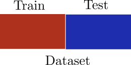{width="40%"}


## Train-Test Redux {.nostretch}

- If you are comparing many different models and features, sometimes need three datasets

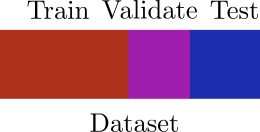{width=40%}


## Train-Test Split Problems

- Estimate of out of sample performance has high variance due to single split

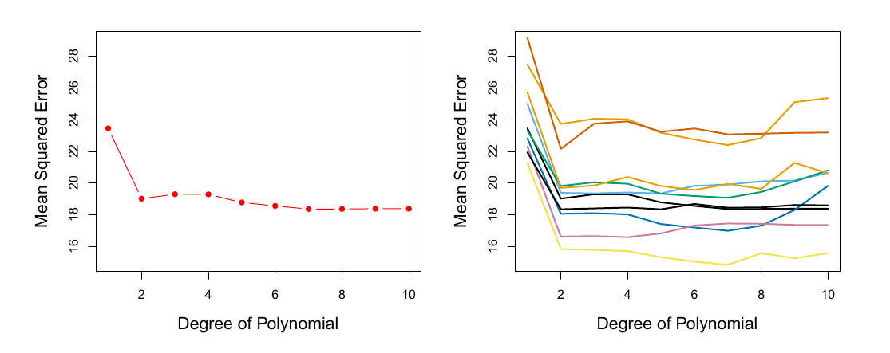


## Train-Test Split Problems

- High variance compounds multiple-comparison issue

```{python}


np.random.seed(20011)

n_models = 20
n_sims = 5000
true_mean = 0.0  

fig, axes = plt.subplots(1, 3, figsize=(15, 5))

variances = [0.01, 0.03, 0.1]
labels = ["$\sigma^2=0.01$", "$\sigma^2=0.03$", "$\sigma^2=0.1$"]

for ax, var, label in zip(axes, variances, labels):
    sigma = np.sqrt(var)
    

    all_scores = np.random.normal(true_mean, sigma, size=(n_sims, n_models))
    best_scores = all_scores.max(axis=1)
    
    single_model_scores = all_scores[:, 0]
    
    ax.hist(single_model_scores, bins=50, alpha=0.5, color="#56B4E9",
            label="Single model score", density=True)
    ax.hist(best_scores, bins=50, alpha=0.5, color="#E69F00",
            label=f"Best of {n_models} models", density=True)
    ax.axvline(true_mean, color="black", ls="--", lw=1.5, label="True performance")
    ax.axvline(best_scores.mean(), color="#E69F00", ls=":", lw=1.5,
               label=f"E[max] = {best_scores.mean():.3f}")
    
    ax.set_title(label, fontsize=12)
    ax.set_xlabel("Estimated performance")
    ax.set_xlim(-2.0, 2.0)
    ax.legend(fontsize=8)

fig.suptitle(
    f"Selection bias: picking the best of {n_models} equally good models\n"
    "Higher variance leads to highly overoptimistic prediction of out of sample error",
    fontsize=13, y=1.05
)
plt.tight_layout()
plt.show()


```


## Train-Test Split Problems

- High variance compounds multiple-comparison issue

```{python}


np.random.seed(20011)

n_models = 1000
n_sims = 5000
true_mean = 0.0  

fig, axes = plt.subplots(1, 3, figsize=(15, 5))

variances = [0.01, 0.03, 0.1]
labels = ["$\sigma^2=0.01$", "$\sigma^2=0.03$", "$\sigma^2=0.1$"]

for ax, var, label in zip(axes, variances, labels):
    sigma = np.sqrt(var)
    

    all_scores = np.random.normal(true_mean, sigma, size=(n_sims, n_models))
    best_scores = all_scores.max(axis=1)
    
    single_model_scores = all_scores[:, 0]
    
    ax.hist(single_model_scores, bins=50, alpha=0.5, color="#56B4E9",
            label="Single model score", density=True)
    ax.hist(best_scores, bins=50, alpha=0.5, color="#E69F00",
            label=f"Best of {n_models} models", density=True)
    ax.axvline(true_mean, color="black", ls="--", lw=1.5, label="True performance")
    ax.axvline(best_scores.mean(), color="#E69F00", ls=":", lw=1.5,
               label=f"E[max] = {best_scores.mean():.3f}")
    
    ax.set_title(label, fontsize=12)
    ax.set_xlabel("Estimated performance")
    ax.set_xlim(-2.0, 2.0)
    ax.legend(fontsize=8)

fig.suptitle(
    f"The problem compounds as the number of models increases\n"
    "Here 1000 models are used",
        fontsize=13, y=1.05
)
plt.tight_layout()
plt.show()


```


## Train-Test Split Problems

- Estimated accuracy is based on a model fit to less than the full data
- Can lead to understimated accuracy
- Data Inefficient
- Sensitivity to rare classes


## Cross Validation

:::: {.columns}

::: {.column width=50%}
- Cross Validation divides data into "folds"
- Fit on $k-1$ folds
- Estimate error on $k$th fold
- Repeat and then average
:::

::: {.column width=50%}
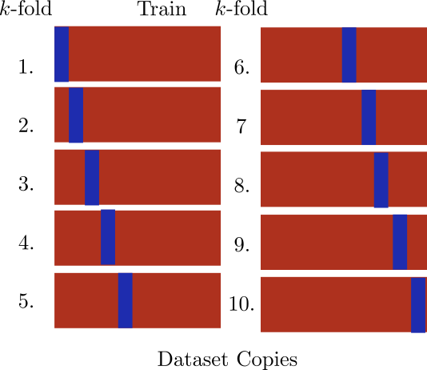
:::

::::


## Cross Validation Disadvantages


- You have to fit your model multiple times (potential dealbreaker)
- How accurate is your estimate of accuracy? Now it is subtle
- Data leakage issues are more subtle


## Leave One Out Cross-Validation (LOO-CV)

- Each "fold" has a single point
- Train entire model on $n-1$ points, test on $1$, repeat

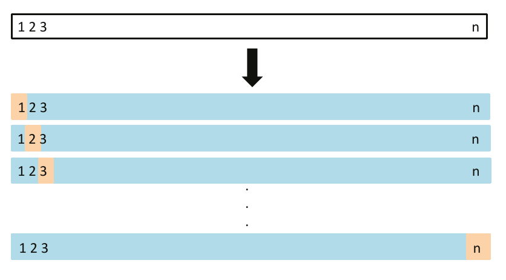


## LOO-CV Tricks

- Refitting model over and over sounds horrendous... but,
- There are tricks to get 'LOO-CV' for free

**Linear Models**

$$
\mathrm{CV}_n = \frac{1}{n}\sum_{i=1}^n \frac{\left(y_i - g_{\mathrm{full}}(\mathbf{x}_i)\right)^2}{1-h_i}
$$

- Leverage $h_i = \mathbf{x}_i^T(X^TX)^{-1}\mathbf{x}_i$


## LOO-CV Tricks

- Refitting model over and over sounds horrendous... but,
- There are tricks to get 'LOO-CV' for free

**Linear Models**

$$
\mathrm{CV}_n = \frac{1}{n}\sum_{i=1}^n \frac{\left(y_i - g_{\mathrm{full}}(\mathbf{x}_i)\right)^2}{1-h_i}
$$

- 'sklearn's 'RidgeCV' does this automatically


## LOO-CV Tricks

- Refitting model over and over sounds horrendous... but,
- There are tricks to get 'LOO-CV' for free

**Bayesian Models**

- This can be approximated for _any_ Bayesian model using _Pareto Smoothed Importance Sampling_
- See the _arViz_ package


## k-Fold Cross Validation

- For $k$-fold, error estimate is:

$$
\mathrm{CV}_k = \frac{1}{k}\sum_{i=1}^k \mathrm{MSE}_k
$$


## How many folds?

- 'LOO-CV' is least biased
  - Because it uses more data per model, the models are closer to the full model


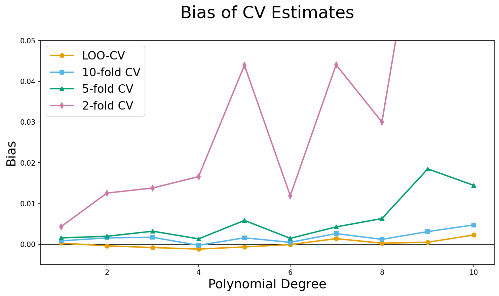


## How many folds?

- What about variance?


- Your textbook argues that "variance" increases with $k$, in a kind of _bias-variance trade-off_
- But they don't give any evidence


## How Many Folds?

- It has been proven mathematically at least for linear regression, that there is no trade-off!
- 'LOO-CV' has lowest variance and lowest bias

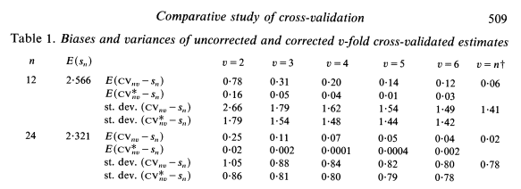


## 'LOO-CV' variance?

- I tried it with repeated experiments using known data generating process
- 'LOO' is best

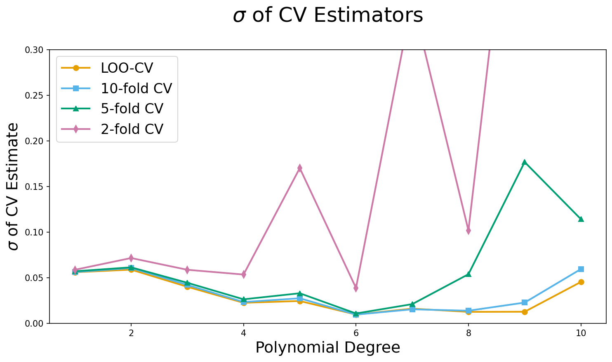


## How Many Folds?

- Decide based on how much data you have and if you have a fomula to get 'loo'
- $k=5$ is a bit more than 5x
-  Difference to 'loo' is proportional to your data
- At same time, bias and variance advantages of 'LOO-CV' decrease with more data


## Validation, k-fold or LOO-CV?

1. If you have no other choice, validation
2. If you can, 'LOO-CV'
3. Otherwise, $k=5$ is a great choice that is a sweet spot of computational expense and diminishing returns 
to bias and variance


## What Metric to Use?

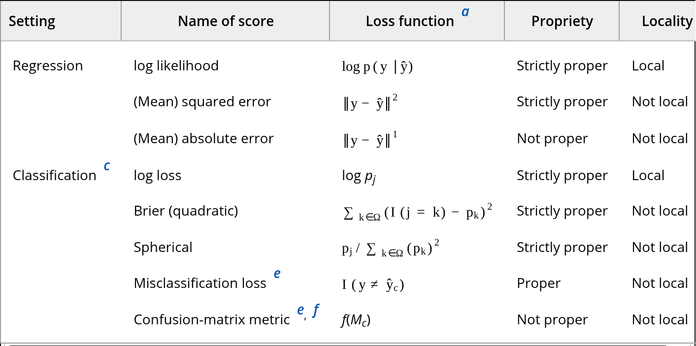


## Proper and Local Metrics

1. Proper Metric: This is one where if your model was the data generating process it would be scored highest

2. Local Metric: For each observation, contribution to score _only_ rates to probability of predicting correct class


## Metric Selection Advice

- If you have likelihood, use 'log' scoring
  - Both classification and regression
- If costs are well known, you can construct a custom metric based on that
- If ranking is key, AUC of ROC curve or similar is not bad


## The Bootstrap

- Motivation: For complicated models there aren't "statistics" we can use to derive uncertainty estimates

**Bootstrap**: Create a lot of fake datasets by resampling from your data with replacement

- Get "samples" from your model, empirical confidence intervals

## The Bootstrap

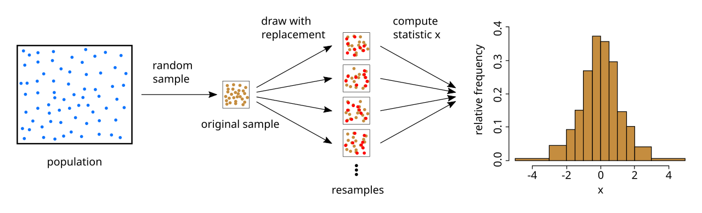


## The Bootstrap

- Resample "B" times, coefficient or prediction $c_r$ for each boostrap
$$
SE_{c} = \left(\frac{1}{B-1}\sum_{r=1}^B\left(c_r - \bar{c}\right)^2     \right)^{1/2}
$$


## Bootstrapping is Expensive

- Convergence rate is $\frac{1}{\sqrt{B}}$
- Slower for tails, need more reps for confidence intervals
- Main use cases are complicated, but not computationally intensive models
  - Various types of regression
  - Tree based methods ("bagging" is based on bootstrap)


## No Inference after Model Selection

- Suppose you care about the values of the model coefficients
- You have a family of different models, and you use cross-validation to pick the "best" one
- Then you look at the model coefficients of the best model
- Smart?

## No Inference after Model Selection

- Winner's Curse- winning model will only include features with a high coefficient
- Values biased away from 0 and standard errors biased low

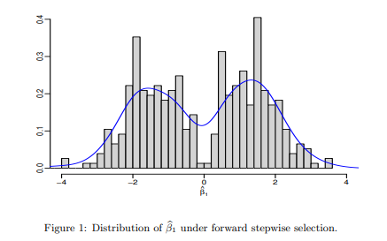


## Bias Correction

- Cross-Validation penalizes more complex models because smaller than full dataset is used
- If $S_g$ is the score of a model $g$, the bias correction is:

$$
S_g^* = S_g +\frac{1}{n}\sum_{i=1}^n \nu_i, \\
\nu_i = L(y_i,g(\mathbf{x}_i)) -\frac{1}{k}\sum_{j=1}^k L(y_i,g_j(\mathbf{x}_i))
$$


## One Standard Error Rule

- Overfitting is something that can occur in model selection
- When you compare a lot of models, the ones that get selected have all there variables as important, some due to chance


## One Standard Error Rule

- Compute standard error of Score estimate of best model:
$$
SE_{CV} = \frac{\hat{\sigma}}{\sqrt{n}}
$$
- Pick simplest model with CV score within one standard error of the best model average


## Thanks!


