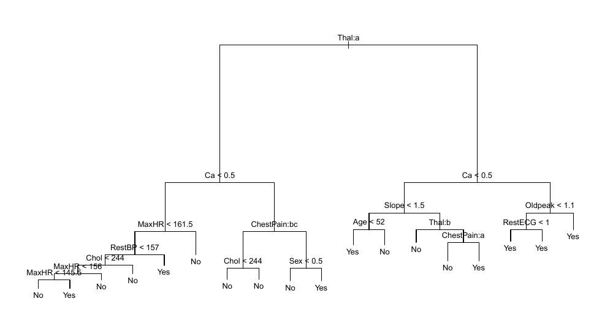
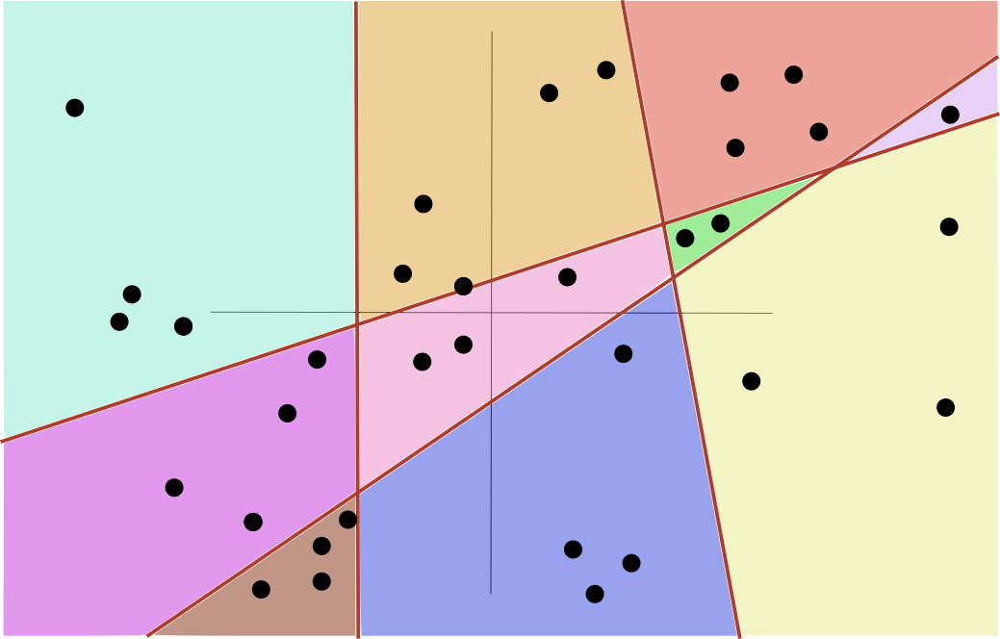
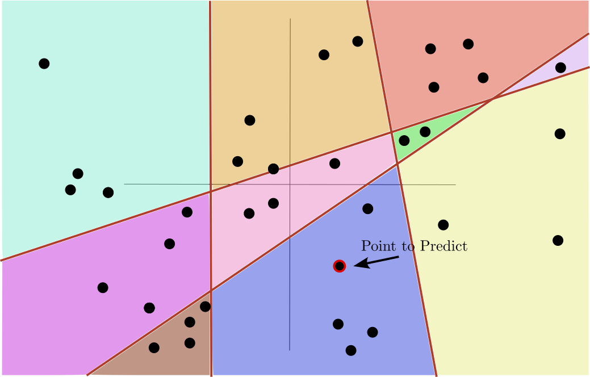
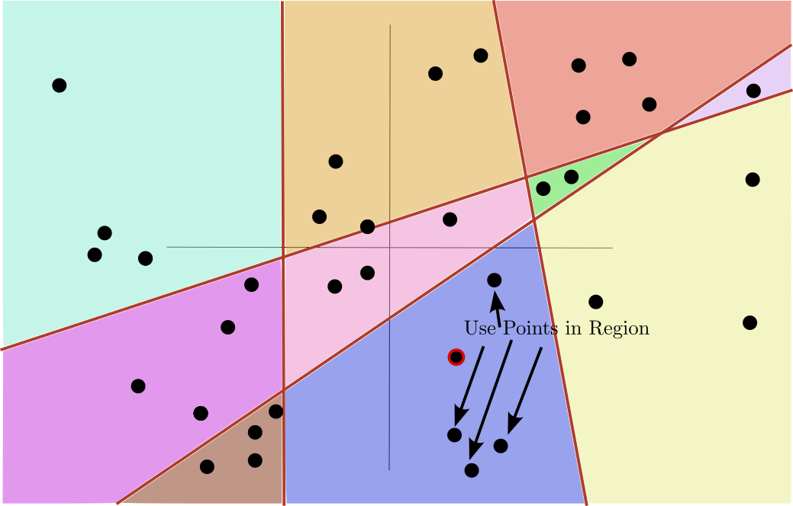
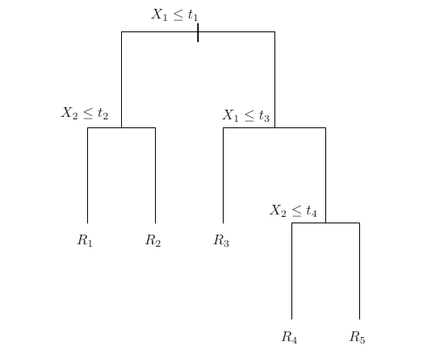
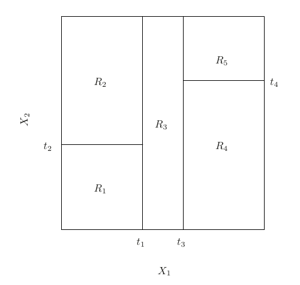
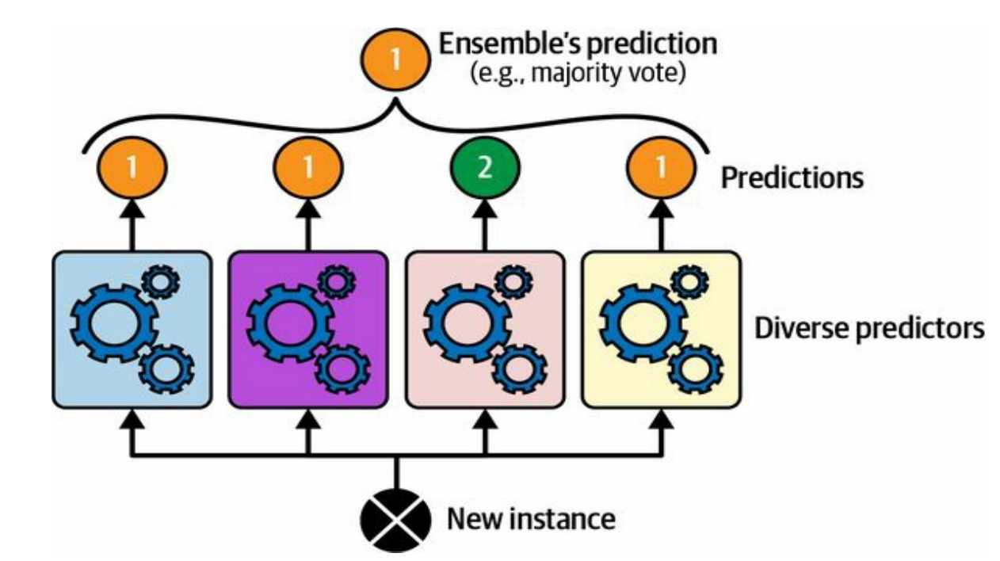
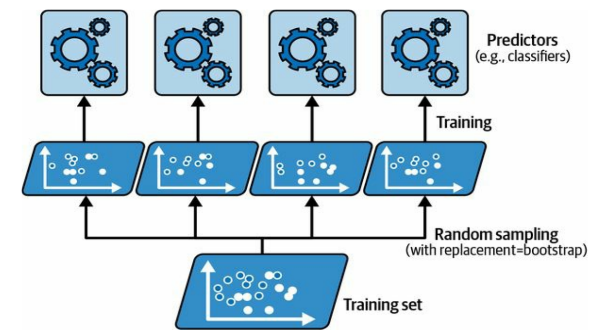
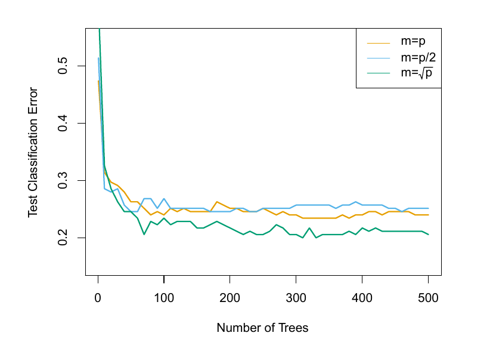

```{python}
import pandas as pd
import numpy as np
import matplotlib.pyplot as plt
import sklearn.model_selection as skm
import shap
# New for this

from sklearn.tree import (DecisionTreeClassifier as DTC,
                          DecisionTreeRegressor as DTR,
                          plot_tree,
                          export_text)

from sklearn.metrics import (accuracy_score, log_loss)

from sklearn.ensemble import \
    (RandomForestRegressor as RF,
    GradientBoostingRegressor as GBR)

from ISLP.bart import BART
from sklearn.tree import export_text
import time
from sklearn.metrics import mean_squared_error, r2_score
from sklearn.preprocessing import OrdinalEncoder
import xgboost as xgb


import pymc as pm
import pymc_bart as pmb
import arviz as az


from sklearn.compose import ColumnTransformer
from sklearn.preprocessing import OneHotEncoder
from matplotlib.pyplot import subplots
from statsmodels.datasets import get_rdataset
from ISLP import load_data, confusion_table
from ISLP.models import ModelSpec as MS

from matplotlib.patches import Rectangle
```


## Week Summary

- Lab 5 Available, due in two weeks
- Reading: 
  - Chapter 8 in ISLP (skip BART until Causal Inference week)
  - Chapter 6 and 7 (up to boosting) in HOML
- One Vignette on Random Forests and Decision Trees


## Decision Trees

- Decision Trees divide predictors space into regions




## Decision Trees

- Predictions made using training data that falls into each region


## Previous Models Easy to Solve

- Previous Models: 
    - Linear Regression
    - Logistic Regression
    - GLMs
    - Support Vector Machines 

::: {style="border: 2px solid black; padding: 20px; border-radius: 5px;"}
Learning algorithms for these models guarantee finding the "best" solution
:::


## Models for Rest of the Class Hard to Solve

- Rest of Class:
    - Decision Trees
    - Neural Networks

::: {style="border: 2px solid black; padding: 20px; border-radius: 5px;"}
It will __NOT__ be possible to find the one best model for your data
:::

- **It becomes much more about finding _good_ solutions**


## Goal of Decision Trees

- Idea is to implement a method called "Piecewise constant regression"


 

## Goal of Decision Trees

- Each value of predictors falls in a region




## Goal of Decision Trees

- Use the values in the region to predict




## Goal of Decision Trees

- Mean or median for regression


## Goal of Decision Trees

- Majority vote for classification


## Binary Recursive Split

- Decision tree algorithms use _binary trees_ to define regions


:::: {.columns}
::: {.column width=50%}

:::

::: {.column width=50%}

:::
::::


## Binary Recursive Split

- Nodes split "parent" set into "child" sets based on a condition

:::: {.columns}
::: {.column width=50%}

:::

::: {.column width=50%}

:::
::::


## Greedy Splits

- At each step: Consider all splits, and all predictors.
- Find _Best_ split
  - Regression: Reduction in MSE
$$
\Delta_{\mathrm{split}} = \quad n\text{MSE}_{\textrm{parent}} - \left(n_L \cdot \textrm{MSE}_L + n_R \cdot \textrm{MSE}_R\right)
$$
- Stop when too many leaves, too much depth, or too few points in a split


## Greedy Splits

- Start with "Hitters" and log salary versus RBIs and Hits

```{python}


Hitters = load_data("Hitters").dropna(subset=["Salary"])
X = Hitters[["Hits", "RBI"]].values
y = np.log(Hitters["Salary"].values)
feature_names = ["Hits", "RBI"]

def plot_tree_regions(max_leaf_nodes):
    vmin, vmax = y.min(), y.max()

    if (max_leaf_nodes == 1):
        fig, ax = plt.subplots(figsize=(10, 8))
        scatter = ax.scatter(X[:, 0], X[:, 1], c=y, cmap="viridis",
                   edgecolors="black", linewidths=0.5, s=40, alpha=0.7)
        cbar = plt.colorbar(scatter, ax=ax, label="Log(Salary)")
        cbar.set_label("Log(Salary)", fontsize=16)
        cbar.ax.tick_params(labelsize=14)
        mean_pred = y.mean()
        ax.annotate(f"${np.exp(mean_pred):.0f}k",
                    xy=(X[:, 0].mean(), X[:, 1].mean()),
                    fontsize=12, fontweight="bold",
                    ha="center", va="center",
                    bbox=dict(boxstyle="round,pad=0.3",
                              facecolor="lightgray", edgecolor="black", alpha=0.8))
        ax.set_xlabel("Hits",fontsize=18)
        ax.set_ylabel("RBI",fontsize=18)
        ax.tick_params(axis="both", labelsize=14)    

        ax.set_title(f"Decision Tree Regions 1 Leaf",fontsize=24)
        plt.tight_layout()
        plt.show()
        return

    # Fit tree
    tree = DTR(max_leaf_nodes=max_leaf_nodes, random_state=0)
    tree.fit(X, y)

    # Create a fine grid for coloring regions
    h = 0.5
    x_min, x_max = X[:, 0].min() - 5, X[:, 0].max() + 5
    y_min, y_max = X[:, 1].min() - 5, X[:, 1].max() + 5
    xx, yy = np.meshgrid(np.arange(x_min, x_max, h),
                          np.arange(y_min, y_max, h))
    Z = tree.predict(np.c_[xx.ravel(), yy.ravel()])
    Z = Z.reshape(xx.shape)

    # Plot
    fig, ax = plt.subplots(figsize=(10, 8))

    # Color the regions
    contour = ax.contourf(xx, yy, Z, levels=20, cmap="viridis", alpha=0.3)
    cbar = plt.colorbar(contour, ax=ax, label="Predicted log(Salary)")

    # Draw sharp decision boundaries
    contour = ax.contourf(xx, yy, Z, levels=20, cmap="viridis", alpha=0.3,
                       vmin=vmin, vmax=vmax)

    # Scatter the data
    scatter = ax.scatter(X[:, 0], X[:, 1], c=y, cmap="viridis",
                          edgecolors="black", linewidths=0.5, s=40, alpha=0.7)

    # Label each region with its predicted value
    # Find the unique predictions and the centroid of each region
    leaves = tree.apply(X)
    for leaf_id in np.unique(leaves):
        mask = leaves == leaf_id
        cx = X[mask, 0].mean()
        cy = X[mask, 1].mean()
        pred = tree.predict(X[mask][:1])[0]
        ax.annotate(f"${np.exp(pred):.0f}k",
                    xy=(cx, cy),
                    fontsize=16, fontweight="bold",
                    ha="center", va="center",
                    bbox=dict(boxstyle="round,pad=0.3",
                              facecolor="white", edgecolor="black", alpha=0.8))

    cbar.set_label("Log(Salary)", fontsize=16)
    cbar.ax.tick_params(labelsize=14)
    ax.tick_params(axis="both", labelsize=14)    
    ax.set_xlabel("Hits",fontsize=18)
    ax.set_ylabel("RBI",fontsize=18)
    ax.set_title(f"Decision Tree Regions "
                 f"{tree.get_n_leaves()} leaves")
    plt.tight_layout()
    plt.show()


plot_tree_regions(1)

```


## Greedy Splits

- 1 Split

```{python}

plot_tree_regions(2)

```


## Greedy Splits

- 2 Splits

```{python}

plot_tree_regions(3)

```


## Greedy Splits

- 3 Splits

```{python}

plot_tree_regions(4)

```


## Greedy Splits

- 4 Splits

```{python}

plot_tree_regions(5)

```


## Greedy Splits

- 20 Splits

```{python}

plot_tree_regions(21)

```


## Classification

- Instead of accuracy, pick variable and splits using evenness:
    - **Gini Impurity:** $\sum_{k}\hat{p}_k(1-\hat{p}_k)$
    - **Entropy:** $-\sum_{k}\hat{p}_k\log \hat{p}_k$
- Pick variable and split to give maximum reduction of weighted Gini or entropy


## Trees are Low Bias and High Variance

- Boston Housing Prices

```{python}

Boston = load_data('Boston')

X_df = Boston.drop(columns=["medv"])
y = Boston['medv']


cat_cols = X_df.select_dtypes(include=["object", "category"]).columns.tolist()
num_cols = X_df.select_dtypes(include=["number"]).columns.tolist()

ct = ColumnTransformer([
    ("cat", OneHotEncoder(drop="first", sparse_output=False), cat_cols),
    ("num", "passthrough", num_cols),
])

X = ct.fit_transform(X_df)
feature_names = ct.get_feature_names_out().tolist()

(X_train,
X_test,
y_train,
y_test) = skm.train_test_split(X,y,test_size=0.3,random_state=0)

y_train = y_train.values
y_test = y_test.values


depths = range(1, 25)
train_mse = []
test_mse = []

for d in depths:
    tree = DTR(max_depth=d, random_state=0)
    tree.fit(X_train, y_train)
    train_mse.append(np.mean((y_train - tree.predict(X_train)) ** 2))
    test_mse.append(np.mean((y_test - tree.predict(X_test)) ** 2))

fig, ax = plt.subplots(figsize=(10, 6))
ax.plot(depths, train_mse, "-o",color="#440154", markersize=4, label="Training MSE")
ax.plot(depths, test_mse, "-o",color="#FCA636", markersize=4, label="Test MSE")
ax.set_xlabel("Tree Depth")
ax.set_ylabel("MSE")
ax.set_title("Deep Trees Don't Generalize")
ax.legend()
plt.tight_layout()
plt.show()


```


## _Pruning_ Regularizes Trees

- Common strategy is to build a large tree and then use regularization to pick a sub-tree
- Cost-Complexity Pruning Penalty $\alpha$
- Pick tree with lowest penalized error:
$$
\mathrm{argmin}_{T\subset T_0} \sum_{i=1}^n (y_i - T(\mathbf{x}_i))^2 + \alpha |T|
$$
- $|T|$ is number of terminal nodes


## Best $\alpha$ with CV

```{python}

X_df = Hitters.drop(columns=["Salary"])
X_df = pd.get_dummies(X_df, drop_first=True)
feature_names = X_df.columns.tolist()
X = X_df.values

y_hitters = np.log(Hitters["Salary"].values)


X_train, X_test, y_train, y_test = skm.train_test_split(
    X, y_hitters, test_size=0.2, random_state=0
)

# Grow a full tree
reg = DTR(random_state=0)
reg.fit(X_train, y_train)

ccp_path = reg.cost_complexity_pruning_path(X_train, y_train)
alphas = ccp_path.ccp_alphas


extra_alphas = np.logspace(
    np.log10(alphas[alphas > 0].max()),
    np.log10(alphas[alphas > 0].max()) + 2,
    50
)
alphas_extended = np.concatenate([alphas, extra_alphas])
# CV to find best alpha
kfold = skm.KFold(n_splits=10, shuffle=True, random_state=10)
grid = skm.GridSearchCV(
    DTR(random_state=0),
    {"ccp_alpha": alphas_extended},
    refit=True, cv=kfold,
    scoring="neg_mean_squared_error"
)
G = grid.fit(X_train, y_train)

# Plot CV MSE vs alpha (log scale)
cv_mses = -G.cv_results_["mean_test_score"]
mask = alphas_extended > 0

fig, ax = plt.subplots(figsize=(10, 6))
ax.plot(alphas_extended[mask], cv_mses[mask], "-o", color="#21918C", markersize=3)
ax.axvline(G.best_params_["ccp_alpha"], color="#FCA636", linestyle="--",
           label=f"Best alpha = {G.best_params_['ccp_alpha']:.4f}")
ax.set_xscale("log")
ax.set_xlabel("Cost Complexity Alpha", fontsize=14)
ax.set_ylabel("10-Fold CV MSE", fontsize=14)
ax.set_title("Hitters: Cost Complexity Pruning", fontsize=18)
ax.legend(fontsize=12)
ax.tick_params(axis="both", labelsize=12)
plt.tight_layout()
plt.show()


```


## Wisdom of the Crowds

- Statistician went to 1908 Plymouth County Fair:
- Polled 800 townsfolk on weight of a cow


## Wisdom of the Crowds

- Crowd Median: 1198 pounds
- Actual Weight: 1202 pounds


## Ensemble Learning

- Combine predictions of several methods




## Ensemble Learning

- Different models make errors in different ways
  - Combining them leads to complementary insights
  - _Stacking:_ Train a final model to combine outputs of different models
  - **Netflix Prize** did this with Neural Networks and Matrix factorization methods, kNN
- Mixture of Experts for LLMs


## When does it help?

- Consider errors from two models, $\delta_1$ and $\delta_2$
- Average them together and compute variance:
$$
\mathrm{Var}(\frac{1}{2}\delta_1 + \frac{1}{2}\delta_2) = \frac{1}{4}\mathrm{Var}(\delta_1) + \\
\frac{1}{4}\mathrm{Var}(\delta_1) + \frac{1}{2}\mathrm{Cov}(\delta_1,\delta_2)
$$
- If models are same, makes no difference
- If models make different errors and accuracy is similar, improve error


## Bagging

- You can also combine models from the same class trained with different features or data:




## Bagging

- Generate a lot of trees, each tree generalizes poorly
- Average or poll their predictions to reduce variance
$$
\hat{g}_{\mathrm{bag}}(\mathbf{x}) = \frac{1}{B} \sum_{j=1}^B \hat{g}_{j}(\mathbf{x})
$$

## Bagging Classification

- Generate a lot of trees, each tree generalizes poorly
- Average or poll their predictions to reduce variance

$$
\hat{g}_{\mathrm{bag}}(\mathbf{x}) = \mathbf{argmax}_{y\in Y} \sum_{j=1}^N I(\hat{g}_j(\mathbf{x}) = y)
$$


## Where do the $g$s come from?

- Goal: Generate trees that have learned, but are different from each-other
- **B**ootstrap **Agg**regat**ing**
  - Fit each tree to Bootstrap Sample of Data


::: {style="border: 2px solid black; padding: 20px; border-radius: 5px;"}
Bagging can be applied to _any_ statistical model, but most common for decision trees
:::


## How many trees to bag?

- Model improves as $B$ increases, up until a point
- Adding more trees doesn't increase test error

```{python}

bag_vec = np.arange(1,100)

train_mse_vec = []
test_mse_vec = []

single_tree = DTR(random_state=0)
single_tree.fit(X_train, y_train)
single_tree_mse = np.mean((y_test - single_tree.predict(X_test)) ** 2)

for j, bag_n in enumerate(bag_vec):

    bag_hitters = RF(max_features=X_train.shape[1], n_estimators = bag_n,random_state=0)
    bag_hitters.fit(X_train,y_train)


    y_hat_bag_train = bag_hitters.predict(X_train)
    train_mse_vec.append(np.mean((y_train-y_hat_bag_train)**2))


    y_hat_bag = bag_hitters.predict(X_test)

    test_mse_vec.append(np.mean((y_test-y_hat_bag)**2))


fig, ax = plt.subplots(figsize = (12,8))
ax.axhline(single_tree_mse, linestyle="--",
           label=f"Single Tree Error")

ax.plot(bag_vec,test_mse_vec,label="Test MSE")
ax.legend()
ax.set_title("Bagging Test Error versus B",fontsize=24)
ax.set_xscale("log")
ax.set_xlabel("Number of Trees B", fontsize=18)
ax.set_ylabel("MSE", fontsize=18);


```


## Decreasing the Variance by Decorrelating Trees

- Improvement from Bagging was modest
- Trees tend to be similar to each-other even though different bootstrap samples

**Random Forest:** For each split, randomly select a certain number of features less than the total.

- Forces trees to be less correlated


## Random Forests

- Can try any value of 'max_features' from 1 to $p$
- $p/3$ for regression, $\sqrt{p}$ for classification

```{python}
bag_n = 500
fig, ax = plt.subplots(figsize=(10, 6))

p = X_train.shape[1]

test_mses = [] 

for max_features in np.arange(1, p):
    rf = RF(max_features=max_features, n_estimators=bag_n, random_state=1)
    rf.fit(X_train, y_train)
    test_mses.append(np.mean((y_test - rf.predict(X_test))**2))

ax.plot(np.arange(1, p), test_mses)

ax.axvline(int(np.sqrt(p)), color="#FCA636", linestyle="--",
           label=f"sqrt(p) = {int(np.sqrt(p))}")
ax.axvline(int(p / 3), color="#21918C", linestyle="--",
           label=f"p/3 = {int(p / 3)}")

ax.set_xlabel("max_features", fontsize=14)
ax.set_ylabel("Test MSE", fontsize=14)
ax.set_title("RF: Test MSE vs max_features (B=500)", fontsize=16)
ax.set_xticks(np.arange(1, p,5))
ax.legend()
plt.tight_layout()
plt.show()
```


## Random Forest Classification

- 15 Class Gene Expression data with 500 features




## Out Of Bag Error

- 1/3rd of data doesn't get chosen each sample
- Can use those data to estimate error


```{python}


p = X_train.shape[1]
n_trees_vec = np.arange(10, 100, 10)

colors = ["#440154", "#31688E", "#35B779", "#FCA636"]


rf_oob = []
rf_test = []
bag_oob = []
bag_test = []

for n in n_trees_vec:
    
    rf = RF(max_features=3, n_estimators=n, oob_score=True, random_state=1)
    rf.fit(X_train, y_train)
    rf_oob.append(np.mean((y_train - rf.oob_prediction_) ** 2))
    rf_test.append(np.mean((y_test - rf.predict(X_test)) ** 2))

    
    bag = RF(max_features=p, n_estimators=n, oob_score=True, random_state=1)
    bag.fit(X_train, y_train)
    bag_oob.append(np.mean((y_train - bag.oob_prediction_) ** 2))
    bag_test.append(np.mean((y_test - bag.predict(X_test)) ** 2))

fig, ax = plt.subplots(figsize=(10, 6))
ax.plot(n_trees_vec, rf_test, "-", color=colors[0], label="RF Test MSE")
ax.plot(n_trees_vec, rf_oob, "--", color=colors[1], label="RF OOB MSE")
ax.plot(n_trees_vec, bag_test, "-", color=colors[2], label="Bagging Test MSE")
ax.plot(n_trees_vec, bag_oob, "--", color=colors[3], label="Bagging OOB MSE")

ax.set_ylim(0.2,0.3)

ax.set_xlabel("Number of Trees", fontsize=18)
ax.set_ylabel("MSE", fontsize=18)
ax.set_title("OOB vs Test Error", fontsize=24)
ax.legend(fontsize=13)
ax.tick_params(axis="both", labelsize=16)
plt.tight_layout()
plt.show()

```


## Feature Importance


```{python}

RF_Hitters = RF(max_features=int(p/3), n_estimators=500, random_state=1)
RF_Hitters.fit(X_train, y_train)

feature_imp = pd.DataFrame(
    {'importance': RF_Hitters.feature_importances_},
    index=feature_names
).sort_values(by='importance', ascending=False)

fig, ax = plt.subplots(figsize=(10, 6))
feature_imp.head(15).plot.barh(ax=ax, legend=False, color="#21918C")
ax.invert_yaxis()
ax.set_xlabel("Feature Importance", fontsize=16)
ax.set_title("Hitters Feature Importances", fontsize=20)
ax.tick_params(axis="both", labelsize=13)
plt.tight_layout()
plt.show()

```


## Feature Importance


- We are building up to something like this:

```{python}


explainer = shap.TreeExplainer(RF_Hitters)
shap_values = explainer.shap_values(X_train)

shap.summary_plot(shap_values, X_train, feature_names=feature_names)


```


## Poor Extrapolation

- Trees do not extrapolate out of the "range" of your dataset
- Predictions "flat" in each region

```{python}
X_df = Hitters.drop(columns=["Salary"])
X_df = pd.get_dummies(X_df, drop_first=True)
feature_names = X_df.columns.tolist()
HMRun_idx = feature_names.index("HmRun")
grid_values = np.linspace(0, 70,70)

fig, ax = plt.subplots(figsize=(10, 6))

pdp_values = []
for val in grid_values:
    X_temp = X_train.copy()
    X_temp[:, HMRun_idx] = val
    pdp_values.append(RF_Hitters.predict(X_temp).mean())

ax.plot(grid_values, pdp_values, color="#31688E", label="Predictions")

ax.axvline(X_train[:, HMRun_idx].max(), color="gray", linestyle="--",
           alpha=0.5, label=f"Training max ({X_train[:, HMRun_idx].max():.0f})")

ax.set_xlabel("Home Runs")
ax.set_ylabel("Partial Dependence log Salary")
ax.set_title("Tree Based Methods Cannot Extrapolate")
ax.legend()
plt.tight_layout()
plt.show()


```


## Thanks