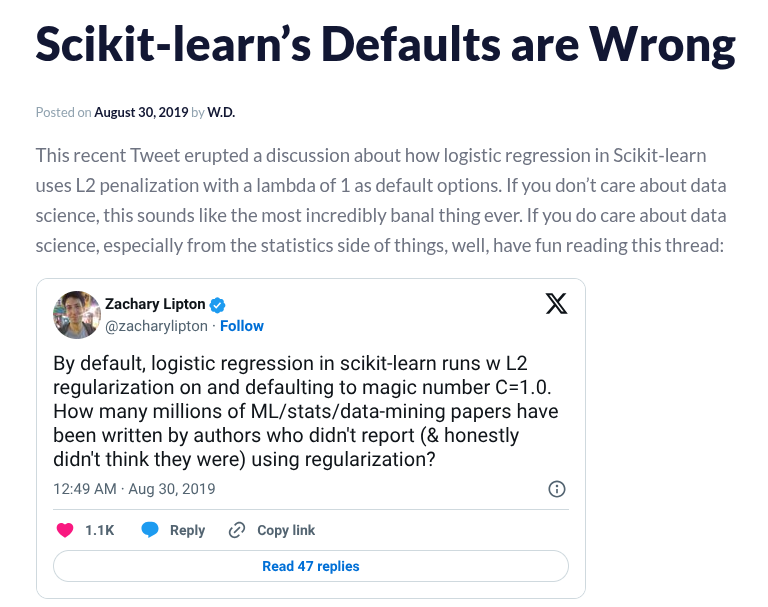
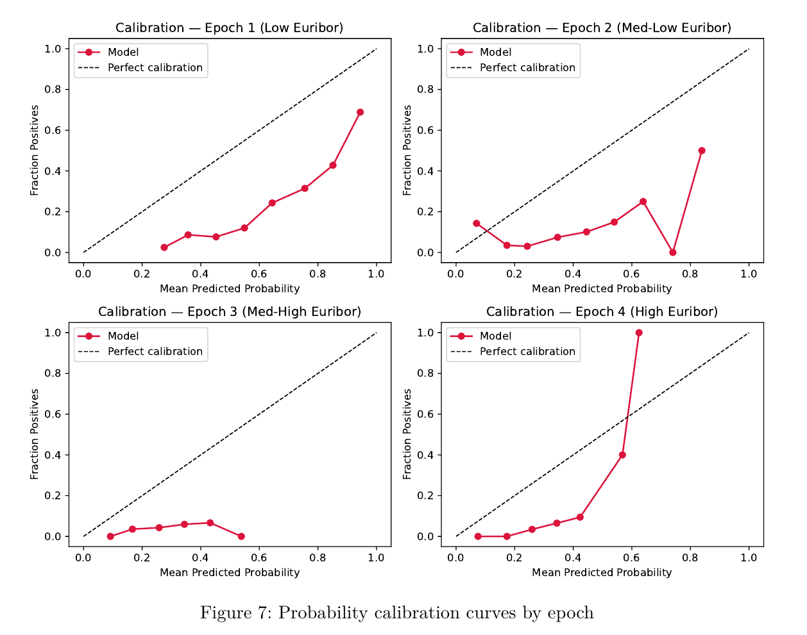
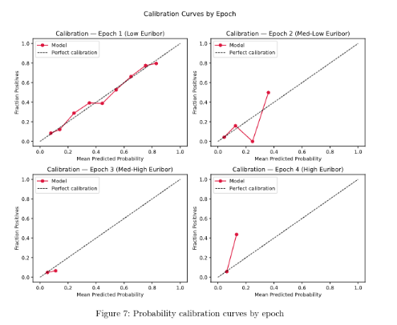
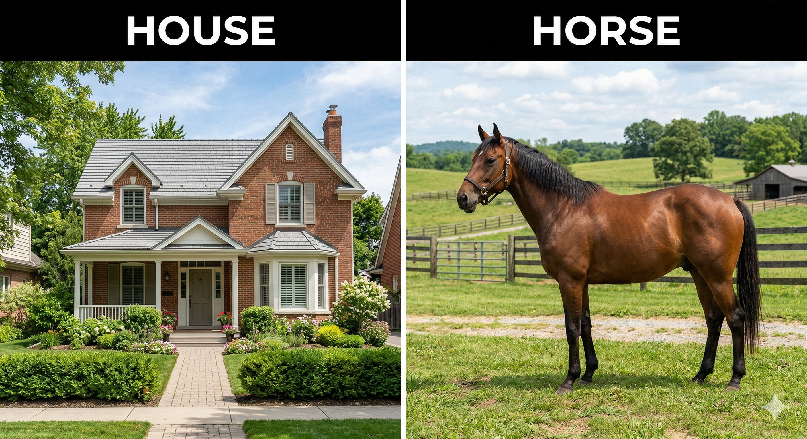
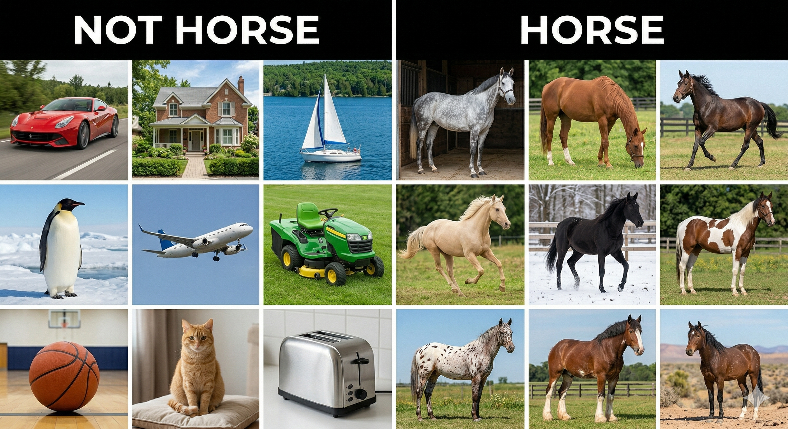

```{python}
import pandas as pd
import numpy as np
import matplotlib.pyplot as plt
import sklearn.model_selection as skm
import shap


from sklearn.tree import (DecisionTreeClassifier as DTC,
                          DecisionTreeRegressor as DTR,
                          plot_tree,
                          export_text)

from sklearn.metrics import (accuracy_score, log_loss)

from sklearn.ensemble import \
    (RandomForestRegressor as RF,
    GradientBoostingRegressor as GBR,
    RandomForestClassifier as RFC)

from ISLP.bart import BART
from sklearn.tree import export_text
import time
from sklearn.metrics import mean_squared_error, r2_score
from sklearn.preprocessing import OrdinalEncoder
import xgboost as xgb


import pymc as pm
import pymc_bart as pmb
import arviz as az


from sklearn.compose import ColumnTransformer
from sklearn.preprocessing import OneHotEncoder
from matplotlib.pyplot import subplots
from statsmodels.datasets import get_rdataset
from ISLP import load_data, confusion_table
from ISLP.models import ModelSpec as MS

from matplotlib.patches import Rectangle

from sklearn.tree import DecisionTreeClassifier, plot_tree
from sklearn.metrics import classification_report, accuracy_score
from sklearn.metrics import roc_curve, roc_auc_score

from sklearn.linear_model import LogisticRegression
from sklearn.preprocessing import StandardScaler
from sklearn.pipeline import Pipeline
from sklearn.calibration import calibration_curve


okabe_ito = {
    "orange":    "#E69F00",
    "sky_blue":  "#56B4E9",
    "green":     "#009E73",
    "yellow":    "#F0E442",
    "blue":      "#0072B2",
    "vermilion": "#D55E00",
    "pink":      "#CC79A7",
    "black":     "#000000",
}

oi_colors = list(okabe_ito.values())

```

## Week Summary

- Lab 5 Available, due next Sunday
- Reading: 
  - Chapter 8 in ISLP: Boosting and Bart
  - Chapter 7 Boosting in ISLP
- Vignette on Boosting
- Vignette on Production Basics


## Lab 3 Feedback

- Be very wary of default or LLM chosen model parameters!!!
    - Penalty On by default




## Lab 3 Feedback

- Be very cognizant of model options!!!
    - Without standard scaler, model is not what you expect


## Lab 3 Feedback

- Be very cognizant of model options!!!
    - 'class_weights' balanced ruins calibration




## Lab 3 Feedback

- Be very cognizant of model options!!!
    - 'class_weights' balanced ruins calibration



## Lab 3 Feedback

- Read the questions
- Read your report
- Message me before turning in a really long report!


## Bagging Review

- Use bootstrapping to generate a lot of datasets
- Fit a deep tree to each dataset
- Average to predict
- Subsample features to make it a Random Forest

## Strong versus Weak Learners

- Many methods in ML are based on the idea that given enough data, the algorithm can reach arbitrarily high accuracy
- Consider an algorithm for identifying horses:



## Strong versus Weak Learners

- As we increase the number of images, accuracy will improve




## Strong versus Weak Learners

- And as the number of horses goes to infinity, the strong learner will become close to perfect


## Strong versus Weak Learners

- The weak learner on the other hand, is any learner that is able to exceed 50\% accuracy with enough data


## Boosting Leverages Weak Learners

- Boosting stands for _Hypothesis Boosting_ and was inspired by the idea of enhancing weak learners to create a strong learner
- A weak learner might be decision trees of depth 1

```{python}


taiwan_credit = pd.read_csv("UCI_Credit_Card.csv")

X = taiwan_credit.drop(columns=["ID", "default.payment.next.month"])
y = taiwan_credit["default.payment.next.month"]

feature_names = list(X.columns)
class_names = ["No Default", "Default"]


X_train, X_test, y_train, y_test = skm.train_test_split(
    X, y, test_size=0.2, random_state=1001, stratify=y
)

tree = DecisionTreeClassifier(max_depth=1, random_state=2)
tree.fit(X_train, y_train)

fig, ax = plt.subplots(figsize=(12, 6))

plot_tree(
    tree,
    feature_names=feature_names,
    class_names=class_names,
    filled=True,
    rounded=True,
    proportion=True,
    fontsize=16,
    ax=ax,
    impurity=False,
)

ax.set_title("Stump Tree")

plt.tight_layout()


```


## Adaptive Boosting

- 'AdaBoost': 
  - Fit simple tree $\hat{f}_0$
  - Initialize ensmeble $\hat{f} = \hat{f}_0$
  - Identify misclassified points under $f$
  - Weight points based on error using learning rate $\lambda$
  - Fit $\hat{f}_1$ with the new weights


## Boosting Regression

- 'Boosting':
  - Fit simple tree $\hat{f} = \lambda\hat{f}_0$
  - Calculate error: $r_i = y_i - \hat{f}(\mathbf{x}_i)$
  - Fit new tree $\hat{f}_1$ to $r_i$
  - Update model: $\hat{f} = \lambda\hat{f}_0 + \lambda\hat{f}_1$
  - Repeat


## Boosting Regression Example

- Start with target function:

```{python}


m = 1000  # number of instances
rng = np.random.default_rng(seed=2026)
X = 4*rng.random((m, 1)) - 2.0
noise = 0.1 * rng.standard_normal(m)
y = np.cos(3 * X[:, 0] ** 2) + noise  # y = cos(3x²) + Gaussian noise

tree_reg1 = DTR(max_depth=2, random_state=99)
tree_reg1.fit(X, y)

X_grid = np.linspace(-2, 2.0, 500).reshape(-1, 1)
y_true = np.cos(3 * X_grid[:, 0] ** 2)
y_pred = tree_reg1.predict(X_grid)

fig, ax = plt.subplots(figsize=(10, 6))
ax.scatter(X[:, 0], y, s=4, alpha=0.3, color="gray", label="Data")
ax.plot(X_grid, y_true, color="black", linewidth=2, label=r"$\cos(3x^2)$")
ax.set_xlabel("x", fontsize=18)
ax.set_ylabel("y", fontsize=18)
ax.set_title("Target Function")
ax.legend(fontsize=16)
plt.tight_layout()
plt.show()

```


## Boosting Regression Example

- Fit a decision tree of depth 2

```{python}
fig, ax = plt.subplots(figsize=(10, 6))
ax.scatter(X[:, 0], y, s=4, alpha=0.3, color="gray", label="Data")
ax.plot(X_grid, y_true, color="black", linewidth=2, label=r"$\cos(3x^2)$")
ax.plot(X_grid, y_pred, color=okabe_ito["vermilion"], linewidth=2, label="Tree")
ax.set_xlabel("x", fontsize=18)
ax.set_ylabel("y", fontsize=18)
ax.set_title("Single Tree Fit")
ax.legend(fontsize=16)
plt.tight_layout()
plt.show()

```


## Boosting Regression Example

- Look at the residuals:

```{python}

y2 = y - tree_reg1.predict(X)

fig, axes = plt.subplots(1, 2, figsize=(16, 6))


axes[0].scatter(X[:, 0], y, s=4, alpha=0.3, color="gray", label="Data")
axes[0].plot(X_grid, y_true, color="black", linewidth=2, label=r"$\cos(3x^2)$")
axes[0].plot(X_grid, y_pred, color=okabe_ito["vermilion"], linewidth=2, label="Tree (depth 2)")
axes[0].set_xlabel("x", fontsize=18)
axes[0].set_ylabel("y", fontsize=18)
axes[0].set_title("Single Tree Fit", fontsize=16)
axes[0].legend(fontsize=14)


axes[1].scatter(X[:, 0], y2, s=4, alpha=0.3, color="gray", label="Residuals")
axes[1].axhline(0, color="black", linewidth=1, linestyle="--")
axes[1].set_xlabel("x", fontsize=18)
axes[1].set_ylabel(r"$y - \hat{y}_1$", fontsize=18)
axes[1].set_title("Residuals", fontsize=16)
axes[1].legend(fontsize=14)

plt.tight_layout()
plt.show()

```


## Boosting Regression Example

- Now fit the residuals

```{python}
tree_reg2 = DTR(max_depth=2, random_state=9)
tree_reg2.fit(X,y2)

y2_pred = tree_reg2.predict(X_grid)
y_ensemble = y_pred + y2_pred  

fig, axes = plt.subplots(1, 2, figsize=(16, 6))


axes[0].scatter(X[:, 0], y2, s=4, alpha=0.3, color="gray", label="Residuals")
axes[0].plot(X_grid, y2_pred, color=okabe_ito["sky_blue"], linewidth=2, label="Tree 2 (depth 2)")
axes[0].axhline(0, color="black", linewidth=1, linestyle="--")
axes[0].set_xlabel("x", fontsize=18)
axes[0].set_ylabel(r"$y - \hat{y}_1$", fontsize=18)
axes[0].set_title("Tree 2 Fit to Residuals", fontsize=16)
axes[0].legend(fontsize=14)

axes[1].scatter(X[:, 0], y, s=4, alpha=0.3, color="gray", label="Data")
axes[1].plot(X_grid, y_true, color="black", linewidth=2, label=r"$\cos(3x^2)$")
axes[1].plot(X_grid, y_ensemble, color=okabe_ito["vermilion"], linewidth=2, label="Tree 1 + Tree 2")
axes[1].set_xlabel("x", fontsize=18)
axes[1].set_ylabel("y", fontsize=18)
axes[1].set_title("Boosting Stage 2", fontsize=16)
axes[1].legend(fontsize=14)

plt.tight_layout()
plt.show()


```


## 10 Rounds of Boosting

```{python}

gbr = GBR(
    max_depth=2,
    n_estimators=10,
    learning_rate=1.0,
    random_state=99,
)
gbr.fit(X, y)

y_gbr = gbr.predict(X_grid)

fig, ax = plt.subplots(figsize=(10, 5))
ax.scatter(X[:, 0], y, s=4, alpha=0.3, color="gray", label="Data")
ax.plot(X_grid, y_true, color="black", linewidth=2, label=r"$\cos(3x^2)$")
ax.plot(X_grid, y_gbr, color=okabe_ito["vermilion"], linewidth=2, label="GBR 10 Rounds")
ax.set_xlabel("x", fontsize=18)
ax.set_ylabel("y", fontsize=18)
ax.legend(fontsize=14)
plt.tight_layout()
plt.show()

```


## 100 Rounds of Boosting

```{python}

gbr = GBR(
    max_depth=2,
    n_estimators=100,
    learning_rate=1.0,
    random_state=99,
)
gbr.fit(X, y)

y_gbr = gbr.predict(X_grid)

fig, ax = plt.subplots(figsize=(10, 5))
ax.scatter(X[:, 0], y, s=4, alpha=0.3, color="gray", label="Data")
ax.plot(X_grid, y_true, color="black", linewidth=2, label=r"$\cos(3x^2)$")
ax.plot(X_grid, y_gbr, color=okabe_ito["vermilion"], linewidth=2, label="GBR 100 Rounds")
ax.set_xlabel("x", fontsize=18)
ax.set_ylabel("y", fontsize=18)
ax.legend(fontsize=14)
plt.tight_layout()
plt.show()

```


## 1000 Rounds of Boosting

```{python}

gbr = GBR(
    max_depth=2,
    n_estimators=1000,
    learning_rate=1.0,
    random_state=99,
)
gbr.fit(X, y)

y_gbr = gbr.predict(X_grid)

fig, ax = plt.subplots(figsize=(10, 5))
ax.scatter(X[:, 0], y, s=4, alpha=0.3, color="gray", label="Data")
ax.plot(X_grid, y_true, color="black", linewidth=2, label=r"$\cos(3x^2)$")
ax.plot(X_grid, y_gbr, color=okabe_ito["vermilion"], linewidth=2, label="GBR 1000 Rounds")
ax.set_xlabel("x", fontsize=18)
ax.set_ylabel("y", fontsize=18)
ax.legend(fontsize=14)
plt.tight_layout()
plt.show()

```


## Boosted Trees Can Overfit

- Learning Rate $\lambda$
$$
\hat{f} = \sum_{i=1}^{n_e} \lambda \hat{f}_i
$$

- Small $\lambda$ slows learning, reduces variance


## Learning Rate Effects

- Small $\lambda$ regularizes

```{python}


learning_rates = [0.001, 0.01, 0.1, 1.0]

fig, axes = plt.subplots(2, 2, figsize=(12, 8), sharey=True)

for ax, lr in zip(axes.flat, learning_rates):
    gbr = GBR(
        max_depth=2,
        n_estimators=1000,
        learning_rate=lr,
        random_state=99,
    )
    gbr.fit(X, y)
    y_gbr = gbr.predict(X_grid)

    ax.scatter(X[:, 0], y, s=4, alpha=0.3, color="gray")
    ax.plot(X_grid, y_true, color="black", linewidth=2)
    ax.plot(X_grid, y_gbr, color=okabe_ito["vermilion"], linewidth=2)
    ax.set_xlabel("x", fontsize=14)
    ax.set_title(rf"$\lambda = {lr}$", fontsize=16)

axes[0, 0].set_ylabel("y", fontsize=14)
axes[1, 0].set_ylabel("y", fontsize=14)
plt.tight_layout()
plt.show()


```


## Max Depth

- Deeper Trees lead to Overfitting

```{python}
depths = [1, 2, 4, 8]

fig, axes = plt.subplots(2, 2, figsize=(12, 8), sharey=True)

for ax, d in zip(axes.flat, depths):
    gbr = GBR(
        max_depth=d,
        n_estimators=1000,
        learning_rate=0.1,
        random_state=99,
    )
    gbr.fit(X, y)
    y_gbr = gbr.predict(X_grid)

    ax.scatter(X[:, 0], y, s=4, alpha=0.3, color="gray")
    ax.plot(X_grid, y_true, color="black", linewidth=2)
    ax.plot(X_grid, y_gbr, color=okabe_ito["vermilion"], linewidth=2)
    ax.set_xlabel("x", fontsize=14)
    ax.set_title(rf"max depth = {d}", fontsize=16)

axes[0, 0].set_ylabel("y", fontsize=14)
axes[1, 0].set_ylabel("y", fontsize=14)
plt.tight_layout()
plt.show()
```

## Other Hyperparameters

- 'subsample' part of the data
  - Large, noisy data
  - Regularizes
  - Increases speed
- 'min_samples_leaf'
- Lasso and Ridge Penalties


## Classification and Gradient Boosting

- Boosted Trees use regression for classification problems
- Standard Loss is called 'cross-entropy', equivalent to 'log' score
- For each _class_ there are trees that predict the weight:
$$
p(y=k|\mathbf{x}) = \frac{\exp(\hat{f}_k(\mathbf{x}))}{\sum_{k'=1}^K \exp(\hat{f}_k(\mathbf{x}))}
$$


## Classification and Gradient Boosting

- Weights come from sum of trees for each class:

$$
\hat{f}_k(\mathbf{x}) = \sum_{m=1}^M \eta \hat{f}_{mk}(\mathbf{x})
$$


## Where does 'Gradient' Come in?

- Gradient of the log likelihood with respect to the weights:
$$
\frac{\partial L}{\partial \hat{f}_k(\mathbf{x}_i)} = I(y_i = k) - p(y=k|\mathbf{x}_i)
$$
- This is the direction in which the likelihood increases most
- Treat the gradient like a residual

## State-Of-The-Art Gradient Boosting

- There are lots of very advanced gradient boosting libraries and models
- Also approximate curvature

```{python}
y_hat = np.linspace(-1, 4, 500)
L = 0.5 * (y_hat - 2.5) ** 2 + 0.15 * (y_hat - 2.5) ** 4

lr = 0.15


x0 = 3.8
L0 = 0.5 * (x0 - 2.5) ** 2 + 0.15 * (x0 - 2.5) ** 4
dL = (x0 - 2.5) + 0.6 * (x0 - 2.5) ** 3
ddL = 1 + 1.8 * (x0 - 2.5) ** 2


x_grad = x0 - lr * dL


x_newton = x0 - dL / ddL

fig, ax = plt.subplots(figsize=(10, 5))
ax.plot(y_hat, L, color="black", linewidth=2)
ax.plot(x0, L0, "o", color="black", markersize=10, zorder=5)

offset_grad = 0.7
offset_newton = -0.7

ax.annotate("",
    xy=(x_grad, L0 + offset_grad), xytext=(x0, L0 + offset_grad),
    arrowprops=dict(arrowstyle="-|>", color=okabe_ito["sky_blue"], lw=2.5))
ax.text((x0 + x_grad) / 2, L0 + offset_grad + 0.25, "Gradient step",
    fontsize=13, color=okabe_ito["sky_blue"], ha="center")

ax.annotate("",
    xy=(x_newton, L0 + offset_newton), xytext=(x0, L0 + offset_newton),
    arrowprops=dict(arrowstyle="-|>", color=okabe_ito["vermilion"], lw=2.5))
ax.text((x0 + x_newton) / 2, L0 + offset_newton - 1.2, "Gradient + curvature step",
    fontsize=13, color=okabe_ito["vermilion"], ha="center")

ax.set_xlabel(r"$\hat{y}$", fontsize=14)
ax.set_ylabel(r"$L(\hat{y})$", fontsize=14)
plt.tight_layout()


```


## Gradient Boosting Libraries

- 'XGBoost': Oldest, slowest, most solid, needs one-hot
- 'CatBoost': Best for categorical, some tricks for low bias
- 'LightGBM': From Microsoft, built for speed, more overfitting potential
- 'HistGradientBoostingClassifier': 'sklearn' implementation


## Example: UCI Credit Card Defaults

- Dataset of 30,000 observations
- Features: Payment History 

```{python}

X_train.head()


```


## Example: UCI Credit Card Default Dataset

- Dataset of 30,000 observations
- Target: Default in the next month
- 78\% don't default


```{python}

y_train.value_counts()

```

## Example: UCI Credit Card Default Dataset

- Dataset of 30,000 observations
- Target: Default in the next month

```{python}

correlations = X_train.corrwith(y_train)
corr_top= correlations.abs().sort_values(ascending=False).head(15)
corr_top_s = correlations[corr_top.index].to_frame(name="correlation")
corr_top_s.head(15)


```


## CV with 'XGBoost'

- Have a lot of hyperparameters:
  - 'n_estimators'
  - 'learning_rate'
  - 'max_depth'
  - even more...

## Early Stopping

- DO NOT use CV to pick 'n_estimators'
- Instead monitor validation error on each fold
- If validation error does not decrease after certain number of iterations, stop
- Pick Other hyperparameters using CV


## Regularization Path

- Select Learning Rate with lowest log-loss

```{python}


learning_rates = [0.005, 0.01, 0.025, 0.05, 0.1, 0.2, 0.3]
dtrain = xgb.DMatrix(X_train, label=y_train)

results = []

for lr in learning_rates:
    cv_results = xgb.cv(
        params={
            "max_depth": 3,
            "learning_rate": lr,
            "objective": "binary:logistic",
            "eval_metric": "logloss",
        },
        dtrain=dtrain,
        num_boost_round=5000,
        nfold=5,
        early_stopping_rounds=50,
        seed=10,
        verbose_eval=False,
    )
    results.append({
        "learning_rate": lr,
        "cv_logloss": cv_results["test-logloss-mean"].min(),
        "n_trees": cv_results.shape[0],
    })

results_df = pd.DataFrame(results)
#print(results_df.to_string(index=False))

# Plot CV log loss vs learning rate
fig, ax = plt.subplots(figsize=(8, 5))
ax.plot(results_df["learning_rate"], results_df["cv_logloss"], "o-", color=okabe_ito["vermilion"])
ax.set_xscale("log")
ax.set_xlabel("Learning rate", fontsize=14)
ax.set_ylabel("CV log loss", fontsize=14)
plt.tight_layout()

```


## 'n_estimators' vs 'learning_rate' trade-off

```{python}


fig, ax = plt.subplots(figsize=(10, 6))


# Right: n_trees vs learning rate
ax.plot(results_df["learning_rate"], results_df["n_trees"], "o-", color=oi_colors[1])
ax.set_xscale("log")
ax.set_yscale("log")
ax.set_xlabel("Learning rate", fontsize=14)
ax.set_ylabel("n estimators", fontsize=14)
ax.set_title("n estimators vs learning rate", fontsize=14)

plt.tight_layout()


```


## Eval Set

- Refit the model with selected hyperparameters on the training 
- But hold out 15\% to determine early stopping
- Just edges out a RF/LR models

```{python}

best_row = results_df.loc[results_df["cv_logloss"].idxmin()]

X_sub, X_es, y_sub, y_es = skm.train_test_split(
    X_train, y_train, test_size=0.15, random_state=1111, stratify=y_train
)

final_model = xgb.XGBClassifier(
    n_estimators=5000,
    max_depth=3,
    learning_rate=best_row["learning_rate"],
    early_stopping_rounds=50,
    eval_metric="logloss",
    verbosity=0,
    random_state=30,
)
final_model.fit(X_sub, y_sub, eval_set=[(X_es, y_es)], verbose=False)

rf = RFC(
    n_estimators=500,
    random_state=999
)
rf.fit(X_train, y_train)


lr_model = Pipeline([
    ("scaler", StandardScaler()),
    ("lr", LogisticRegression(max_iter=10000, random_state=31,penalty=None)),
])
lr_model.fit(X_train, y_train)

lr_probs = lr_model.predict_proba(X_test)[:, 1]
lr_fpr, lr_tpr, _ = roc_curve(y_test, lr_probs)
lr_auc = roc_auc_score(y_test, lr_probs)

print(f"{'Model':<25} {'Log Loss':>10} {'Accuracy':>10}")
print("-" * 47)
print(f"{'XGBoost':<25} {log_loss(y_test, final_model.predict_proba(X_test)):>10.4f} {accuracy_score(y_test, final_model.predict(X_test)):>10.4f}")
print(f"{'Random Forest':<25} {log_loss(y_test, rf.predict_proba(X_test)):>10.4f} {accuracy_score(y_test, rf.predict(X_test)):>10.4f}")
print(f"{'Logistic Regression':<25} {log_loss(y_test, lr_model.predict_proba(X_test)):>10.4f} {accuracy_score(y_test, lr_model.predict(X_test)):>10.4f}")

```


## ROC Curves

```{python}

xgb_probs = final_model.predict_proba(X_test)[:, 1]
rf_probs = rf.predict_proba(X_test)[:, 1]

xgb_fpr, xgb_tpr, _ = roc_curve(y_test, xgb_probs)
rf_fpr, rf_tpr, _ = roc_curve(y_test, rf_probs)

xgb_auc = roc_auc_score(y_test, xgb_probs)
rf_auc = roc_auc_score(y_test, rf_probs)

fig, ax = plt.subplots(figsize=(8, 7))
ax.plot(xgb_fpr, xgb_tpr, color=okabe_ito["vermilion"], linewidth=2, label=f"XGBoost (AUC = {xgb_auc:.3f})")
ax.plot(rf_fpr, rf_tpr, color=okabe_ito["sky_blue"], linewidth=2, label=f"Random Forest (AUC = {rf_auc:.3f})")
ax.plot(lr_fpr, lr_tpr, color=okabe_ito["green"], linewidth=2, label=f"Logistic Regression (AUC = {lr_auc:.3f})")
ax.plot([0, 1], [0, 1], color="gray", linewidth=1, linestyle="--")
ax.set_xlabel("False Positive Rate", fontsize=14)
ax.set_ylabel("True Positive Rate", fontsize=14)
ax.legend(fontsize=13)
plt.tight_layout()


```


## Calibration Curves

```{python}

fig, axes = plt.subplots(1, 2, figsize=(14, 6), sharey=True)

for ax, name, probs in [
    (axes[0], "Logistic Regression", lr_model.predict_proba(X_test)[:, 1]),
    (axes[1], "XGBoost", final_model.predict_proba(X_test)[:, 1]),
]:
    prob_true, prob_pred = calibration_curve(y_test, probs, n_bins=10,strategy="quantile")
    ax.plot(prob_pred, prob_true, "o-", color=okabe_ito["vermilion"], linewidth=2)
    ax.plot([0, 1], [0, 1], color="gray", linewidth=1, linestyle="--")
    ax.set_xlabel("Predicted probability", fontsize=14)
    ax.set_title(name, fontsize=14)

axes[0].set_ylabel("Observed frequency", fontsize=14)
plt.tight_layout()
plt.show()


```


## Thanks
